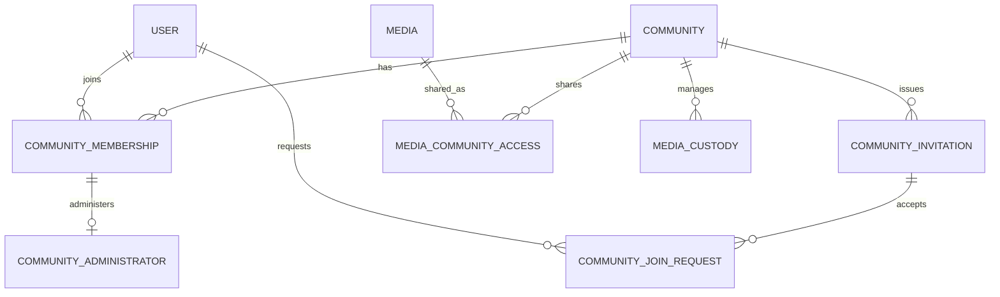

# Community論理データモデル

## 概要

> 実装状況: Community関連のDB定義は一部存在しますが、本ページで定義するCommunity機能と整合性制約は未実装です。

Community固有のentityと、User・Media domainとの関連を定義します。

## Entityと関連

AdministratorをMembershipとは別tableで表現する既存設計に合わせ、role列と別tableの二重管理は行いません。Membershipを持つ全員がMemberであり、Administrator行の存在が管理権限を表します。

## Community

Communityは識別子、必須の名称、作成日時、更新日時を持ちます。名称の重複は許可し、説明、作成者専用属性、親Communityを持ちません。

## MembershipとAdministrator

MembershipはCommunityとUserの参加関係です。Administratorは有効なMembershipを参照する別entityとして表現し、Communityごとに少なくとも1人存在します。role列と別entityの二重管理は行いません。

## 招待URLと参加申請

招待URLはCommunityに紐付き、発行から7日間有効です。参加申請は招待、Community、申請Userを参照し、`PENDING`、`APPROVED`、`REJECTED`、`CANCELLED`、`INVALIDATED`の状態を持ちます。

## Media domainとの境界

Communityへの共有関係とCustodyはMedia domainが所有します。Community側はMembership・Administrator・Uploaderとの組み合わせによって認可を判定します。Mediaの論理モデルは[Media論理データモデル](/media/data-model)を正本とします。
