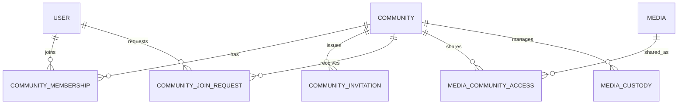

# Community論理データモデル

## 概要

> 実装状況: Community関連のDB定義は一部存在しますが、本ページで定義するCommunity機能と整合性制約は未実装です。

Community固有のentityと、User・Media domainとの関連を定義します。

## Entityと関連

Community内の権限は`COMMUNITY_MEMBERSHIP.role`で表現し、`member`または`admin`を保持します。Administrator専用entityは設けず、Membershipと権限を二重管理しません。

## Community

Communityは識別子、必須の名称、作成日時、更新日時を持ちます。名称の重複は許可し、説明、作成者専用属性、親Communityを持ちません。

## MembershipとRole

MembershipはCommunityとUserの参加関係であり、`role`として`member`または`admin`を持ちます。`admin` MembershipがAdministrator権限を表します。Communityごとに少なくとも1人の`admin`が存在する不変条件は、Community行のlockとService transactionで保証します。

## InvitationとUser起点Join Request

InvitationはCommunityに紐付く招待URLを表し、発行から7日間有効です。Initial ReleaseのInvitation acceptは有効なInvitationをconsumeし、Membershipを直接成立させます。

User起点Join RequestはInvitationとは独立した将来機能です。Communityと申請Userを参照し、`PENDING`、`APPROVED`、`REJECTED`、`CANCELLED`、`INVALIDATED`の状態を持ちます。Invitationを参照せず、Invitation acceptの中間状態にも使用しません。

## Media domainとの境界

Communityへの共有関係とCustodyはMedia domainが所有します。Community側はMembership role・Uploaderとの組み合わせによって認可を判定します。Mediaの論理モデルは[Media論理データモデル](/media/data-model)を正本とします。
