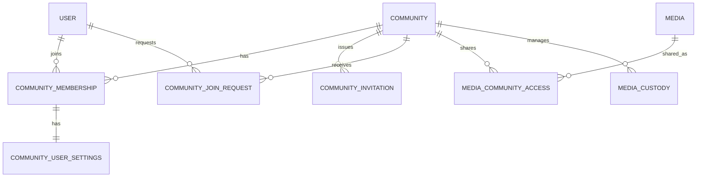

# Community論理データモデル

## 概要

> 実装状況: Community関連のDB定義は一部存在しますが、本ページで定義するCommunity機能と整合性制約は未実装です。

Community固有のentityと、User・Media domainとの関連、不変条件を定義します。

## Entityと関連

```mermaid
erDiagram
  COMMUNITY ||--o{ COMMUNITY_MEMBERSHIP : has
  USER ||--o{ COMMUNITY_MEMBERSHIP : joins
  COMMUNITY_MEMBERSHIP ||--|| COMMUNITY_USER_SETTINGS : has
  COMMUNITY ||--o{ COMMUNITY_INVITATION : issues
  COMMUNITY ||--o{ COMMUNITY_JOIN_REQUEST : receives
  USER ||--o{ COMMUNITY_JOIN_REQUEST : requests
  COMMUNITY ||--o{ MEDIA_COMMUNITY_ACCESS : shares
  MEDIA ||--o{ MEDIA_COMMUNITY_ACCESS : shared_as
  COMMUNITY ||--o{ MEDIA_CUSTODY : manages
```

Community内の権限は`COMMUNITY_MEMBERSHIP.role`で表現し、`member`または`admin`を保持します。Administrator専用entityは設けず、Membershipと権限を二重管理しません。

### Community

Communityは識別子、必須の名称、lifecycle状態、作成日時、更新日時を持ちます。lifecycle状態は`ACTIVE`または`DELETING`です。削除受付時に`DELETING`へ遷移し、以後は通常の閲覧・参加・更新対象から除外します。Community管理Mediaの削除Lifecycleが完了した後にCommunityを物理削除します。名称の重複は許可し、説明、作成者専用属性、親Communityを持ちません。

### MembershipとRole

MembershipはCommunityとUserの参加関係であり、`role`として`member`または`admin`を持ちます。`admin` MembershipがAdministrator権限を表します。

### User × Community Settings

Community User SettingsはMembershipに従属するUser個別のpresentation設定です。Initial ReleaseではContext Accentを保持します。Community brandingではなく、同じCommunityでもUserごとに異なる値を許可します。

Membership作成時に同じTransactionでSettingsを作成し、Membership終了時に削除します。再参加では過去値を復元せず新規生成します。roleや参加日時等のMembership情報とpresentation preferenceを同じ概念として扱いません。

### InvitationとUser起点Join Request

InvitationはCommunityに紐付く招待URLを表し、発行から7日間有効です。Initial ReleaseのInvitation acceptは有効なInvitationを検証し、Membershipを直接成立させます。Invitation自体を使用済み状態にはせず、有効期間内は複数Userが同じURLを利用できます。

User起点Join RequestはInvitationとは独立した将来機能です。Communityと申請Userを参照し、`PENDING`、`APPROVED`、`REJECTED`、`CANCELLED`、`INVALIDATED`の状態を持ちます。Invitationを参照せず、Invitation acceptの中間状態にも使用しません。

## 不変条件

- `ACTIVE` Communityごとに少なくとも1人の`admin` Membershipが存在する。`DELETING`では削除cleanupに伴うMembership削除を許容する。
- 同じCommunityとUserのMembershipは1件だけ存在する。
- ACTIVEなMembershipにはUser × Community Settingsが1件対応し、Settings単独では存在しない。
- Administratorは必ず有効なMembershipを持ち、Administrator専用entityは持たない。
- Communityごとに失効処理されていないInvitationは1件だけ存在する。
- User起点Join Requestでは、同じCommunity・Userの`PENDING`申請を同時に複数持たない。
- Communityは別Communityを親または子として持たず、参加者・Media・権限を継承しない。

## 他domainとの境界

Community domainはCommunity、Membership、User × Community Settings、Invitation、User起点Join Requestを所有します。Communityへの共有関係とCustodyはMedia domainが所有し、Community側はMembership role・Uploaderとの組み合わせによって認可を判定します。Mediaの論理モデルは[Media論理データモデル](/media/data-model)を正本とします。Userの認証主体とaccount lifecycleは[User論理データモデル](/user/data-model)を正本とします。
