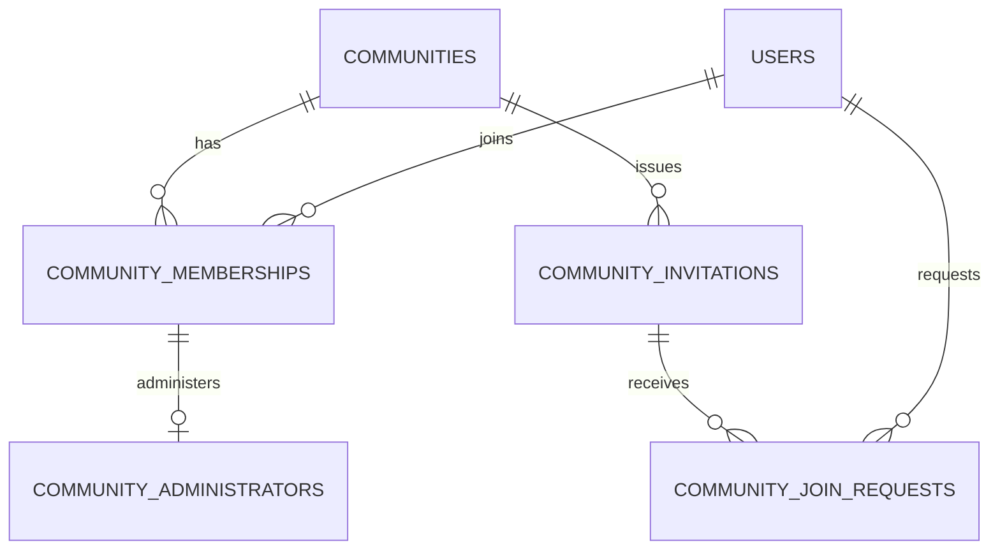

# Community物理データモデル

## 概要

> 実装状況: Community関連のDB定義は一部存在しますが、本ページで定義するCommunity機能と整合性制約は未実装です。

Community domainが所有するPostgreSQL table、column、PK、FK、index、削除規則を定義します。IDは`varchar(26)`のULID、時刻は`timestamptz`とします。

## 全体ER

## Community関連table

### communities

| 列 | 型 | 制約 | 意味 |
| --- | --- | --- | --- |
| id | varchar(26) | PK | Community ID |
| name | text | NOT NULL、前後空白除去後に空でない | 表示名。同名を許可 |
| created_at | timestamptz | NOT NULL | 作成時刻 |
| updated_at | timestamptz | NOT NULL | 更新時刻 |

説明、作成者、親Communityは保持しません。

### community_memberships

| 列 | 型 | 制約 | 意味 |
| --- | --- | --- | --- |
| community_id | varchar(26) | FK communities ON DELETE CASCADE | 所属先 |
| user_id | varchar(26) | FK users | 参加User |
| joined_at | timestamptz | NOT NULL | 参加時刻 |

PKは`(community_id, user_id)`です。`(user_id, community_id)`へindexを追加します。退会・User削除時は共有解除や最終Administrator確認が必要なため、単純なFK cascadeだけに依存しません。

### community_administrators

| 列 | 型 | 制約 | 意味 |
| --- | --- | --- | --- |
| community_id | varchar(26) | 複合FK community_memberships | 対象Community |
| user_id | varchar(26) | 複合FK community_memberships | Administrator |
| granted_at | timestamptz | NOT NULL | 付与時刻 |

PKは`(community_id, user_id)`です。複合FKによって参加していないUserをAdministratorに任命できません。Communityごとに1人以上という条件は、Community行lockとService transactionで保証します。

### community_invitations

| 列 | 型 | 制約 | 意味 |
| --- | --- | --- | --- |
| id | varchar(26) | PK | 招待ID |
| community_id | varchar(26) | FK communities ON DELETE CASCADE | 招待対象Community |
| token_hash | varchar(128) | NOT NULL、UNIQUE | 推測困難なtokenのhash |
| created_by_user_id | varchar(26) | FK users ON DELETE SET NULL | 発行Administrator |
| created_at | timestamptz | NOT NULL | 発行時刻 |
| expires_at | timestamptz | NOT NULL | 発行から7日後 |
| revoked_at | timestamptz | NULL可 | 無効化時刻 |

`revoked_at IS NULL`を条件とするCommunity単位のpartial unique indexで、失効処理されていない招待URLを1件に制限します。期限切れURLは再発行Transaction内で`revoked_at`を設定してから新規行を作成します。期限判定に現在時刻を使うpartial indexは作成しません。

### community_join_requests

| 列 | 型 | 制約 | 意味 |
| --- | --- | --- | --- |
| id | varchar(26) | PK | 申請ID |
| community_id | varchar(26) | FK communities ON DELETE CASCADE | 参加申請先 |
| invitation_id | varchar(26) | FK community_invitations | 使用した招待 |
| applicant_user_id | varchar(26) | FK users | 申請者 |
| status | varchar(16) | NOT NULL、CHECK | `PENDING`、`APPROVED`、`REJECTED`、`CANCELLED`、`INVALIDATED` |
| requested_at | timestamptz | NOT NULL | 申請時刻 |
| reviewed_by_user_id | varchar(26) | FK users ON DELETE SET NULL | 承認・拒否Administrator |
| reviewed_at | timestamptz | NULL可 | 承認・拒否時刻 |
| resolved_at | timestamptz | NULL可 | 確定・取消し・無効化時刻 |

`status = 'PENDING'`を条件に`(community_id, applicant_user_id)`へpartial unique indexを設定し、重複申請を防ぎます。申請User削除時は先に`INVALIDATED`へ更新し、Userの削除・匿名化方式とFK動作は #16・#27 で整合させます。`(community_id, status, requested_at)`のindexで承認待ち一覧を取得します。

Media domainが所有する`media_custodies`と`media_community_accesses`は[Media物理データモデル](/media/physical-data-model)を参照します。

## 所有境界

`communities`、`community_memberships`、`community_administrators`、`community_invitations`、`community_join_requests`は本ページを設計上の正本とします。GraphQL・実行可能SQL schemaの正本は実装を所有する`memoria-api`です。
