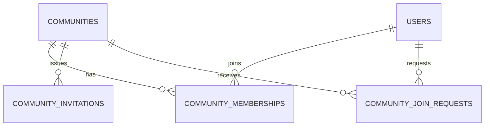

# Community物理データモデル

## 概要

> 実装状況: Community関連のDB定義は一部存在しますが、本ページで定義するCommunity機能と整合性制約は未実装です。

Community domainが所有するPostgreSQL table、column、PK、FK、index、削除規則を定義します。

## PostgreSQL schema

本domainが所有するrelationは`community` schemaへ配置します。schema名と共通の参照規約は[物理データモデル共通規約](/system/data/physical-model-conventions)を正本とします。

## 共通規約

ID、日時、命名、constraint、index、削除方針は[物理データモデル共通規約](/system/data/physical-model-conventions)に従います。本ページではCommunity domain固有の定義と例外を記載します。

## 全体ER

## 所有table

### communities

| 列 | 型 | 制約 | 意味 |
| --- | --- | --- | --- |
| id | varchar(26) | PK | Community ID |
| name | text | NOT NULL、前後空白除去後に空でない | 表示名。同名を許可 |
| created_at | timestamptz | NOT NULL | 作成時刻 |
| updated_at | timestamptz | NOT NULL | 更新時刻 |

説明、作成者、親Communityは保持しません。

### community_memberships

| 列 | 型 | 制約 | 意味 |
| --- | --- | --- | --- |
| community_id | varchar(26) | FK communities ON DELETE CASCADE | 所属先 |
| user_id | varchar(26) | FK users ON DELETE RESTRICT | 参加User |
| role | varchar(16) | NOT NULL、CHECK | `member` / `admin` |
| joined_at | timestamptz | NOT NULL | 参加時刻 |

PKは`(community_id, user_id)`です。Userが参加しているCommunityのlookup用に`(user_id, community_id)`へindexを追加します。Community内のMember一覧は最近参加したUserから表示し、安定したcursor paginationのため`joined_at DESC, user_id DESC`をsortとします。このaccess pattern用に`(community_id, joined_at DESC, user_id DESC)`へindexを追加します。Administrator専用tableは設けず、`role = 'admin'`のMembershipがAdministrator権限を表します。Communityごとに1人以上の`admin`を維持する条件は、Community行lockとService transactionで保証します。退会・User削除時は共有解除や最終Administrator確認が必要なため、User参照は`ON DELETE RESTRICT`とします。User削除flowでは必要なCommunity / Media cleanupを完了してMembershipを明示削除した後にUserを物理削除します。

### community_invitations

| 列 | 型 | 制約 | 意味 |
| --- | --- | --- | --- |
| id | varchar(26) | PK | 招待ID |
| community_id | varchar(26) | FK communities ON DELETE CASCADE | 招待対象Community |
| token_hash | varchar(128) | NOT NULL、UNIQUE | 推測困難なtokenのhash |
| created_by_user_id | varchar(26) | FK users ON DELETE SET NULL | 発行Administrator |
| created_at | timestamptz | NOT NULL | 発行時刻 |
| expires_at | timestamptz | NOT NULL | 発行から7日後 |
| revoked_at | timestamptz | NULL可 | 無効化時刻 |

`revoked_at IS NULL`を条件とするCommunity単位のpartial unique indexで、失効処理されていない招待URLを1件に制限します。期限切れURLは再発行Transaction内で`revoked_at`を設定してから新規行を作成します。期限判定に現在時刻を使うpartial indexは作成しません。

Initial ReleaseのInvitation acceptは有効なInvitationを検証し、`community_memberships(role='member')`を同じTransactionで直接作成します。Invitation自体に使用済み状態を表すcolumnは持たせず、有効期間内は複数Userが同じURLを利用できます。Join RequestをInvitation acceptの中間relationとして作成しません。

### community_join_requests

`community_join_requests`はInvitation acceptとは独立したUser起点Join Requestの将来機能です。以下の論理・物理設計は将来実装時のbaselineとして保持しますが、Initial ReleaseではUI/APIを提供せず、`00001_initial.sql`にもtableを作成しません。機能実装時に要件を再確認し、その時点のversioned migrationで追加します。

| 列 | 型 | 制約 | 意味 |
| --- | --- | --- | --- |
| id | varchar(26) | PK | 申請ID |
| community_id | varchar(26) | FK communities ON DELETE CASCADE | 参加申請先 |
| applicant_user_id | varchar(26) | FK users ON DELETE CASCADE | 申請者 |
| status | varchar(16) | NOT NULL、CHECK | `PENDING`、`APPROVED`、`REJECTED`、`CANCELLED`、`INVALIDATED` |
| requested_at | timestamptz | NOT NULL | 申請時刻 |
| reviewed_by_user_id | varchar(26) | FK users ON DELETE SET NULL | 承認・拒否Administrator |
| reviewed_at | timestamptz | NULL可 | 承認・拒否時刻 |
| resolved_at | timestamptz | NULL可 | 確定・取消し・無効化時刻 |

statusとreview / resolve情報は次の整合条件を持ちます。

| status | reviewed_by_user_id | reviewed_at | resolved_at |
| --- | --- | --- | --- |
| `PENDING` | NULL | NULL | NULL |
| `APPROVED` | 承認時は必須。後のUser削除でNULL可 | NOT NULL | NOT NULL |
| `REJECTED` | 拒否時は必須。後のUser削除でNULL可 | NOT NULL | NOT NULL |
| `CANCELLED` | NULL | NULL | NOT NULL |
| `INVALIDATED` | NULL | NULL | NOT NULL |

DBではstatusに応じた`reviewed_at` / `resolved_at`のNULL整合をCHECK constraintで保証します。`reviewed_by_user_id`は履歴上のreviewerを表しますが、User物理削除時に`ON DELETE SET NULL`となるため、`APPROVED` / `REJECTED`の保存状態に対してNOT NULLを要求しません。承認・拒否transaction実行時にreviewer Userが存在することはServiceで保証します。

`status = 'PENDING'`を条件に`(community_id, applicant_user_id)`へpartial unique indexを設定し、重複申請を防ぎます。申請User削除時は先に`INVALIDATED`へ更新して並行する承認を防止し、User物理削除時に`ON DELETE CASCADE`でJoin Request自体を削除します。User削除後まで申請履歴を保持する要件は設けません。承認待ち一覧は新しい申請から表示し、`requested_at DESC, id DESC`を安定したsortとします。`(community_id, status, requested_at DESC, id DESC)`のindexで取得します。

Media domainが所有する`media_custodies`と`media_community_accesses`は[Media物理データモデル](/media/physical-data-model)を参照します。

## 削除規則

Community削除時は`communities`を起点としてMembership、Invitation、User起点Join Requestに加え、当該CommunityへのUser管理Media Access、Community scopeのGroup / Tagとそれらの従属relationを同じtransaction内でCASCADE削除します。ただし、`media_custodies.community_id`はON DELETE RESTRICTとし、Community管理Mediaが残る場合は通常のCommunity削除を拒否します。User管理Media本体、User scopeの分類、他Communityへの共有は変更しません。Media domainのcleanupをFK cascadeだけで代替しません。

Membershipの退会・除外・User削除では、最後のAdministrator確認とUser管理Mediaの共有解除が必要なため、`users`からの単純なFK cascadeだけに依存しません。Invitationの発行者やJoin Requestのreviewerなど履歴上のUser参照は、User削除後に不要な個人情報を保持しないよう`ON DELETE SET NULL`またはUser domainの削除規則に従います。

Media domainが所有する`media_custodies`と`media_community_accesses`の削除規則は[Media物理データモデル](/media/physical-data-model)を正本とします。

## 他domainとの境界

`communities`、`community_memberships`、`community_invitations`、`community_join_requests`は本ページを設計上の正本とします。GraphQL・実行可能SQL schemaの正本は実装を所有する`memoria-api`です。
