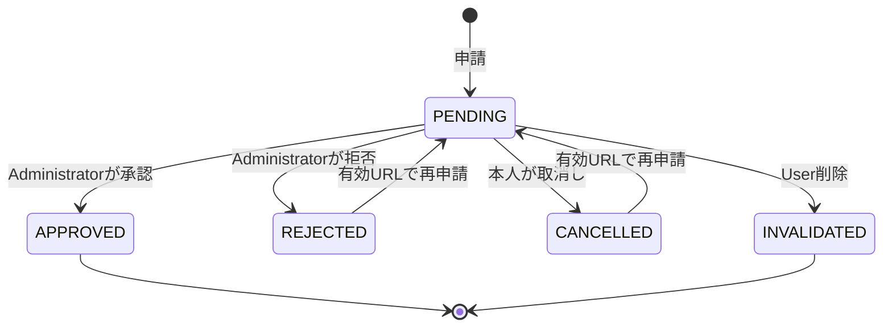

# Communityユースケース

## 概要

> 実装状況: Community関連のDB定義は一部存在しますが、本ページで定義するCommunity機能と整合性制約は未実装です。

User、Administrator、Memberの操作、前提条件、結果、対象外を定義します。

## Communityを作成・変更する

- ログイン済みUserはCommunityを作成できる。
- `name`は必須とし、前後の空白を除去して空文字・空白だけの値を拒否する。名称の長さは入力・Security設計で決定する。
- 異なるCommunity間で同名を許可する。
- 説明、Community画像、公開profile、Community検索、作成者専用属性を持たない。
- 作成したUserを最初のMembershipおよびAdministratorとして、Community作成と同じTransactionで登録する。
- 作成者に恒久的な特権は与えない。別Administratorが残る場合は作成者も退会・User削除できる。
- Administratorは名称を変更でき、既存の招待URLは引き続き有効となる。

## 招待URLを発行・共有する

AdministratorがCommunityごとに1件の有効な招待URLを発行します。tokenは推測困難な乱数とし、DBにはtokenのhashだけを保存します。

- 発行時刻から7日間有効。
- 有効期間内は複数人が同じURLから参加申請できる。
- 発行、無効化、再発行、状態確認はAdministratorだけができる。
- 再発行時には古いURLを同じTransactionで無効化する。
- URLはCommunityに属し、発行者の退会・除外・User削除だけでは失効しない。
- Community名の変更後も利用でき、招待画面には最新の名称だけを表示する。
- 期限切れ・無効化後は新規申請できないが、受付済み申請は維持する。
- Community削除後はURLを利用できず、名称を含むCommunity情報を表示しない。
- HTTPSを必須とし、tokenをlog、外部解析、第三者Serviceへ送信しない。
- URL確認と参加申請にはrate limitを適用する。具体値はSecurity要件で決定する。
- login後の戻り先はアプリケーション内で許可されたpathだけを受け付ける。

期限切れは`expires_at`の比較で判定し、状態を更新する常駐処理は必須としません。

## Communityへの参加を申請する

招待URLを開いたUserにはCommunity名だけを表示します。Member一覧、Media、Group、Tag、メールアドレスは参加承認まで表示しません。未登録Userはloginまたは登録後、元の招待画面へ戻って申請します。

- 申請者は参加前のUserに限定する。
- 同じCommunity・Userの未処理申請は同時に1件だけ許可する。
- 参加済みUserの申請は拒否する。
- 申請自体には有効期限を設けない。
- すべてのAdministratorが申請者のnicknameを確認し、承認・拒否できる。profile画像は初回Release対象外とする。
- 承認時にMemberとしてMembershipを作成する。
- 申請者は承認前に申請を取り消せる。
- 拒否・取消し後は有効な招待URLから再申請できる。過度な申請・取消しはrate limit対象とする。
- URLの失効・再発行だけでは既存申請を無効化しない。
- 申請者がUser削除した場合は申請を無効化し、承認待ち一覧から除外する。
- 承認・拒否・取消し・User削除が競合した場合は、先にcommitした処理を有効とし、後続は現在状態を再確認する。
- 承認または拒否したAdministratorと処理日時を記録する。
- 拒否理由入力、一括拒否、block機能、メール・push通知は初回Releaseに含めない。

## Mediaを共有・Uploadする

| 操作 | Custodian | Media本体 | Communityでの扱い |
| --- | --- | --- | --- |
| User管理Mediaを共有 | Userのまま | 複製しない | 参加者全員が閲覧できる |
| Communityへ直接Upload | Community | 新しいMediaを登録 | Communityの参加者が閲覧できる |
| User管理MediaをCommunityへ委譲 | UserからCommunityへ変更 | 複製しない | 初回Release対象外 |

共有できるのは対象MediaのUser Custodian本人であり、本人が参加しているCommunityだけを共有先にできます。Administratorによる事前承認は不要です。1つのMediaを複数Communityへ共有できます。

共有解除はUser Custodian本人、または共有先CommunityのAdministratorが実行できます。解除対象はそのCommunityとの閲覧関係と、そのCommunity内のGroup・Tag関連だけです。Media本体、Custody、他Communityの共有・分類には影響させません。

CommunityへはAdministratorとMemberのどちらも直接Uploadできます。Community管理MediaのUploader本人は、Community参加中に限り、自分がUploadしたMediaを削除しOriginalをdownloadできます。

## Group・Tagで共同整理する

AdministratorとMemberはCommunity内のGroup・Tagを作成し、閲覧できるMediaを分類できます。User管理MediaをCommunityへ共有した場合も、そのCommunity内だけで有効なGroup・Tagを設定できます。

- Group・TagはMediaの管理主体や閲覧権限を変更しない。
- Community側の分類は、共有元Userの個人領域の分類とは独立する。
- 共有解除時は対象MediaのCommunity側Group・Tag関連だけを削除する。
- Group・Tag本体と、他Mediaの分類は保持する。
- Group・Tag自体の編集・削除権限、名称、階層構造はそれぞれの詳細設計で確定する。

## 退会・除外する

Memberは自分で退会できます。AdministratorはMemberまたは別Administratorを除外できます。ただし、最後のAdministratorの退会・除外・降格は禁止します。

退会または除外時には、Membership削除、Administrator権限削除、本人がCustodianであるMediaの当該Community共有解除、当該CommunityのGroup・Tag関連解除を同じTransactionで行います。

Community管理MediaはUploaderが退会してもCommunityへ残し、退会済みUploaderによる閲覧、削除、Original downloadを禁止します。退会したUserが過去にCommunity内で作成したGroup・TagはCommunityに残します。

Communityから除外されたUserも、有効な招待URLがあれば再申請できます。Administratorが再承認しない限り参加できません。

## Communityを削除する

Administratorの1人が、他Administratorの同意なしでCommunityを削除できます。確認画面に対象名称と削除の影響を表示し、Community名の入力を要求します。

- `media_custodies.community_id`が対象CommunityのMediaが1件でもある場合は削除できない。
- 初回Releaseでは管理主体の委譲がないため、対象Mediaをすべて削除する必要がある。
- Community、Membership、Administrator権限、招待URL、参加申請、共有関係、Community内Group・Tagを同じTransactionで削除または無効化する。
- 共有されていたUser管理Media本体、User側分類、他Communityの共有・分類は変更しない。
- 削除したCommunityは復元できない。
- 実行Userと実行日時はSecurity・Privacy要件で定める範囲で記録する。

## Userを削除する

UserがCommunityの最後のAdministratorである場合は、別MemberのAdministrator昇格、またはCommunity削除を選択します。account削除時にCommunity削除を選ぶ場合だけ、対象Media件数、参加者数、他UserのUploadへの影響を確認し、Community名入力と再認証を条件にCommunity管理Mediaも削除できます。その他のMembershipは退会処理と同じ規則で解消し、未処理の参加申請は無効化します。

Community管理MediaはUploaderがUser削除しても保持し、表示上は「削除済みUser」として扱います。uploaded_by_user_idをNULLにし、氏名、email、削除前nickname、Auth0 identifierを保持しません。詳細は[User物理データモデル](/user/physical-data-model)を正本とします。削除済みUploaderには権限を与えません。
