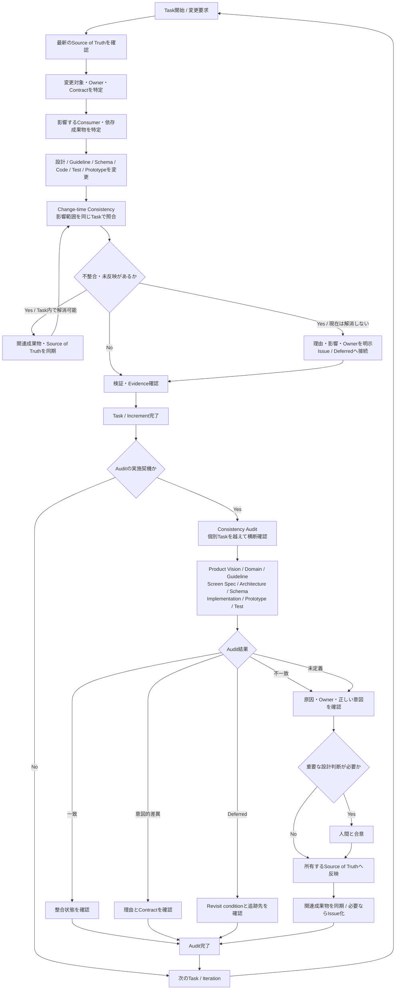

# アジャイル開発とイテレーション運用

## 目的

Memoriaはウォーターフォール型の工程完了を前提とせず、短い反復で要求、設計、実装、検証から学習するアジャイル開発を採用します。開発は固定期間ではなく、達成するGoalを単位としたイテレーションで進めます。

初回リリース前でも、すべてを一度に完成させてから統合するのではなく、検証可能な小さなIncrementを継続して`develop`へ統合します。イテレーションとReleaseは同一ではなく、各イテレーションで本番Releaseを必須にしません。ただし、完了したIncrementは既存機能を壊さず、Release候補へ含められる品質を満たします。

## 初回Releaseの優先順位

開発対象の優先順位と公開可否は[初回Releaseの範囲と成功条件](/first-release)を基準に判断します。初回Releaseは静止画像、Community、Group、Tagを対象とし、動画と将来向けの運用拡張を前提にしません。要求・詳細設計が未確定の領域は関連Issueで先に判断し、確定済みの領域から小さなイテレーションとして進めます。

## 基本原則

- Productの目的と利用者価値を起点に優先順位を決める
- 要求、設計、実装、検証を一方向の工程として固定せず、得られた知見を次の判断へ反映する
- 採用済みの作業はIssueをProduct Backlogの正本とし、Idea、Release scope、解決状態を区別して管理する
- イテレーションごとに達成するGoalを一つ定め、作業量や経過日数ではなく結果で評価する
- Issueのチェックリストは実績と照合し、完了した項目だけをチェック済みにする
- 未完了の作業を完了扱いにせず、理由、影響、後続Issueを記録してBacklogへ戻す
- 設計書は各時点で合意された最新設計を表し、設計変更を実装と同じイテレーションまたは先行する設計Taskで反映する
- 振り返りで見つかったProcess改善は、次のイテレーションで実行可能なActionへ変換する

開発頻度が不定期であるため、イテレーションに固定期間を設定しません。開始日からの経過日数や非開発期間を進捗として評価せず、Goalの完了、中断、または中止で区切ります。3イテレーションを完了した時点で、作業分割、再開コスト、同時進行数、記録量が適切か見直します。外部期限がある場合だけ目標日をIssueへ記載します。

## Issue管理モデル

Issueは、作業の種類、Releaseとの関係、解決状態、完了判定を一つの属性へ混在させず、独立した軸として管理します。Openであることだけから「現在のReleaseに必要」「実装すると決定済み」「未完了Task」のいずれかを推測しません。

### Issue type

Issue titleの接頭辞は、そのIssueが管理する責務を表します。Release時期や優先順位は接頭辞へ含めません。

| 接頭辞 | 責務 |
| --- | --- |
| `idea:` | まだ採用を決定していないProduct / Technical ideaの探索・採否判断 |
| `design:` | 要求・仕様・Architecture・Contract等の設計判断 |
| `feat:` | 採用済みCapabilityの実装と検証 |
| `fix:` | 合意済み仕様または期待動作との差異の修正 |
| `refactor:` | 外部仕様・Behaviorを変えない内部改善 |
| `chore:` | Dependency、CI、設定、保守等の作業 |
| `security:` | Security / Privacy上、独立して追跡すべき課題 |
| `iteration:` | 一つのIteration Goalと対象作業の統合管理 |
| `design coverage:` | Domain / Capabilityの設計探索状態の継続管理 |

接頭辞は「どの成果を作るIssueか」で決めます。同じCapabilityでも、採否判断は`idea:`、採用後の設計は`design:`、実装は`feat:`のように別Issueへ分けられます。単に将来実施するという理由で`idea:`にはしません。

### Ideaと採用済みBacklog

Ideaは「実装候補として記録した」状態であり、Product Backlogへ採用済みであることを意味しません。Idea Issueには少なくともProblem / Opportunity、期待するValue、既知のConstraint、採否を再検討するTriggerを記録します。詳細なAcceptance Criteriaや実装設計を先回りして要求しません。

Ideaを採用する場合は、必要な要求・設計・実装Issueを作成または特定し、採用判断と移行先をIdeaへ記録してIdea IssueをCloseします。採用しない場合も判断理由を残してCloseします。Idea Issue自体を長期の実装進捗Issueへ変質させません。

一方、将来実装することを既に合意したCapabilityはIdeaではなくProduct Backlogです。現在のRelease対象外でも通常の`design:` / `feat:`等として管理し、Release scopeで現在対象外であることを表現します。

### Release scope

Issue自身の解決状態とReleaseへの包含は別軸です。Release scopeはLabelで表し、title prefixやOpen / Closedへ意味を混在させません。

Initial Releaseでは次を使用します。

- `release:initial`: Initial Releaseの成功条件を成立させるために必要
- `release:deferred`: 採用済みだがInitial Releaseでは提供・完了を要求しない
- Release非依存の設計運用、CI保守、Coverage状態管理等はRelease labelを必須としない

`release:deferred`には、Issue本文またはコメントからReasonとRevisit conditionを確認できる状態を保ちます。単に優先順位が低いことだけを理由にDeferredへ移しません。

将来の具体的なRelease計画が必要になった場合、ReleaseごとのLabelを無制限に追加することを前提とせず、実際のRelease planning要件を確認してMilestone等を含め管理方式を再設計します。

[初回Releaseの範囲と成功条件](/first-release)をProduct-level scopeの正本とし、Issue labelはそのscopeを検索・棚卸し可能にする投影です。両者が矛盾した場合は正本を確認し、Issue labelを同期します。

### Acceptance CriteriaとEvidence

Acceptance Criteriaは、第三者がEvidenceを確認してYes / Noを判定できる成果条件として記述します。「十分」「適切」「検討する」等、追加の主観判断を必要とする表現だけを完了条件にしません。

同一Issue内で完結する成果条件はchecklistで管理できます。checklistは作業手順ではなく結果を記述します。

```text
- [ ] Initial Release対象操作のGraphQL contractが正本に定義されている
- [ ] 対象Repositoryのcontract testが成功している
```

独立したGoal、成果、判断または検証として追跡する価値がある条件は子Issueへ分離できます。その場合、親IssueのAcceptance Criteriaから対象Issueを参照し、原則としてその子Issueが`Closed (completed)`であることを条件とします。

```text
- [ ] #123 が Closed (completed)
- [ ] #124 が Closed (completed)
```

完了条件を機械的に表現するためだけに細かな子Issueを作りません。Issue分割は、独立した成果として優先順位・依存関係・Review・中断再開・検証を管理する価値があるかで判断します。

子IssueがすべてClosedでも、親IssueのGoalが自動的に成立するとは限りません。親IssueをCloseする前に、子Issueを統合した結果が親のGoalとAcceptance Criteriaを満たすことをConsistency Reviewで確認します。

Acceptance Criteriaを`[x]`へ変更する際、PR、正本文書、code、schema、test、Closed child Issue等のEvidenceを確認します。Evidenceを確認できない項目を推測で完了扱いにしません。

Design Coverage Issueは継続的な状態管理であり、この通常の完了モデルの例外です。Coverage IssueのOpen状態は未完了Taskを意味せず、対象DomainのCoverageを継続管理する間はOpenを維持できます。

### Resolution state

`Open`は、そのIssueが現在も追跡対象であることだけを意味します。Release blockingや現在Iterationへの包含を意味しません。

Close時は理由を区別します。

- `completed`: Issue自身のGoal / Acceptance Criteriaを満たした
- `not planned`: 重複、要求変更、採用見送り、前提失効等によりIssueの成果を実施しない

未達条件を別Issueへ移しただけで元Issueを`completed`にしません。Scope変更により元IssueのGoalが成立している場合は、変更理由と移管先を記録してから判定します。

### Issueに保持する情報

通常のTask / Design Issueは、必要な範囲で次を確認できる状態にします。

- Purpose / Goal
- Scope
- Out of Scope
- Acceptance Criteria
- Dependencies / Blocking
- Evidence / Source of Truth
- Deferred workとRevisit condition（存在する場合）
- Release scope（Releaseに関係する場合）

既存Issueを形式だけ合わせるために一括書き換えません。棚卸しまたは実際に着手するときに、現在の正本との差異を確認して必要な情報を補正します。過去の本文を履歴として保持する必要がある場合は、本文を無理に現在形へ書き換えず、差異と現在の判定をコメントへ残せます。

### Issue本文と履歴の更新

Issue本文は、そのIssueを開始した背景、当初のScope、Acceptance Criteria、その後の変更を追跡できる記録として扱います。Issue本文にはGitのような変更履歴を前提としないため、意味のある既存情報を直接削除・置換して履歴を失わせません。

通常Issueでは次の規則に従います。

- 既存のPurpose、Scope、Out of Scope、Acceptance Criteria、Constraint、Deferred等は原則として削除しない
- 既存内容が後の判断で無効または変更になった場合、旧内容を`~~取り消し線~~`で残し、その近くに現在の内容または参照先を追記する
- Acceptance Criteriaの達成は`[ ]`から`[x]`への更新を許容する。条件そのものを変更する場合は旧条件を削除せず、取り消し線と新条件で変更を表現する
- 作業進捗、日付付きの設計判断、検証結果、Deferred解消、PR反映状況、Consistency Review結果、close理由等の時系列情報は本文へ追記せず、原則としてコメントへ記録する
- IssueをCloseするために本文を完成形へ全面的に書き換えない。最終EvidenceとResolution理由はコメントから確認できる状態にする
- 誤字脱字、format、意味を変えない表現修正、単純なlink保守等は、設計判断の履歴を失わない範囲で直接修正できる

設計や実装の現在のSource of TruthはIssue本文ではなく、各Repositoryで定めた正本文書、schema、code、test等です。Issueコメントは、いつ何を確認し、どの判断によって現在の正本へ到達したかを追跡する履歴として使用します。

#### Design Coverage Issueの例外

Design Coverage Issueは、過去のCoverage表ではなく現在のCoverage状態を一覧できること自体が役割です。そのためCoverage Map、Evidence、Blocking等は現在状態へ直接更新できます。削除されたCapabilityや過去のStateを取り消し線でMapへ蓄積しません。

CoverageのState変更、Capability追加・除外、Blocking解消等、意味のある変更を行った場合は、変更理由と必要なEvidenceをコメントへ記録して履歴を保持します。Coverage Issueの本文を現在状態へ更新できることは、通常Issueの履歴保持規則を他のIssueで省略する根拠にはしません。

通常Issueで取り消し線が増え、現在状態の把握を妨げるほど可読性が悪化した場合は、履歴を独断で削除して整理せず、Issue履歴の保持方法そのものを再検討します。

### Repository ownership

Issueは成果のSource of Truthを所有するRepositoryへ置きます。Product / Design判断は`memoria-design`、Web実装は`memoria-web`、Backend実装は`memoria-api`、Infrastructure実装は`memoria-IaC`を基本とします。

複数RepositoryへまたがるGoalは、全体判断を所有する親Issueから各Repositoryの実装Issueを参照します。各実装Issueへ同じ仕様本文を複製せず、Design Source of Truthと関連Issue / PRをリンクします。


## Backlogとイテレーション

GitHub ProjectsとMilestonesは使用せず、GitHub Pluginで扱えるIssueとPRで管理します。

| 単位 | 管理方法 | 内容 |
| --- | --- | --- |
| Product Backlog | Open Issue | Product全体で必要な要求、設計、実装、改善 |
| 大規模な目的 | 親Issue | Goal、Phase、依存関係、全体の完了条件 |
| 独立した作業 | 子Issue | 一つの検証可能な成果と受け入れ条件 |
| イテレーション | 親Issue | Goal、対象Issue、対象外、開始時の前提、Checkpoint、Review |
| 完了 | Closed Issue | 受け入れ条件とDefinition of Doneを満たした状態 |

Issueをイテレーションへ入れる前に、少なくとも目的、対象範囲、受け入れ条件、主要な依存関係、検証方法が理解できる状態にします。詳細が不足した項目は要求整理または設計Taskとして扱い、実装者の推測で補いません。

## イテレーションIssue

イテレーションごとに一つの親Issueを作成し、GitHub ProjectsとMilestonesの代わりにGoalと進捗を管理します。Titleは`iteration: <達成する結果>`を基本とします。同時に進める主要イテレーションは原則として一つに限定します。

イテレーションIssueには次を記載します。

- Goal
- 開始時の前提
- 対象Issue
- 明示的な対象外
- 依存関係とrisk
- Review結果
- 未完了項目とBacklogへ戻す判断
- 振り返りで得たこと
- 次のイテレーションで実行する改善

イテレーションIssueのChecklistは進捗の見通しに使用しますが、項目数や消化率を成果そのものとみなしません。Goalを満たしたか、利用者価値または検証可能な学習を得たかでReviewします。

## イテレーションの進め方

1. 開発を開始または再開するときにProduct Backlog、最新の`develop`、設計、依存関係を確認する
2. Goalと対象Issueを決め、イテレーションに含めない範囲を明示する
3. 実装に必要な設計と契約を確認し、不足があれば設計Taskを先に行う
4. 最新の`develop`からTaskごとの作業branchを作成する
5. 設計、実装、test、結合確認を行い、小さなPRを作成する
6. PRのマージ前にIssueの受け入れ条件とチェックリストを実績に基づいて更新する
7. 人間の確認後にPRを`develop`へ統合し、関連IssueのOpen／Closedが実態と一致することを確認する
8. 対象成果物の主要部分が概ね揃った段階でConsistency Reviewを行い、Use Case、設計、Visual Prototype、実装・testの整合性を確認する
9. Goalと受け入れ条件に対して成果をReviewする
10. 未完了項目を再評価し、理由と後続Issueを記録してBacklogへ戻す
11. Processと技術上の学びを振り返り、具体的な改善Taskを決める

## 整合性確認の二層構造

Memoriaでは、成果物間の整合性を一つの確認工程だけへ依存させません。通常のTaskで変更影響を局所的に揃える**Change-time Consistency**と、個別Taskを越えて蓄積したsemantic driftを横断的に検出する**Consistency Audit**を併用します。両者は代替関係ではなく、異なるfailure modeを補完します。

### 全体像



この図の上段は通常Taskごとの**Change-time Consistency**、下段は節目で行う**Consistency Audit**を表します。Auditは通常Taskの代替ではなく、局所的な影響範囲確認だけでは発見できなかったsemantic driftを検出するSafety Netです。変更方向は一方向に限定せず、設計から実装への具体化、実装・検証から設計へのFeedback、GuidelineからScreen Specificationへの反映など、どの方向でも同じ整合性原則を適用します。

### Change-time Consistency

要求、設計、Guideline、schema、code、test、Visual Prototype等を変更するときは、Context mapで影響範囲を特定し、関連するSource of Truthと成果物を同じTaskの中で照合します。設計から実装へ具体化する場合だけでなく、実装・検証で得た知見を設計へ戻す場合や、横断GuidelineからScreen Specificationを見直す場合にも適用します。

変更のたびに全Repository・全文書を機械的に読むことは要求しません。変更内容から影響するcontract、owner、consumer、依存成果物を特定し、その範囲を確認します。影響があるのに現在のTaskで解消できない差異は暗黙に残さず、理由と影響を明示してIssueまたは既存の追跡先へ接続します。

Taskの完了判断では、少なくとも次を確認します。

1. 変更元と、その変更を受ける直接の成果物が一致している
2. 変更によって意味・責務・contractが変わるconsumerや依存成果物を確認している
3. 実装・Prototype・test等から得た新しい知見を、必要な上流Source of Truthへ反映している
4. 意図的に差異を残す場合、その理由、owner、Revisit conditionまたは追跡Issueを確認できる

### Consistency Audit

Change-time Consistencyは、影響範囲を正しく発見できることを前提とするため、それだけでProduct全体の整合性を保証しません。複数TaskやIterationをまたいで蓄積したtransitive dependency、古い前提、更新漏れ、Source of Truth間の矛盾を検出するSafety Netとして、対象領域を横断するConsistency Auditを行います。

Auditでは、対象範囲に応じてProduct Vision、Domain設計、Cross-cutting Guideline、Screen Specification、Architecture、実行可能なschema・設定、実装、Visual Prototype、test等を横断してsemantic consistencyを確認します。表面的な文言一致ではなく、目的、Capability、責務、状態、権限、contract、User Experienceが同じ判断を表しているかを確認します。

実施契機は固定日だけに限定せず、次のような節目を使用します。

- Domain、Screen Specification、Design System、Architecture等の大きな設計更新が一巡したとき
- 複数Issue・PR・RepositoryにまたがるGoalの主要成果が揃ったとき
- Design Coverageの主要領域をReady / Validatedへ進める判断をするとき
- Release candidateを評価する前
- Consistency Reviewや通常Taskで、局所的な差異では説明できないdriftが見つかったとき
- 複数Iterationを通じた変更蓄積を見直す必要があると判断したとき

Audit結果は少なくとも**一致 / 不一致 / 未定義 / 意図的差異 / Deferred**を区別します。不一致を発見しても、設計、実装、Guideline等のどれかを階層だけで機械的に正しいものとして更新しません。Owner Document、actual behavior、現在のProduct Goalを確認し、重要な判断は人間との合意後に正本へ反映します。現在解消しない項目はIssueで追跡します。

Auditは通常Taskの整合性責任を置き換えません。「後でAuditする」ことを理由に、変更時に判明している差異を放置しません。

## Consistency Review

Memoriaでは、作業の種類を問わず、対象作業の主要な成果が概ね揃った時点で、関連する前提・正本・成果物・依存関係・後続作業との整合性を確認します。この確認をConsistency Reviewと呼び、開発の基本プロセスとして扱います。

Consistency Reviewは特定の工程だけに適用するGateではなく、要求整理、Use Case、設計、Visual Prototype、実装、test、Infrastructure、Migration、運用手順、Process改善など、独立した成果を作る作業全般へ適用します。作業途中の細かな変更ごとには実施せず、主要な論点や成果が概ね出揃い、個別修正より横断的な照合から得られるFeedbackの価値が高くなった時点で行います。

「すべて完成するまでReviewしない」運用にはしません。不整合や漏れを発見した場合にまだ安全に調整できる時点で実施し、Review後の変更によって前提や関連成果物が変わった場合は必要な範囲で再度Reviewします。

### 実施タイミング

具体的なタイミングは作業の性質に応じて決めます。共通の判断基準は、対象作業について主要な入力、判断、成果、例外または制約が概ね揃い、次の作業へ進む前に全体としての整合性を確認できる状態になったことです。

例えば、Use CaseならActor・目的・主要フロー・結果等の洗い出しが概ね終わった時点、設計なら主要判断と必要な詳細化が揃った時点、Visual Prototypeなら目的達成に必要な画面・状態・Interactionが一通り具体化された時点、実装なら主要code・contract・testを結合して振る舞いを確認できる時点が該当します。これらは適用対象を限定する工程一覧ではなく、共通原則の適用例です。

複数Issue、PR、Repository、Component、Phase等をまたいで一つのGoalを成立させる場合も、個々の成果だけでなく統合した状態でConsistency Reviewを行います。

### 確認内容

Reviewでは対象作業に関係する最新のGitHub正本を読み直し、作業内容に応じて次を確認します。

1. 作業の目的、Goal、受け入れ条件と実際の成果が一致しているか
2. 前提、制約、責務、用語、状態、権限、contract等が関連する正本や成果物間で矛盾していないか
3. 必要な入力・主要ケース・例外・failure / edge caseが漏れていないか
4. 上流の意図や判断が具体化の過程で欠落・変質していないか
5. 具体化・実装・検証で得られたFeedbackを、必要な上流の正本へ反映できているか
6. 関連するIssue、PR、test、documentation、migration、運用Task等に必要な変更が漏れていないか
7. 依存する作業と後続作業の境界が現在の判断と一致しているか
8. Design Coverage Mapの対象である場合、State、Evidence、Blocking、DeferredがReview結果と一致しているか

文書や実装の表面的な一致を目的にせず、対象Goalを成立させる意味・責務・contractが一貫していることを確認します。

### 不整合の扱い

不整合を発見した場合は、どれか一つの成果物を実装都合で自動的に正しいものとして合わせません。現在の目的とSource of Truthを確認し、不整合の原因を特定します。ProductまたはArchitecture上の重要な判断が必要な場合は人間と合意してから変更し、必要な正本と関連成果物を同じ判断へ揃えます。

修正によって別の前提、成果物、Issue、test等へ影響する場合は、その対象も再確認します。

### 現時点で確定・対応できない課題

Consistency Reviewに限らず、通常の作業過程で現在は判断材料や依存成果物が不足している、適切な対応時期が後続にある、または現在のScopeから独立して追跡すべき課題が判明した場合、暗黙のTODOや会話上の申し送りだけで保持しません。

追跡が必要な課題はIssueを正本として管理し、少なくとも次を記録します。

- 未解決の論点または必要なTask
- 現時点で確定・実施しない理由
- 影響するGoal、成果物、CapabilityまたはSystem
- 現時点で確定していることと未決定事項
- 再検討または着手する条件・適切なタイミング
- 関連するIssue、PR、設計書、実装等
- 後続作業で確認すべき条件または論点

Issueへ分離したこと自体を解決とは扱いません。現在のGoal、受け入れ条件、安全性を阻害する課題は現在の作業のBlockingとして解消します。現在の成果を成立させたまま後続へ延期できる課題だけをDeferred workとして分離します。

Design Coverage MapでBlockingまたはDeferredとして表現する価値がある場合はIssueをTracking先として参照し、Coverage MapへBacklogを複製しません。

### Review結果

Review結果は対象Issue、PR、イテレーションIssue等、現在の作業を追跡している正本から確認できるようにし、Consistency Review専用の恒久台帳は作りません。

Review後は、整合して次の作業へ進める状態、不整合を修正して関連成果物を同期した状態、後続Issueへ適切に分離した状態、またはBlockingが残り現在の作業へ戻る状態のいずれであるかを明確にします。

### Web実装のPR作成前フォーマット

ChatGPTが`memoria-web`を実装する場合、ChatGPTの実行環境ではBiome formatterを実行できないことを前提に、PR作成前に人間のローカル環境でformatを適用します。未formatの変更をPRへ継続的に積み上げ、既知のBiome違反によってQuality Gateを失敗させる運用は行いません。

1. 最新の`develop`を確認し、作業branchを作成する。この時点ではPRを作成しない。
2. ChatGPTは作業branch上でTaskの実装を進める。
3. PRへ進められる一区切りまで実装したら、ChatGPTは追加実装を止め、人間へローカル環境で`devbox shell`に入り`npm run format`を実行するよう依頼する。
4. 人間はformat結果を確認し、必要な変更をcommitして作業branchへpushする。
5. 人間からpush完了の連絡を受けた後、ChatGPTはGitHub上の作業branchを再取得し、最新状態とformat反映後のcommitを確認する。
6. 確認後に通常のPRを作成し、GitHub ActionsのQuality Gateで検証する。

format依頼後はPR作成前の実装freezeとして扱います。追加修正が発生した場合は、その修正後に再度formatを依頼し、pushされた最新状態を確認してからPRを作成します。ChatGPTは実際にformatterを実行していない状態を「format済み」と報告しません。

## 中断と再開

不定期開発では、開発速度より再開コストを下げることを重視します。作業を中断する場合は、イテレーションIssueへCheckpointを記録します。

- 完了したこと
- 未完了のこと
- 現在のbranchとPR
- 実行済みの検証
- 判明している問題とrisk
- 次に行う具体的な一手
- 再開時に確認する前提、設計、依存関係

再開時はCheckpointだけを無条件に信頼せず、最新の`develop`、Open Issue・PR、設計書、外部依存の変更を確認します。Goalの価値や優先順位が下がっている場合は、継続を前提にせずBacklogへ戻すか中止します。

## 大規模機能のPhase分割

一つのイテレーションまたは安全にReviewできるPRへ収まらない機能は、実装Layerごとではなく、利用者価値または独立して検証できる振る舞いを基準にPhaseへ分割します。

各Phaseでは次を定義します。

- 達成する結果と利用者または開発者が確認できる価値
- 対象範囲と明示的な対象外
- 開始条件と完了条件
- 変更する契約、data、画面、外部I/O
- 前後Phaseとの境界と依存関係
- 後方互換性、migration、rollback
- testと結合確認
- 未公開機能を安全に無効化する方法

Phaseは順序を整理するための境界であり、要求工程、設計工程、実装工程のようなウォーターフォール型の工程分割には使用しません。各Phase内で必要な要求確認、設計、実装、検証を完結させます。

## 統合可能性

- 長期間存続するFeature branchを前提にしない
- Taskごとのbranchを最新の`develop`へrebaseし、小さなPRで継続的に統合する
- 未完成の機能を統合する場合は、既存利用者から到達できない構成、Feature flag、後方互換なAPIなどで安全に無効化する
- DB migrationは展開と縮退を考慮し、複数Phaseをまたぐ場合はexpand／migrate／contractを検討する
- GraphQLなどの共有契約は、利用側が移行できる互換期間を設ける
- 一時的な分岐を永続的な二重実装にしないため、削除条件と削除Taskを定義する
- Phase途中のcodeもCI、test、認可、data整合性の基準を緩和しない

## Visual Prototypeと本体実装の責務境界

Visual Prototypeは使い捨てのmockとして扱わず、本体で利用可能なUIと振る舞いを先行して具体化・検証するconsumerとして扱います。Prototypeで必要になったcodeであっても、Prototype固有の事情に依存しない責務は本体から利用できる品質と依存方向で実装します。

分離の判断は再利用回数だけでは行いません。次のいずれかに該当し、独立した仕様・変更理由・検証価値を持つ場合は、UI Component、custom hook、pure function、configuration等への分離を検討します。

- 独立した表示、interaction、responsive behaviorを持ち、Storybookで単体検証する価値がある
  - この条件でUI Componentとして分離したものは、原則として同時にStorybook Storyを用意し、主要な表示状態とinteractionを単体で確認可能にする
- React stateやeffectを伴う一まとまりの振る舞いとして、Componentから分離することで状態管理を検証しやすくなる
- validation、filter、状態遷移、派生値計算等をReact非依存のpure functionとして表現できる
- 複数consumerが同じ仕様として参照すべきlabel、icon、構成、制約等のconfigurationである
- 現時点で再利用されなくても、責務を分離することでtestを疎結合にできる

Reactに依存しない処理は、不要にcustom hookへ包まずpure functionとして表現することを優先します。Componentは表示とinteraction、hookはReact固有のstate/effect、pure functionは入力から出力を導くlogicという依存境界を基本とします。

UI Componentへ含める見た目は、そのComponent自身の意味、状態、interactionを表現する装飾に限定します。区切り線、外側の余白、隣接要素との位置関係等、親layoutや他Componentとの関係によって成立する装飾は子Componentへ内包せず、Composition Rootまたはlayoutを所有する親Componentの責務として扱います。StorybookではComponent単体の責務が確認できる状態を基本とし、親layout由来の装飾を単体Storyへ持ち込みません。

一方、固定fixture、Storybookのreview state、API成功・失敗の模倣、Prototypeだけの画面遷移等はPrototype adapter側へ残し、本体利用可能なmoduleへ混在させません。Prototypeはこれらのadapterから本体利用可能なComponent、hook、pure function、configurationへ入力を与える構造にします。

Application Shellのような横断UIは、Navigation、Context Switcher、Account Menu等の具体的な子要素をShell本体へ固定せず、呼び出し側をComposition Rootとして注入・配置できる構造を基本とします。利用状態によってChrome要素の表示可否が変わる場合は、Shell自身へ画面固有の分岐を埋め込まず、React非依存の表示Policyを正本とし、必要に応じて軽量なwrapper Componentから利用します。これにより本体layoutは必要な部品を直接構成し、PrototypeはPrototype adapterで標準構成を再利用できます。

表示Policyのwrapperはstateやeffectを持たず、表示対象外ではDOMを生成しない単純な境界とします。大量描画されるComponentと同様の先行最適化は行わず、性能上の問題が実測された場合はpure functionを直接利用する等、Compositionを維持したまま最適化できる構造を保ちます。

Web frontendでは、本体利用可能なUI ComponentとVisual Prototypeの所在を分離します。本体利用可能なComponentは`src/components`、Visual PrototypeおよびPrototype専用adapterは`src/prototypes`へ配置します。依存方向は`src/prototypes`から`src/components`を基本とし、本体ComponentからPrototype moduleへ依存させません。Prototype専用の共通compositionも`src/components`へ置かず、`src/prototypes`内で共有します。

分離そのものを目的にはしません。独立した仕様・変更理由・test価値を持たない細かなJSXやlogicまで機械的に分割し、追跡costを増やすことは避けます。

## 要求から実装への接続

すべての要求を一括して確定してから設計へ進みません。機能または利用者価値ごとに、次の順序で進めます。

1. 要求Issueで目的、Actor、受け入れ条件、制限、対象外を合意する
2. 合意した要求を関連する概要・詳細設計へ反映する
3. 実装可能な契約、data、画面、migration、testを設計する
4. Repositoryごとの実装IssueとPRへ分割する
5. 結合確認とFeedbackを次の要求・設計へ反映する

要求が未確定の機能は実装者の推測で進めず、その機能の要求Issueへ戻します。一方、無関係な要求Issueの完了を待って、着手可能な機能を停止しません。

## Definition of Ready

実装Taskは次を満たしてから着手候補とします。

- 目的と期待する結果が明確である
- 受け入れ条件と対象外が明確である
- 参照する設計書と所有repositoryが分かる
- 主要な依存関係、互換性、data migrationの有無が分かる
- 実行する検証を決めている
- 一つのGoalとして完了・検証できる大きさか、Phaseへ分割されている

## Definition of Done

Taskは次を満たした場合だけ完了とします。

- 受け入れ条件を満たしている
- 必要な設計書、実装可能schema、生成物が同期している
- 対象repositoryで必要なformat、test、build、結合確認が成功している
- security、認可、互換性、migration、rollbackへの影響を確認している
- PRで差分と検証結果がReviewされている
- 未完了作業や後続PhaseがIssueとして追跡できる
- 人間が成果を確認している

「codeを書いた」「PRを作った」「一部のtestが通った」だけでは完了としません。

## 制限事項

- Issueの消化量や経過期間を目的化せず、速度のために品質基準や設計判断を省略しない
- イテレーション開始後の変更を一律禁止しないが、Goalへの影響を確認し、追加と交換する範囲を明示する
- 大規模機能を一つの巨大Issue、長期branch、巨大PRだけで管理しない
- Phase完了をProduct Releaseと同一視しない
- Layer単位の部分実装を、それだけで利用者価値の完了とみなさない
- 将来必要になる可能性だけを理由に、現在のPhaseで過剰な抽象化や拡張点を実装しない


## Issue完了時の更新

IssueとPRは、コード変更だけでなく進捗状態の正本です。PRをマージする際は、次の順序で更新します。

1. Issueの受け入れ条件と各チェック項目を、実装、検証結果、PRの差分と照合する
2. 完了を確認できた項目だけを`[x]`へ更新する
3. 未完了項目はチェックせず、未完了の理由、影響、後続Issueを記載する
4. CI成功と人間の承認を確認して、方針どおり通常のmerge commitで統合する
5. PRの`Closes`による自動クローズ、または手動更新後にIssueのOpen／Closedが実態と一致することを確認する
6. 親Issueがある場合は、子Issueの完了を親Issueのチェックリストへ反映する

チェックリストの消化を目的にしません。部分的に完了した項目を一括してチェックせず、受け入れ条件を満たしていないIssueはOpenのまま維持します。作業範囲から分離した残件は、追跡可能な後続Issueを作成して相互リンクします。

## Issueの定期棚卸し

Issueは作成時点の計画ではなく、現在の作業状態を示す正本として維持します。開発頻度が不定期であるため、毎週・毎月のような固定日程を必須にせず、開発再開時、イテレーションの開始・終了時、関連PRを複数マージした後、設計やrepository構成を変更した後に棚卸しします。

対象は`memoria-design`だけでなく、関連する`memoria-web`、`memoria-api`、`memoria-IaC`のIssue、PR、GitHub Actionsです。

1. Open Issue、関連するClosed Issue、親Issue、子Issue、対応PR、最新の`develop`を確認する。
2. 目的、対象範囲、依存関係、優先順位が現在の要求・設計・実装に一致するか照合する。
3. チェックリストをPR、変更済みfile、GitHub Actionsの結果と照合し、完了を確認できた項目だけを`[x]`へ更新する。
4. 参照path、設計書、対象repository、command、環境構成が古い場合は現在の正本へ更新する。
5. 子IssueのOpen／Closedと親Issueのチェックリストを同期し、後から判明した独立課題を親Issueへ紐付ける。
6. 受け入れ条件を満たし、未完了項目がないIssueはCloseする。
7. 一部だけ完了したIssueはOpenを維持する。人間の判断で成果の導入を先行してCloseする場合は、未達の条件、判断理由、後続Issueを明記する。
8. 重複、不要、前提が失効したIssueは、統合先または中止理由を示したうえで整理する。
9. 確認できていないbuild、test、手動確認、security検証を完了として記録しない。ChatGPTが扱う成果物の実行検証はGitHub Actionsへ委譲する。
10. 次に着手するIssueと、その依存関係・判断待ち事項を確認する。

固定頻度の自動実行、GitHub Projects、Milestones、新しい管理台帳は必須にしません。棚卸し結果はIssue本文、親Issueのチェックリスト、必要な後続Issueへ反映し、恒久的な運用方針だけを設計書へ記載します。
