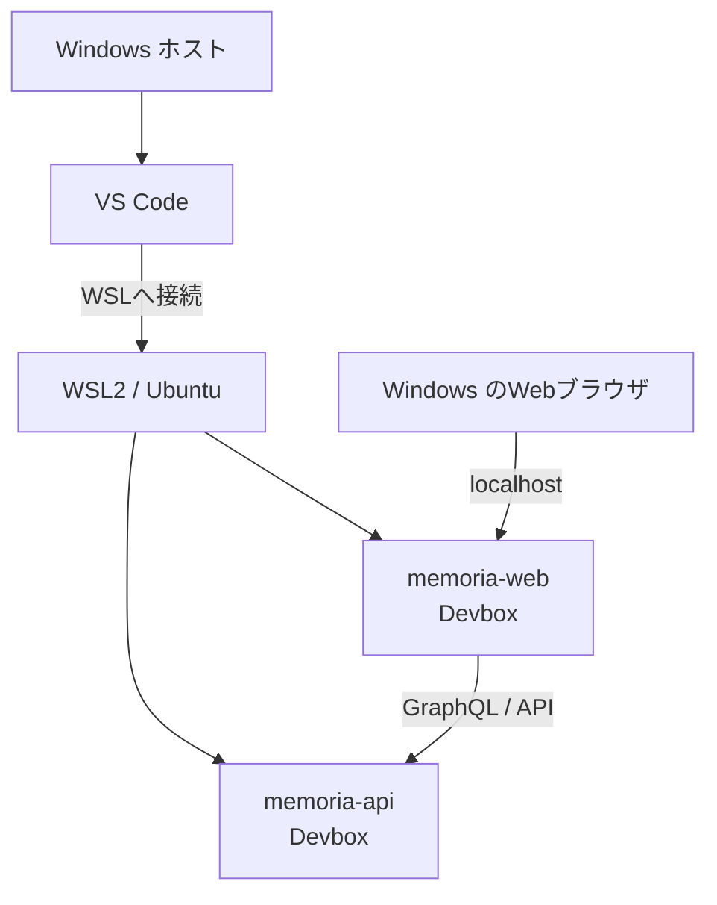

# ローカル開発環境

## 目的

Memoriaのローカル開発環境を再現可能にし、WindowsとLinuxの差異に起因する問題を切り分けやすくするための共通方針です。実行可能なコマンド、環境変数、ポートなどのリポジトリ固有情報は、各リポジトリのREADMEと設定を正本とします。

## 標準構成



- WindowsをホストOSとし、WSL2上のUbuntuを開発環境とします。
- VS CodeからWSLへ接続し、Ubuntu側のリポジトリを開きます。
- Node.js、npm、Goなど、プロジェクトのコマンドはUbuntu上のDevbox内で実行します。
- `memoria-web`と`memoria-api`は、それぞれ別のターミナルでDevboxを起動します。
- 動作確認はWindowsのWebブラウザから`localhost`へアクセスして行います。
- Dockerを使用する場合は、WSLから利用できる状態にします。Docker Desktopを使う場合は対象ディストリビューションのWSL integrationを有効にします。

ローカル開発は人間による開発の主要環境です。AI支援専用の補助環境としては扱いません。

## ファイルの配置

リポジトリは、原則としてUbuntuのファイルシステム（例: `/home/<user>/workspace/`）へ配置します。`/mnt/c/`配下での開発は、ファイル監視やI/O性能、権限の差異が問題になる場合があるため標準構成にしません。

`node_modules`はUbuntu上で生成し、Windows、macOS、他のLinux環境からコピーまたは共有しません。

## 基本手順

### 1. WSLでリポジトリを開く

VS CodeをWSLへ接続し、Ubuntu側にcloneした対象リポジトリを開きます。ターミナルがUbuntu上で動作していることを確認します。

```sh
uname -a
pwd
```

### 2. Devboxへ入る

各リポジトリでDevbox shellを起動します。

```sh
devbox shell
```

以降の`npm`、`go`、コード生成、テスト、開発サーバーのコマンドは、原則としてこのshell内で実行します。

### 3. 依存関係をインストールする

lockfileを変更しない通常のセットアップでは、各リポジトリで文書化されたパッケージマネージャーとコマンドを使用します。npmを基準とするリポジトリでは次を使用します。

```sh
npm ci
```

### 4. WebとAPIを起動する

`memoria-api`と`memoria-web`を別々のWSLターミナルで開き、それぞれのDevbox内で起動します。起動コマンド、環境変数、ポートは各リポジトリのREADMEと設定を参照します。

1. APIを起動し、起動完了と待受ポートを確認します。
2. Webが参照するAPI endpointを確認します。
3. Webを起動します。
4. WindowsのWebブラウザから表示された`localhost` URLへアクセスします。
5. WebからAPIへの通信を含む操作を確認します。

## Nextraの確認

`memoria-design`はNextra 4とNext.js App Routerを使用します。MDX本文は`content/`、routeとlayoutは`app/`、サイドメニューの順序は各階層の`_meta.js`で管理します。

Devbox内で次を実行します。

```sh
npm ci
npm run dev
```

Windowsのブラウザから`http://localhost:3000`へアクセスします。変更を完了する前にビルドも確認します。

```sh
npm run build
```

## 依存関係の管理

npmパッケージは`package.json`と`package-lock.json`へ記録します。Devboxが提供するNode.jsなどの開発ツールは`devbox.json`と`devbox.lock`で管理します。開発者ごとの手動インストールを標準手順にせず、`npm ci`と`devbox shell`で再現できる状態を維持します。

## 再現性を維持する規則

- プロジェクトコマンドはWSL2 Ubuntu上のDevbox内で実行します。
- リポジトリと`node_modules`はUbuntu側に置き、OS間で共有しません。
- lockfileは意図した依存関係更新以外で再生成・削除しません。
- `package.json`とlockfileに記録された依存関係を`npm ci`で導入します。
- WebとAPIを結合確認するときは、両方をそれぞれのDevboxで起動します。
- Windowsブラウザからの`localhost`到達と、WebからAPIへの通信を分けて確認します。
- バージョン、ポート、環境変数、起動コマンドは、各実装リポジトリのREADMEと実行可能な設定を正本とします。


