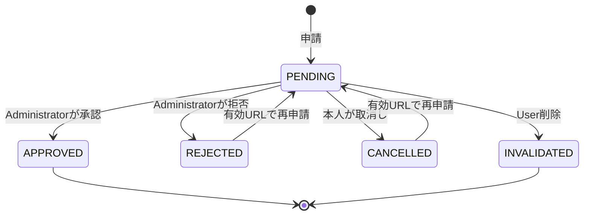
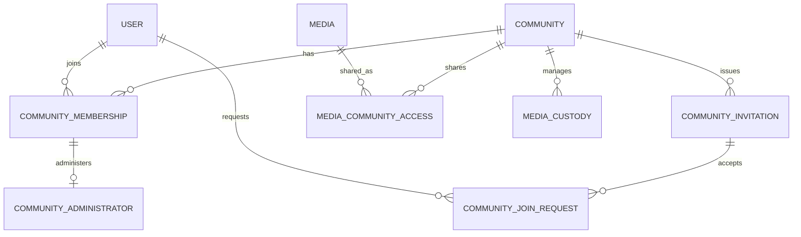

# Community詳細設計

## 概要

> 実装状況: Community関連のDB定義は一部存在しますが、本ページの参加申請、招待URL、Administrator制約、共有解除、Uploader権限のアプリケーション機能は未実装です。

Communityは、家族や友人などがMediaを共有する閉じた独立空間です。初回Releaseでは静止画像、Membership、Administrator、招待URL、参加申請、Community内のGroup・Tagを扱います。メール・push通知とMedia管理主体の委譲は初回Release対象外です。

## 基本情報と作成

- ログイン済みUserはCommunityを作成できる。
- `name`は必須とし、前後の空白を除去して空文字・空白だけの値を拒否する。名称の長さは入力・Security設計で決定する。
- 異なるCommunity間で同名を許可する。
- 説明、Community画像、公開profile、Community検索、作成者専用属性を持たない。
- 作成したUserを最初のMembershipおよびAdministratorとして、Community作成と同じTransactionで登録する。
- 作成者に恒久的な特権は与えない。別Administratorが残る場合は作成者も退会・User削除できる。
- Administratorは名称を変更でき、既存の招待URLは引き続き有効となる。

## MembershipとAdministrator

Communityは少なくとも1人のAdministratorを持ちます。Administratorは必ず有効なMembershipを持ち、複数人を設定できます。参加申請を承認したUserはMemberとして参加します。

| 操作 | Administrator | Member | Community外User |
| --- | --- | --- | --- |
| Community名・参加者一覧の閲覧 | 可能 | 可能 | 不可 |
| Community名の変更 | 可能 | 不可 | 不可 |
| 招待URLの発行・無効化・再発行 | 可能 | 不可 | 不可 |
| 参加申請一覧の閲覧・承認・拒否 | 可能 | 不可 | 不可 |
| Administrator権限の付与・解除 | 可能 | 不可 | 不可 |
| Member・Administratorの除外 | 可能 | 不可 | 不可 |
| CommunityへのMedia Upload | 可能 | 可能 | 不可 |
| User管理MediaのCommunity共有 | 自分のMediaのみ可能 | 自分のMediaのみ可能 | 不可 |
| Community内のGroup・Tagの作成とMedia分類 | 可能 | 可能 | 不可 |
| 自分の退会 | 最後のAdministrator以外は可能 | 可能 | 不可 |
| Community削除 | 条件を満たせば可能 | 不可 | 不可 |

Administrator権限の付与対象は参加済みMemberです。別Administratorが残る場合に限り、AdministratorをMemberへ戻すか、Communityから直接除外できます。事前の降格や複数人承認は必要ありません。

Administratorが2人同時に退会・除外・降格すると0人になる可能性があるため、Community行を同じ順序でlockし、更新後のAdministrator数を同じTransaction内で確認します。

参加者一覧には表示名、Administrator role、利用可能なprofile画像だけを表示します。メールアドレスは表示しません。参加申請一覧はAdministratorだけが閲覧します。

## 招待URL

AdministratorがCommunityごとに1件の有効な招待URLを発行します。tokenは推測困難な乱数とし、DBにはtokenのhashだけを保存します。

- 発行時刻から7日間有効。
- 有効期間内は複数人が同じURLから参加申請できる。
- 発行、無効化、再発行、状態確認はAdministratorだけができる。
- 再発行時には古いURLを同じTransactionで無効化する。
- URLはCommunityに属し、発行者の退会・除外・User削除だけでは失効しない。
- Community名の変更後も利用でき、招待画面には最新の名称だけを表示する。
- 期限切れ・無効化後は新規申請できないが、受付済み申請は維持する。
- Community削除後はURLを利用できず、名称を含むCommunity情報を表示しない。
- HTTPSを必須とし、tokenをlog、外部解析、第三者Serviceへ送信しない。
- URL確認と参加申請にはrate limitを適用する。具体値はSecurity要件で決定する。
- login後の戻り先はアプリケーション内で許可されたpathだけを受け付ける。

期限切れは`expires_at`の比較で判定し、状態を更新する常駐処理は必須としません。

## 参加申請

招待URLを開いたUserにはCommunity名だけを表示します。Member一覧、Media、Group、Tag、メールアドレスは参加承認まで表示しません。未登録Userはloginまたは登録後、元の招待画面へ戻って申請します。

- 申請者は参加前のUserに限定する。
- 同じCommunity・Userの未処理申請は同時に1件だけ許可する。
- 参加済みUserの申請は拒否する。
- 申請自体には有効期限を設けない。
- すべてのAdministratorが申請者の表示名と利用可能なprofile画像を確認し、承認・拒否できる。
- 承認時にMemberとしてMembershipを作成する。
- 申請者は承認前に申請を取り消せる。
- 拒否・取消し後は有効な招待URLから再申請できる。過度な申請・取消しはrate limit対象とする。
- URLの失効・再発行だけでは既存申請を無効化しない。
- 申請者がUser削除した場合は申請を無効化し、承認待ち一覧から除外する。
- 承認・拒否・取消し・User削除が競合した場合は、先にcommitした処理を有効とし、後続は現在状態を再確認する。
- 承認または拒否したAdministratorと処理日時を記録する。
- 拒否理由入力、一括拒否、block機能、メール・push通知は初回Releaseに含めない。

## Mediaの共有と直接Upload

| 操作 | Custodian | Media本体 | Communityでの扱い |
| --- | --- | --- | --- |
| User管理Mediaを共有 | Userのまま | 複製しない | 参加者全員が閲覧できる |
| Communityへ直接Upload | Community | 新しいMediaを登録 | Communityの参加者が閲覧できる |
| User管理MediaをCommunityへ委譲 | UserからCommunityへ変更 | 複製しない | 初回Release対象外 |

共有できるのは対象MediaのUser Custodian本人であり、本人が参加しているCommunityだけを共有先にできます。Administratorによる事前承認は不要です。1つのMediaを複数Communityへ共有できます。

共有解除はUser Custodian本人、または共有先CommunityのAdministratorが実行できます。解除対象はそのCommunityとの閲覧関係と、そのCommunity内のGroup・Tag関連だけです。Media本体、Custody、他Communityの共有・分類には影響させません。

CommunityへはAdministratorとMemberのどちらも直接Uploadできます。Community管理MediaのUploader本人は、Community参加中に限り、自分がUploadしたMediaを削除しOriginalをdownloadできます。

| Media | 操作者 | Variant閲覧 | Original download | Media削除 | 共有解除 |
| --- | --- | --- | --- | --- | --- |
| User管理Media | User Custodian | 可能 | 可能 | 可能 | 可能 |
| Communityへ共有されたUser管理Media | 共有先Administrator | 可能 | 不可 | 不可 | 対象Communityのみ可能 |
| Communityへ共有されたUser管理Media | 共有先Member | 可能 | 不可 | 不可 | 不可 |
| Community管理Media | Administrator | 可能 | 可能 | 可能 | 対象外 |
| Community管理Media | 参加中のUploader本人 | 可能 | 可能 | 可能 | 対象外 |
| Community管理Media | その他のMember | 可能 | 不可 | 不可 | 対象外 |
| Community管理Media | 退会済みUploader | 不可 | 不可 | 不可 | 対象外 |

Media情報の編集機能は、初回Releaseで必要な編集項目がない限り提供しません。将来追加する場合はAdministratorと参加中のUploader本人へ許可します。file本体の差し替えは提供しません。

## GroupとTag

AdministratorとMemberはCommunity内のGroup・Tagを作成し、閲覧できるMediaを分類できます。User管理MediaをCommunityへ共有した場合も、そのCommunity内だけで有効なGroup・Tagを設定できます。

- Group・TagはMediaの管理主体や閲覧権限を変更しない。
- Community側の分類は、共有元Userの個人領域の分類とは独立する。
- 共有解除時は対象MediaのCommunity側Group・Tag関連だけを削除する。
- Group・Tag本体と、他Mediaの分類は保持する。
- Group・Tag自体の編集・削除権限、名称、階層構造はそれぞれの詳細設計で確定する。

## 退会と除外

Memberは自分で退会できます。AdministratorはMemberまたは別Administratorを除外できます。ただし、最後のAdministratorの退会・除外・降格は禁止します。

退会または除外時には、Membership削除、Administrator権限削除、本人がCustodianであるMediaの当該Community共有解除、当該CommunityのGroup・Tag関連解除を同じTransactionで行います。

Community管理MediaはUploaderが退会してもCommunityへ残し、退会済みUploaderによる閲覧、削除、Original downloadを禁止します。退会したUserが過去にCommunity内で作成したGroup・TagはCommunityに残します。

Communityから除外されたUserも、有効な招待URLがあれば再申請できます。Administratorが再承認しない限り参加できません。

## Community削除

Administratorの1人が、他Administratorの同意なしでCommunityを削除できます。確認画面に対象名称と削除の影響を表示し、Community名の入力を要求します。

- `media_custodies.community_id`が対象CommunityのMediaが1件でもある場合は削除できない。
- 初回Releaseでは管理主体の委譲がないため、対象Mediaをすべて削除する必要がある。
- Community、Membership、Administrator権限、招待URL、参加申請、共有関係、Community内Group・Tagを同じTransactionで削除または無効化する。
- 共有されていたUser管理Media本体、User側分類、他Communityの共有・分類は変更しない。
- 削除したCommunityは復元できない。
- 実行Userと実行日時はSecurity・Privacy要件で定める範囲で記録する。

## User削除と削除済みUploader

UserがCommunityの最後のAdministratorである場合は、別のMemberへAdministrator権限を付与するか、Communityを削除するまでUserを削除できません。その他のMembershipは退会処理と同じ規則で解消します。未処理の参加申請は無効化します。

Community管理MediaはUploaderがUser削除しても保持し、表示上は「削除済みUser」として扱います。氏名・メールアドレス等の個人情報を保持することは前提にせず、匿名化や識別子の具体的な方式はUser詳細設計とSecurity・Privacy要求で決定します。削除済みUploaderには権限を与えません。

## 論理データモデル

AdministratorをMembershipとは別tableで表現する既存設計に合わせ、role列と別tableの二重管理は行いません。Membershipを持つ全員がMemberであり、Administrator行の存在が管理権限を表します。

## Transactionと競合制御

| 操作 | 同じTransactionで確定する内容 |
| --- | --- |
| Community作成 | Community、Membership、Administrator登録 |
| 招待URL再発行 | 既存URL無効化、新規URL登録 |
| 参加申請 | URL有効性、Community存在、Membership不存在、重複申請確認、申請登録 |
| 申請承認 | Administrator権限、申請状態、User存在確認、Membership作成、申請確定 |
| 申請拒否・取消し | 操作者権限、PENDING確認、状態更新 |
| Administrator追加・解除 | Membership確認、Community lock、管理者数の再確認 |
| 退会・除外 | 最終Administrator確認、Membership削除、User管理Mediaの共有解除、Community分類関連削除 |
| 共有追加・解除 | Membership・Custody確認、Access追加・削除、Community分類関連削除、Event記録 |
| Community削除 | Community lock、管理Media不存在確認、関連情報削除・無効化 |

操作間のdeadlockを避けるため、Community、Membership、Media/Custodyの順に一貫してlockします。認可と存在確認はlock取得後に再評価します。Community削除と直接Uploadが競合する場合も同じCommunity行をlockし、削除後のUploadや管理Mediaを残した削除を防ぎます。

## エラーと境界条件

| 状況 | 扱い |
| --- | --- |
| 未認証UserによるCommunity操作 | 認証が必要 |
| Community外Userによる詳細取得 | 情報を公開しない |
| 招待tokenが無効・期限切れ | 参加申請を受け付けない |
| 参加済みUserの申請 | 重複参加として拒否 |
| 未処理申請の重複 | 既存申請を維持し重複登録しない |
| 拒否・取消し後の再申請 | 有効URLから可能 |
| 最後のAdministratorの退会・降格・除外 | 拒否 |
| Community管理Mediaが残るCommunity削除 | 拒否 |
| Membershipを失ったUploaderの操作 | 拒否 |
| 同時承認・拒否・取消し | 先にcommitした状態を採用 |
| User削除と申請承認の競合 | 削除済みUserの参加を禁止 |

## 初回Release対象外

- メール通知・push通知：[通知機能の検討 #47](https://github.com/hazuki3417/memoria-design/issues/47)
- Media管理主体の委譲：[委譲機能の詳細設計 #48](https://github.com/hazuki3417/memoria-design/issues/48)
- Community説明、公開検索、User block、一括承認・拒否、一括委譲
- file本体の差し替え、実際の編集項目がないMedia編集画面

## 関連資料

- [CommunityとMediaの共有](./community-access)
- [Media物理データモデル](./physical-data-model)
- [Mediaレコードパターン](./record-patterns)
- [Mediaの整合性とTransaction](./consistency-transactions)
- [User削除時のMedia処理](./user-deletion)
- [初回Releaseの範囲と成功条件](/first-release)
