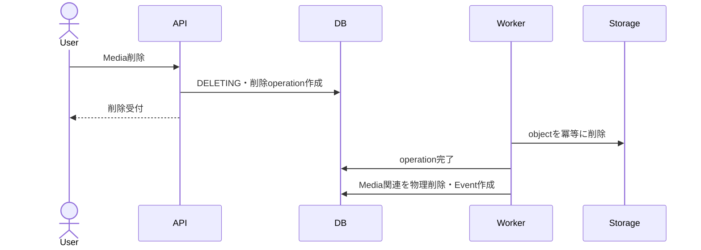

# Mediaの整合性とTransaction

## 概要

> 実装状況: ImageのDB・Object Storage操作は存在しますが、Custody・Access・Eventとstorage operationを含むtransaction設計は未実装です。

DB内の整合性はPostgreSQL transactionで保証し、Object Storageとの整合性は冪等操作と再試行で保証します。外部I/OをDB transactionへ含められるものとして扱いません。

## Transaction境界

| ユースケース | DB transactionに含める処理 |
| --- | --- |
| upload | Media、subtype、Custody、UPLOADED event、Processing Job、Outbox Eventの作成 |
| 共有・解除 | Custody確認、Access追加・削除、Event作成 |
| 委譲 | Custody lock、全Access削除、Custody更新、Event作成 |
| Group追加・解除 | scope・権限・循環確認、関連更新 |
| 削除要求 | ACTIVE確認、DELETING更新、storage operation作成 |
| 削除完了 | domain関連削除、Media削除、DELETED event作成 |
| User削除 | 管理対象が0件であることの確認とUser削除 |
| Community作成 | Community、Membership、Administratorの登録 |
| 招待URL再発行 | 既存URLの無効化、新規URLの発行 |
| 参加申請 | token・期限・Community確認、重複防止、PENDING登録 |
| 参加承認 | PENDING確認、User存在確認、Membership登録、承認記録 |
| 退会・除外 | 最終Administrator確認、Membership削除、共有解除、Community内Group・Tag関連削除 |
| Community削除 | Community lock、管理Media不存在確認、Membership・共有・分類・招待・申請の削除 |

GraphQLの同一requestに複数Mutationがあっても、Mutationごとに独立したtransactionとします。Mutationをnestして複数操作を一つのtransactionにするAPIは提供しません。

## 競合制御

### 委譲・共有・削除

対象の`media_custodies`と`media`を`SELECT ... FOR UPDATE`でlockします。lock取得後に操作者がCustodianを変更できるか再確認します。

- 委譲と共有が競合した場合、先にcommitした結果を後続処理が再検証
- DELETING Mediaへの共有・委譲・Group追加を拒否
- 同じCommunityへの同時共有は複合PKで重複を防止
- update件数が期待値と異なる場合は競合errorとしてrollback

### Communityとの境界

Community作成、Administrator権限、招待URL、参加申請、退会・除外、Community削除のTransactionと競合制御は[Communityの整合性とTransaction](/community/consistency-transactions)を正本とします。Media domainではCommunityとの共有、Media Custody、Upload、Media削除、Object Storageとの整合性を扱います。

### Group DAG

relation追加前に、追加するchildからparentへ到達できるかをrecursive CTEで確認します。確認とinsertは同一transactionで行い、関連するGroup行を一定順序でlockします。

## Upload

初期構成ではFrontendがAPIへOriginalを送信し、APIがObject Storageへ保存します。Frontendから署名付きURLでS3へ直接uploadする方式は、APIまたはEC2の通信負荷が問題になった場合の将来的な最適化候補であり、現在のupload契約には含めません。

1. APIでfile size、MIME type、実dataを検査
2. ULIDのMedia IDを生成
3. Object Storageの最終keyへOriginalだけをupload
4. DB transactionでMedia、subtype、Custody、Media Event、Processing Job、Outbox Eventを作成
5. DB transaction失敗時はupload済みobjectを冪等に削除
6. 補償削除に失敗した場合は運用retry対象として記録

DBへ先に登録しないのは、利用可能なMedia行がfileなしで残ることを避けるためです。Objectだけが残る失敗は一覧取得へ影響せず、補償削除できます。

個人領域へのuploadではUser、Communityへの直接uploadではCommunityを初期Custodianとします。派生物はAPI request内で生成せず、commit後にOutbox PublisherがRedis Streamsへ通知し、Media Workerが非同期で生成します。APIからRedisへ直接送信しません。

将来S3への直接uploadを採用する場合は、署名付きURLの発行権限、完了通知、実dataの検証、未確定Objectの削除、Idempotency Key、DB transaction境界を改めて設計します。複数fileの選択やURLの一括発行を導入する場合も、retryと非同期処理の基本単位は1 Mediaのまま維持します。

## Delete

削除は復元を提供しませんが、DBとObject Storageの部分失敗を放置しないため一時的なDELETING状態を使用します。

- Objectが存在しない場合も削除成功として扱います。
- 一部objectの削除失敗は未完了operationだけをretryします。
- DELETING中のMediaは閲覧・更新対象から除外します。
- 完了後にMediaとdomain関連を物理削除します。
- backupは障害復旧用であり、個別Mediaの復元には使用しません。

## Event

現在状態のCustodyと操作traceを同じtableへ混在させません。

- `media_custodies`: 現在の管理主体
- `media_events`: 誰がどの操作をしたか
- `outbox_events`: 確定した変更をWorkerへ確実に伝達するための内部event
- application log・trace: 障害調査

Event作成は対象のdomain変更と同じDB transactionで行います。Eventが作成できない場合はdomain変更もrollbackします。

## 認可確認

認可は次の順で判定します。

1. 認証済みUserをcontextから取得
2. Media statusがACTIVEであることを確認
3. Custodian、Community Membership、Administrator、UploaderをDBで確認
4. 操作別の権限を判定
5. 更新対象をlockした後に権限を再確認

clientが指定したUser IDやCommunity IDだけを根拠にしません。Community管理MediaのOriginal download・削除ではAdministrator、または有効なMembershipを持つUploader本人であることを確認します。共有されたUser管理Mediaに対してAdministrator権限を拡張しません。

## Errorと再試行

- constraint違反はdomain errorへ変換し、DB詳細を共有しない
- deadlock・serialization failureは上限回数を設けてretry
- storage retryは指数backoffと最大間隔を設定
- retry回数だけで破棄せず、FAILEDとして運用から確認可能にする
- logへtoken、object内容、署名付きURL、個人情報を出力しない

## Test観点

各操作は、対象レコードだけでなく対象外レコードが変化していないことを確認します。

- transaction途中のerrorで部分更新が残らない
- 同時委譲でCustodianが複数にならない
- 委譲後にAccessが残らない
- Community CustodyへAccessを作れない
- Groupの多段循環を拒否する
- storage retryで二重削除errorにならない
- Media削除後も必要期間のEventを検索できる
