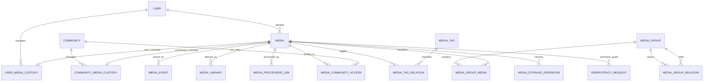
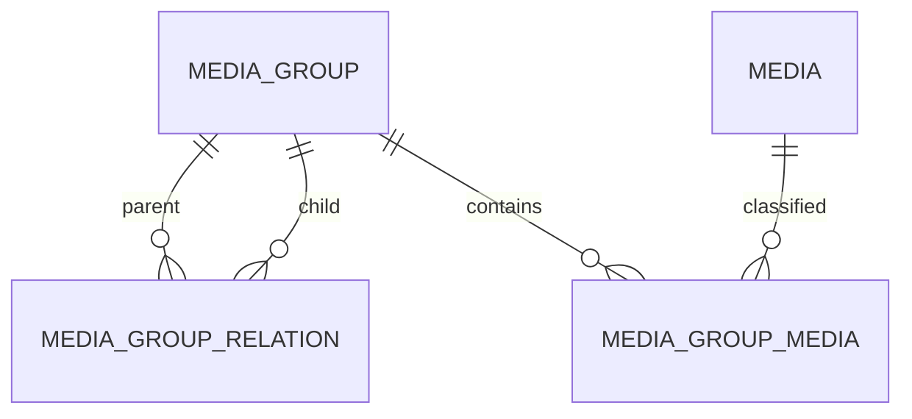

# Media論理データモデル

## 概要

> 現在の論理モデルはInitial Releaseの静止画像を対象とします。動画固有属性は現在の設計scopeに含めません。物理schemaの正本は`memoria-api/schemas/postgres/`です。

このページはMemoriaの論理データモデルを定義します。

## Entityと関連

```mermaid
erDiagram
  USER ||--o{ MEDIA : uploads
  USER ||--o{ USER_MEDIA_CUSTODY : manages
  COMMUNITY ||--o{ COMMUNITY_MEDIA_CUSTODY : manages
  MEDIA ||--o| USER_MEDIA_CUSTODY : user_custodian
  MEDIA ||--o| COMMUNITY_MEDIA_CUSTODY : community_custodian
  MEDIA ||--o{ MEDIA_EVENT : traced_by
  MEDIA ||--o{ MEDIA_VARIANT : derived_as
  MEDIA ||--o{ MEDIA_PROCESSING_JOB : processed_by
  MEDIA ||--o{ MEDIA_COMMUNITY_ACCESS : shared_to
  MEDIA ||--o{ MEDIA_TAG_RELATION : tagged
  MEDIA_TAG ||--o{ MEDIA_TAG_RELATION : classifies
  MEDIA_GROUP ||--o{ MEDIA_GROUP_MEDIA : contains
  MEDIA ||--o{ MEDIA_GROUP_MEDIA : classified
  MEDIA_GROUP ||--o{ MEDIA_GROUP_RELATION : parent
  MEDIA_GROUP ||--o{ MEDIA_GROUP_RELATION : child
  MEDIA ||--o{ MEDIA_STORAGE_OPERATION : cleanup
  MEDIA ||--o{ IDEMPOTENCY_REQUEST : command_guard
  COMMUNITY ||--o{ MEDIA_COMMUNITY_ACCESS : can_view
```

## Media

| 属性 | 意味 |
| --- | --- |
| id | Media識別子 |
| fileName・fileSize・mimeType | 原本の属性 |
| uploadedByUserId | 最初のUploader。User削除後は「削除済みUser」として扱う |
| uploadedAt | アップロード日時 |
| createdAt・updatedAt | 登録・更新日時 |

Media自体には管理主体を埋め込みません。Uploaderは操作の実行者、Custodyは現在の管理関係、Variantは表示用派生物、Processing Jobは非同期処理状態を表し、それぞれ独立して扱います。

## Media VariantとProcessing Job

Media Variantは対象Media、派生形式、幅・高さ、storage key、byte数を保持します。Imageではアスペクト比を維持した複数幅のWebPを生成し、一覧と詳細表示で共用します。Processing JobはMedia、処理種別、状態、試行回数、失敗内容を保持し、1 Jobは1 Mediaだけを対象にします。

## Custodianと共有

各MediaはUser Media CustodyまたはCommunity Media Custodyを必ず一つだけ持ちます。両方がない状態と両方がある状態をDB制約または同等の仕組みで禁止します。

User管理MediaはMedia Community Accessを複数持てます。Community管理Mediaは別CommunityへのAccessを持たず、CustodianであるCommunityの参加者が閲覧します。

個人領域へのuploadではUser、Communityへの直接uploadではCommunityが初期Custodianです。いずれもUploaderは実際にuploadしたUserとして記録します。

## Tag

TagはUser scopeまたはCommunity scopeを一つ持つflatな分類語です。Mediaとのrelationは多対多で、Custodyや閲覧権限を変更しません。Community scopeのTag relationは、そのCommunityで閲覧可能なMediaにだけ作成できます。Tagの作成・rename・削除とMedia分類の権限はTag仕様を正本とします。

## Media Group

```mermaid
erDiagram
  MEDIA_GROUP ||--o{ MEDIA_GROUP_RELATION : parent
  MEDIA_GROUP ||--o{ MEDIA_GROUP_RELATION : child
  MEDIA_GROUP ||--o{ MEDIA_GROUP_MEDIA : contains
  MEDIA ||--o{ MEDIA_GROUP_MEDIA : classified
```

GroupはUserまたはCommunityのスコープを一つ持ち、Mediaは複数Groupへ所属できます。Group関係はDAGで、複数の親を許可し、直接・間接の循環を禁止します。

## 不変条件

- 各MediaはUserまたはCommunityのどちらか一方をCustodianとして必ず1つ持つ。
- User管理Mediaだけが複数CommunityへのMedia Community Accessを持てる。
- Community管理Mediaは別CommunityへのAccessを持たない。
- Uploader、Custodian、閲覧権限は独立した概念として扱う。
- Media GroupとTagは分類専用で、Custodyや閲覧権限を変更しない。
- Group / Tag relationは対象scopeで現在閲覧可能なMediaにだけ存在でき、共有解除・退会等で可視性を失う場合はCommunity scope relationをcleanupする。
- Processing Job、Outbox、Storage Operation、Idempotency Requestは業務Entityと区別したdurable technical stateであり、画面の一時進捗やDraftを永続Entityとして表現しない。
- Group関係はDAGとし、自己参照と直接・間接の循環を禁止する。

## 他domainとの境界

Community、Membership、Invitation、User起点Join RequestはCommunity domainが所有します。Initial ReleaseのInvitation acceptはMembershipを直接成立させ、User起点Join RequestはInvitationとは独立した将来機能です。詳細は[Community論理データモデル](/community/data-model)を正本とします。

Media domainはMedia、Custody、Communityへの共有関係、Media Group、Tag、Variant、Processing Job、Outbox、Storage Operation、Idempotency Requestを所有します。Community MembershipはCommunity共有Mediaの閲覧やUploader権限を行使する前提として参照します。

Userの認証主体とaccount lifecycleは[User論理データモデル](/user/data-model)を正本とします。

## 詳細設計

- [物理データモデル](./physical-data-model)
- [レコードパターン](./record-patterns)
- [整合性とTransaction](./consistency-transactions)

