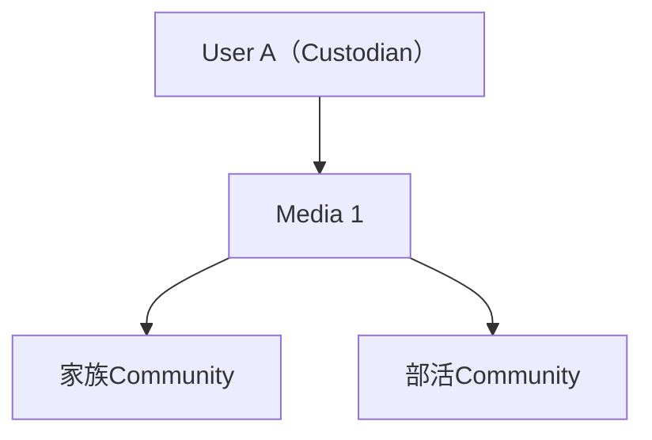
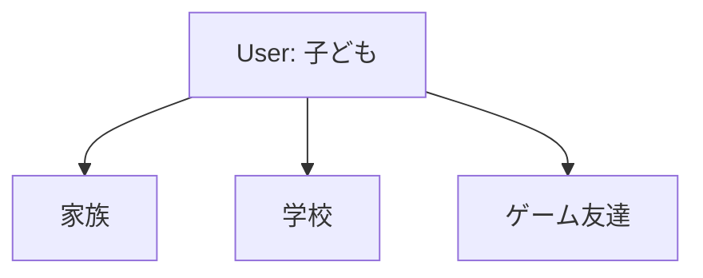
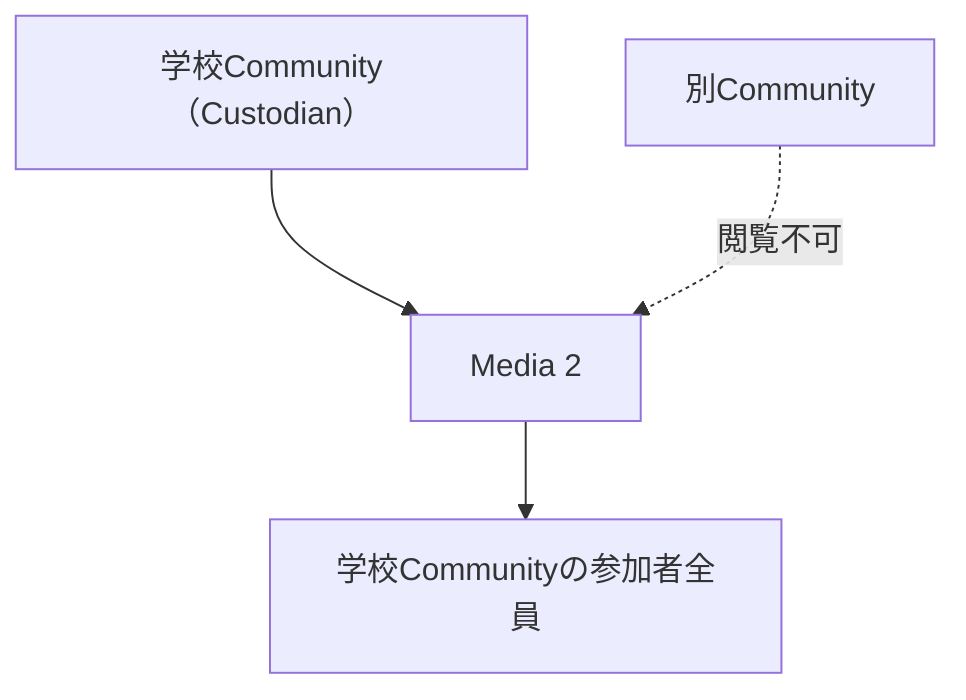
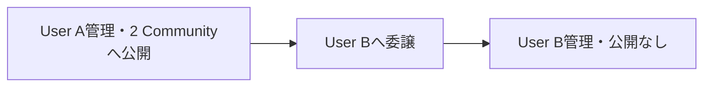
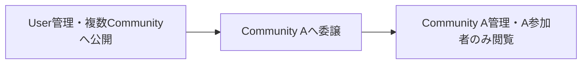
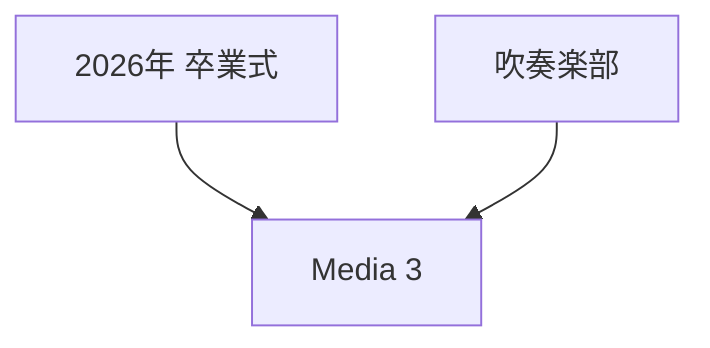
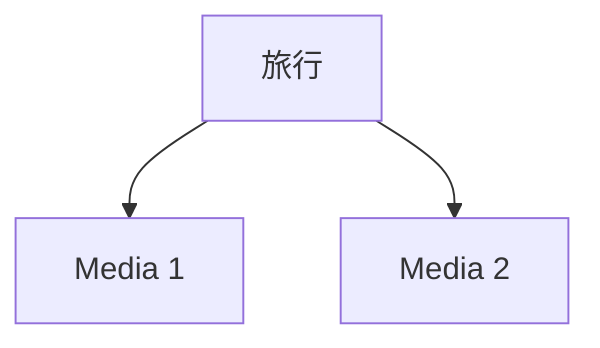
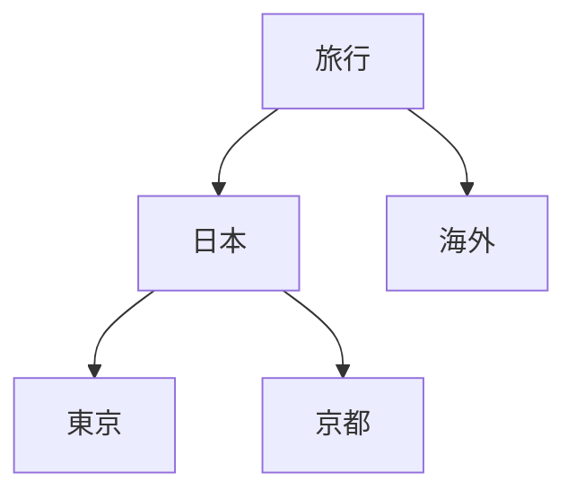
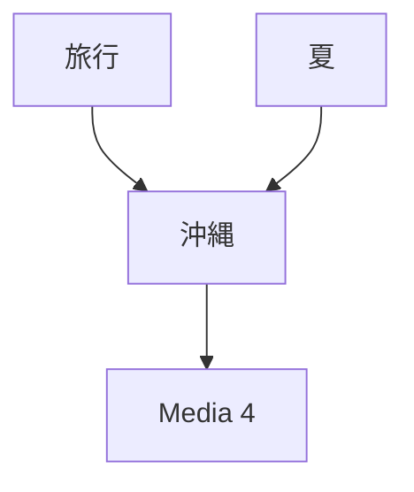
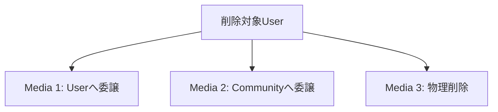

# Mediaデータパターン

## 概要

> 実装状況: ImageとImage Groupの一部は実装済みです。Media Custodian、Community公開、動画、委譲時の公開解除は設計との差分があります。

## 1. User管理Mediaを複数Communityへ公開

- CustodianはUser Aだけ
- 家族と部活の参加者は同じMediaを閲覧
- Community同士に関係はない
- Mediaを複製しない

## 2. Userが複数Communityへ所属

Userが共通していても、各Communityの参加者・Media・権限は独立します。

## 3. Community管理Media

Community管理Mediaを別Communityへ公開しません。

## 4. 委譲時の公開解除

### UserからUser

### UserからCommunity

以前の公開判断は継承しません。

## 5. Mediaの複数Group所属

同じMediaを複製せず、複数の分類から参照します。

## 6. Groupの単純構造

## 7. Groupの木構造

## 8. GroupのDAG

`沖縄`は`旅行`と`夏`の両方に所属します。循環は許可しません。

## 9. User削除

すべての管理Mediaを解決してからUserを削除します。

## 禁止パターン

- 1 Mediaを複数Userが共同管理
- 1 MediaをUserとCommunityが共同管理
- Community管理Mediaを別Communityへ公開
- Communityのネスト
- Community内の参加者別Media ACL
- Groupによるアクセス制御
- Group関係の循環
- CustodianがないMedia

