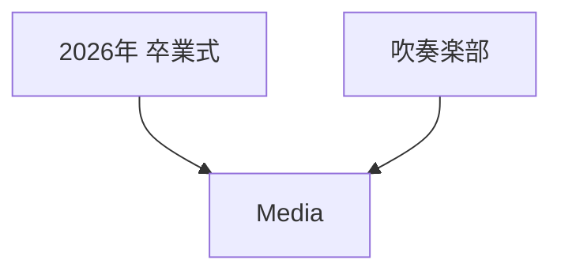
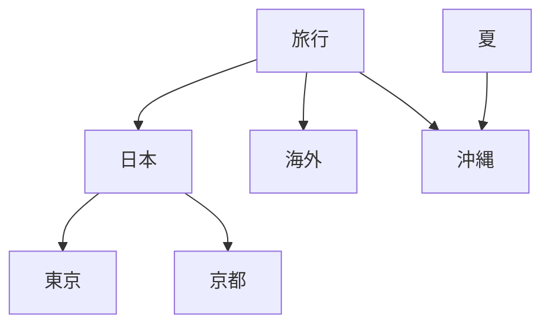

# Media Group

## 概要

> 実装状況: Image Groupと親子関係は一部実装済みです。Mediaへの名称統一、Communityでの権限、DAGの多段循環保証を含む本仕様との差分があります。

## 目的

Media GroupはMediaを分類・整理するための概念です。学校Communityで「2026年 卒業式」「2025年 運動会」のようにMediaをまとめる用途を想定します。

Groupはfolderではありません。Group自身も別Groupへ所属でき、同じGroupが複数Groupへ所属できます。結果として階層的に見える場合はありますが、一意なtreeやpathを前提としません。

Groupは次の情報へ影響しません。

- MediaのCustodian
- Communityへの共有範囲
- Community内部の閲覧権限
- 物理fileの保存場所

## 所属範囲

GroupはUser scopeまたはCommunity scopeのどちらか一方だけに所属します。

- Userは自分のPersonal Groupを作成・管理できる
- Community Groupの分類体系はCommunityのAdministratorが管理する
- CommunityのAdministratorとMemberは、既存のCommunity Groupを使って閲覧可能なMediaを分類できる
- User間でGroupを共有しない
- Community間でGroupを共有しない
- UserとCommunityの間でGroupを共有しない
- User管理MediaをCommunityへ共有した場合も、Community内だけで有効なGroup関連を作成できる
- 共有解除・退会・除外時は当該CommunityのMediaとGroupの関連だけを削除し、Group本体は保持する

Community Groupでは「分類体系を管理すること」と「分類体系を利用すること」を分離します。AdministratorはGroupの作成・rename・削除・Group間relationの追加と解除を行えます。MemberはGroup構造を変更せず、既存Groupを使ったMedia分類だけを行えます。Group作成者という追加のownershipや権限概念は導入しません。

## Group名

Group名はscope内でGroupを識別する名称です。

- Group名は必須とする
- 入力時に前後のUnicode whitespaceを除去し、除去後が空文字の場合は拒否する
- 同一scope内で同じ保存名のGroupを複数作成できない
- Personal Groupは同一User scope、Community Groupは同一Community scopeで重複を禁止する
- 別scopeでは同じGroup名を許可する
- 大文字・小文字、全角・半角、内部の連続空白等をSystemが自動統合しない
- renameにも同じ名称規則と重複判定を適用する
- Group名はtrim後100文字以内とする

100文字はGroupを一覧・検索・relation選択で人が識別する名称として十分な表現幅を確保しつつ、極端に長い名称をProductとして受け付けないための上限です。DB column幅やUI layoutから逆算した値ではなく、Product上の入力制約として扱います。作成とrenameの双方へ同じ上限を適用します。

## Mediaとの関係

1つのMediaは複数Groupへ所属できます。Media本体を複製せず、relationだけを追加します。

- 1つのGroupから除外しても他のGroup所属は維持する
- すべてのGroupから除外してもMedia本体は削除しない
- Groupを削除してもMedia本体は削除しない
- Media削除時はすべてのGroup関連を削除する

Media分類のrelation semanticsと権限は本設計を正本とします。Initial Releaseの具体的Interactionは[Media Browser / Detail](/screens/media-browser-detail)を正本とし、Media Detailでは1 Mediaのdirect Group relationを確認して追加・除外でき、Browserで明示選択した複数Mediaには1つ以上の同じ既存Groupを一括追加できます。Initial ReleaseではGroupからのbulk除外を主要Capabilityとしません。bulk追加でもMediaごとに現在scope・可視性・権限を再検証し、部分成功を許容します。

## Group同士の関係

Media Groupは有向非巡回グラフ（DAG）として扱います。同じGroupを複数の所属先Groupへ関連付けられますが、循環は許可しません。

Groupが複数の所属先を持てるため、Groupには一意なrootやbreadcrumb pathを定義しません。「日本 / 沖縄」のようなpathをGroupのidentityや正規Navigationとして扱いません。

### 制約

- relationは同一scopeのGroup間だけに作成できる
- 自分自身を所属先または所属Groupにできない
- 直接・間接を問わず循環を作れない
- 同じrelationを重複登録できない
- 所属先を持たないGroupを許可する
- 所属Groupを持たないGroupを許可する
- 1 scopeに作成できるGroupは1,000件までとする
- 1 Groupが直接所属できるGroupは10件までとする
- 1 Groupに直接所属するGroupも10件までとする
- DAGの深度は20段までとする

自己参照だけでなく複数段の循環も禁止し、serviceまたはDBで循環検出を保証します。

これらの規模上限は、特定の利用パターンから最適値を導出したものではありません。利用実績がない段階で過度に具体的なユースケースを作って上限を正当化せず、無制限なResource消費と極端に複雑な分類構造を避けるための初期境界値として定義します。実利用、性能test、運用上の必要性から不足または過剰であることが確認された場合は見直します。

## GroupのLifecycle

### 作成

Groupは名称だけで成立できます。作成時点で所属先Groupを持つことを必須にしません。

Group作成時は名称だけを入力して成立させます。所属先Groupの追加は作成後のGroup relation管理として別操作で行い、Group作成とrelation追加を一つの必須操作へ結合しません。

### rename

renameはGroupの名称だけを変更します。Groupのidentity、Media relation、他Groupとのrelationは維持します。

### 削除

Group削除では次を削除します。

- Group本体
- 対象GroupとMediaのrelation
- 対象Groupと他Groupのrelation

次は削除しません。

- Media本体
- 他Group本体
- 他Group同士のrelation

Group削除によって途切れたDAGをSystemが自動的に再接続しません。例えば `日本 → 沖縄 → 那覇` で「沖縄」を削除しても、`日本 → 那覇` を自動生成しません。

削除前には、GroupによるMedia分類と他Groupとのrelationが削除される一方、Media本体と他Groupは削除されないことをUserが理解できる確認を提供します。Group名の再入力は要求しません。

## Group relationの操作

Group間relationは、対象Groupを中心に「このGroupが所属するGroup」と「このGroupに所属するGroup」の双方を管理する操作として扱います。

Group詳細では少なくとも次の関係を確認できるようにします。

- このGroupが所属するGroup
- このGroupに所属するGroup

Initial Releaseでは、選択中Groupを基準として所属先Group（parents）と所属Group（children）の双方を同じrelation編集Interactionから追加・解除できます。Userは個別の追加・解除Commandを順番に実行するのではなく、編集後のrelation状態をDraftとして構成し、保存時に追加・解除の差分をまとめて反映します。

relation先の検索対象は同一scopeのGroupに限定します。検索結果からGroup自体を除外することで制約を表現せず、対象Groupとの各方向について現在のrelation状態と追加可否を識別できるようにします。自己参照、既存relation、循環、深度、直接relation数上限等により追加できない方向はActionを無効化し、Userが理由を確認できるようにします。UIで事前に選択を防いでも、APIは保存時の現在状態を再検証して制約違反を拒否します。

relation解除は指定したrelationだけを削除します。他のGroup relationやMedia relationには影響せず、解除後に所属先が0件になっても正常です。GroupやMedia本体を削除しないため、Group削除と同等の強い破壊的確認は要求しません。

## Group UXの基本方針

Groupはfolder treeやgraph editorとして表現しません。

通常のGroup discoveryではGroupをflatに発見できるようにし、Groupを選択した後はそのGroupを中心として所属先Group、所属Group、Mediaを確認します。複数所属を通常のdomain capabilityとして扱いますが、DAG全体を常時visualizeすることはInitial Releaseの主要Interactionにしません。

この方針により、DAGの能力を維持しながら、一意でないtree pathや大規模graphの理解をUserへ要求しません。

PersonalとCommunityでは同じInteraction modelを利用できます。違いはscopeと操作権限です。

## Tagとの違い

| 概念 | 用途 |
| --- | --- |
| Tag | Mediaへ短い属性・検索語を付ける |
| Media Group | 名称とGroup間relationを持つ分類構造 |

TagとGroupは併用でき、どちらもアクセス制御には使用しません。TagはInitial Release対象ですが、基礎設計と具体的なInteractionは別途設計します。

## 未決定事項

次はGroupのdomain semanticsを変更せず、関連設計を進める段階で確定します。

- Group一覧queryのcursor paginationと検索matchingの具体的なAPI契約
- GraphQL Operation名、Input / Payload、error表現

Group全体をgraphとしてvisualizeする機能、Groupの作成者ownership、folder固有のmove semanticsはInitial Releaseの前提にしません。
