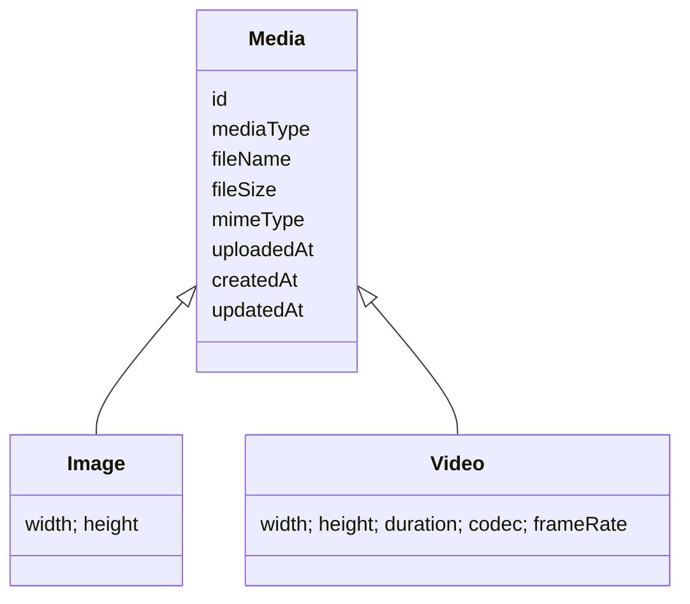

# Media

## 概要

> 実装状況: 現在の実装は静止画像を表すImageが中心です。Mediaへの名称・データモデル統一と動画対応は未実装です。

Memoriaは静止画像と動画を管理・共有・継承するシステムです。Word、PDF、記事、音声単体などを扱う汎用ストレージにはしません。

[初回Release](/first-release)で提供するMediaは静止画像に限定します。動画はProduct全体の将来的な対象ですが、初回Releaseの必須機能には含めません。

## 目的と対象範囲

Media domainは静止画像・将来の動画、その管理主体、共有、分類、派生物、処理状態、削除ライフサイクルを扱います。CommunityそのもののMembership・InvitationやUserの認証・account lifecycleは所有しません。

## 主要概念

- Uploaderは最初にアップロードしたUserです。著作権者や法的所有者を意味しません。
- CustodianはMediaを現在管理する1 Userまたは1 Communityです。
- Viewerは共有先Communityへの参加を通してMediaを閲覧します。
- Media Eventはアップロード、委譲、共有変更、削除など重要操作のトレースです。
- Media VariantはOriginalから生成する表示用の派生物です。画像一覧と詳細表示は同じ派生物を使用します。
- Media Processing Jobは派生物の非同期生成を管理します。Uploader、Custodian、閲覧権限はそれぞれ独立した概念です。

## 制約と責務境界

1. Mediaには常に1つのCustodianが存在します。
2. Custodianは1 Userまたは1 Communityのどちらか一方です。
3. 管理責任と閲覧可能範囲を分離します。
4. User管理Mediaは複数Communityへ共有できます。
5. Community管理Mediaは別Communityへ共有しません。
6. Community内部では参加者全員が共有Mediaを閲覧できます。
7. Media Groupは分類専用で、管理・閲覧権限に影響しません。
8. 削除したMediaは復元できません。
9. 著作権者、利用許諾、権利移転は管理しません。

Community、Membership、Invitation、User起点Join Requestは[Community設計](/community)を正本とします。Userの認証主体とaccount lifecycleは[User設計](/user)を正本とします。

## 設計書の読み取り順序

詳細は[ユースケース](./use-cases)、[論理データモデル](./data-model)、[物理データモデル](./physical-data-model)、[レコードパターン](./record-patterns)、[整合性とTransaction](./consistency-transactions)、[Media処理と派生物](./processing)を参照してください。

## 初回Release対象外

- 動画の機能提供
- Media管理主体の委譲（[Issue #48](https://github.com/hazuki3417/memoria-design/issues/48)）
- 削除Mediaの復元
- Word・PDF・音声単体などMedia境界外のfile管理

