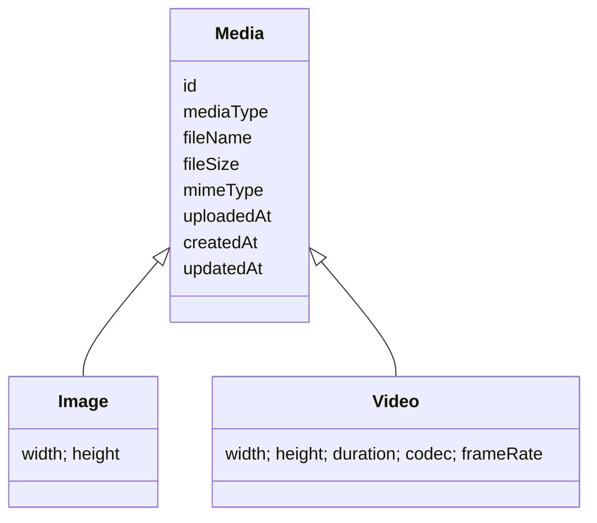

# Media

## 概要

> 実装状況: 現在の実装は静止画像を表すImageが中心です。Mediaへの名称・データモデル統一と動画対応は未実装です。

Memoriaは静止画像と動画を管理・共有・継承するシステムです。Word、PDF、記事、音声単体などを扱う汎用ストレージにはしません。

## 概念

- Uploaderは最初にアップロードしたUserです。著作権者や法的所有者を意味しません。
- CustodianはMediaを現在管理する1 Userまたは1 Communityです。
- Viewerは公開先Communityへの参加を通してMediaを閲覧します。
- Media Eventはアップロード、委譲、公開変更、削除など重要操作のトレースです。

## 制約

1. Mediaには常に1つのCustodianが存在します。
2. Custodianは1 Userまたは1 Communityのどちらか一方です。
3. 管理責任と閲覧可能範囲を分離します。
4. User管理Mediaは複数Communityへ公開できます。
5. Community管理Mediaは別Communityへ公開しません。
6. Community内部では参加者全員が公開Mediaを閲覧できます。
7. Media Groupは分類専用で、管理・閲覧権限に影響しません。
8. 削除したMediaは復元できません。
9. 著作権者、利用許諾、権利移転は管理しません。

詳細は[ユースケース](./use-cases)、[論理データモデル](./data-model)、[物理データモデル](./physical-data-model)、[レコードパターン](./record-patterns)、[整合性とTransaction](./consistency-transactions)を参照してください。

