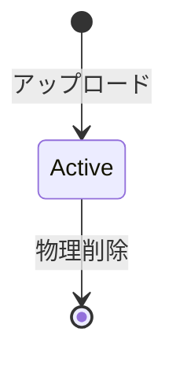

# Mediaライフサイクル

## 概要

> 実装状況: Image削除は存在しますが、Media全体、派生ファイル、再試行を含む一貫した削除処理には差分があります。

物理削除、削除確認、削除中状態、backup、再試行の共通規則は[削除・Lifecycle共通方針](/system/cross-cutting/deletion-lifecycle)を正本とします。

## 状態

利用者向けのMedia状態は、利用中または削除済みの2つです。DELETINGはStorage cleanup用の内部状態であり、復元可能な状態ではありません。

## アップロード

アップロード時に次を確定します。

- Media ID
- Media種別
- 物理ファイル
- 共通・種別固有メタデータ
- Uploaderとアップロード日時
- 初期Custodian
- UPLOADEDイベント
- 派生物生成のProcessing JobとOutbox Event

個人領域へアップロードした場合の初期CustodianはUser、Communityへ直接アップロードした場合はCommunityです。Uploaderは実行したUserを記録しますが、著作権または法的所有権の根拠とは扱いません。Originalを保存した後にdomain情報・Job・Outbox Eventを同じtransactionで確定し、表示用VariantはWorkerで非同期に生成します。

## 削除

- Media本体を物理削除する
- DBレコードを削除する
- Groupとの関連を削除する
- Communityへの公開設定を削除する
- 幅別Variantなどの派生ファイルを削除する
- 削除した事実をDELETEDイベントとして記録できる
- 削除したMediaは復元できない

削除前に次を明示します。

> 削除したMediaは復元できません。

## 整合性とbackup

Media固有のStorage operationと削除対象は[Mediaの整合性とTransaction](./consistency-transactions)を正本とします。外部I/O、retry、backupからの個別復元を提供しない方針は[削除・Lifecycle共通方針](/system/cross-cutting/deletion-lifecycle)に従います。

## 対応しない機能

- ごみ箱
- 論理削除
- Userからの復元
- 問い合わせによる個別復元
- 削除Media専用のarchive schema
- 削除Media専用のarchive bucket

