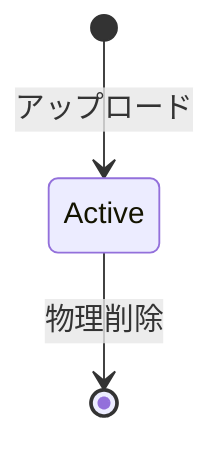

# Mediaライフサイクル

## 概要

> 実装状況: Image削除は存在しますが、Media全体、派生ファイル、再試行を含む一貫した削除処理には差分があります。

## 状態

利用者向けのMedia状態は、利用中または削除済みの2つです。ごみ箱、論理削除、アーカイブ、復元可能期間は設けません。

## アップロード

アップロード時に次を確定します。

- Media ID
- Media種別
- 物理ファイル
- 共通・種別固有メタデータ
- Uploaderとアップロード日時
- 初期Custodian
- UPLOADEDイベント

初期CustodianはアップロードしたUserです。Userがアップロードした事実を、著作権または法的所有権の根拠とは扱いません。

## 削除

- Media本体を物理削除する
- DBレコードを削除する
- Groupとの関連を削除する
- Communityへの公開設定を削除する
- サムネイル、プレビューなどの派生ファイルを削除する
- 削除した事実をDELETEDイベントとして記録できる
- 削除したMediaは復元できない

削除前に次を明示します。

> 削除したMediaは復元できません。

## 整合性

オブジェクトストレージとDBを単一トランザクションにできないため、削除処理の失敗を検知し、完了するまで再試行できるようにします。これは利用者向けの復元機能ではありません。

## バックアップ

障害復旧用バックアップに削除済みデータが一時的に含まれる可能性はありますが、個別Mediaの復元には使用しません。バックアップの保持と破棄は、システム全体の災害復旧方針として別に管理します。

## 対応しない機能

- ごみ箱
- 論理削除
- Userからの復元
- 問い合わせによる個別復元
- 削除Media専用のarchive schema
- 削除Media専用のarchive bucket

