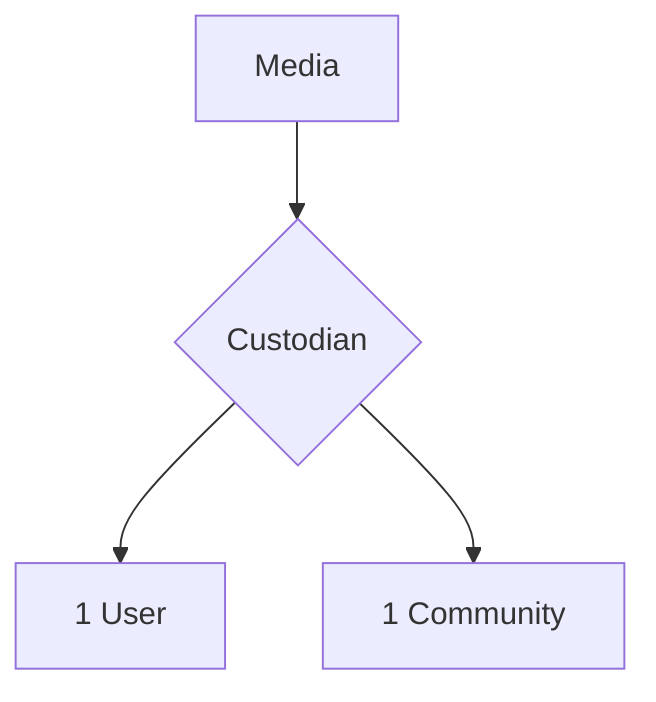

# Mediaの管理主体と委譲


## 概要

> 実装状況: Custodian、Media Event、委譲時の公開解除は未実装です。

## 管理主体

Mediaには常に1つのCustodianが存在します。Custodianは管理責任を表し、法的な所有者や著作権者を表しません。



次の状態は許可しません。

- Custodianが存在しない
- 複数Userによる共同管理
- 複数Communityによる共同管理
- UserとCommunityによる共同管理

管理と公開は別の概念です。Custodianであることは、他のCommunityへの公開を意味しません。

## Uploader

Mediaにはアップロード日時と最初のUploaderを記録します。管理主体を委譲してもUploaderは変更しません。

Uploaderは操作のトレースを目的とした情報であり、著作権者や法的所有者ではありません。User削除後にUploaderが不明になることを許容します。

## Media Event

詳細なセキュリティ監査ログではなく、Mediaに対する重要操作をトレースします。

| Event | 記録対象 |
| --- | --- |
| UPLOADED | Mediaを登録した |
| CUSTODIAN_CHANGED | 管理主体を委譲した |
| ACCESS_CHANGED | Communityへの公開を追加・解除した |
| DELETED | Mediaを削除した |

`actorUserId`はUser削除後に不明となることを許容します。保存期間はストレージ費用と操作追跡の必要期間を基準に運用設計で定め、永久保存は要件としません。

## 委譲

現在対応する委譲は次の3種類です。

- UserからUser
- UserからCommunity
- CommunityからUser

CommunityからCommunityへの直接委譲は、具体的なユースケースがないため対応しません。Community統合や閉鎖が必要になった場合に専用ユースケースとして再検討します。

### 公開設定

委譲時は既存の公開設定をすべて解除します。委譲先がUserの場合は、必要に応じて改めてCommunityへ公開します。委譲先がCommunityの場合は、そのCommunityの参加者だけが閲覧できます。

```mermaid
sequenceDiagram
    actor Actor as 操作者
    participant Media
    participant Access as 公開設定
    participant Event as Media Event
    Actor->>Media: 委譲を要求
    Media->>Access: 既存公開をすべて解除
    Media->>Media: Custodianを変更
    Media->>Event: CUSTODIAN_CHANGEDを記録
    Media-->>Actor: 委譲完了
```

公開解除とCustodian変更は、一貫した結果になるよう同じ処理単位で扱います。途中で失敗した場合は委譲を完了しません。

### 利用者への通知

委譲前に次を明示します。

> 委譲すると、現在の公開先はすべて解除されます。

委譲先による承認や再公開依頼のワークフローは設けず、必要な連絡は利用者間のコミュニケーションで解決します。


