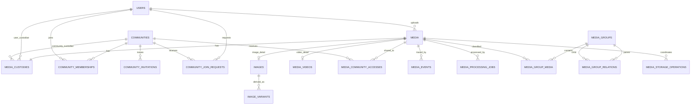

# Media物理データモデル

## 概要

> 実装状況: PostgreSQLは`images`、`image_groups`などImage中心です。このページのMedia table、Custody、Media Event、動画属性、storage operationは未実装です。

PostgreSQLへ実装するMedia関連table、column、constraint、index、削除規則を定義します。

## PostgreSQL schema

本domainが所有するrelationは`media` schemaへ配置します。schema名と共通の参照規約は[物理データモデル共通規約](/system/data/physical-model-conventions)を正本とします。

## 共通規約

ID、日時、命名、constraint、index、削除方針は[物理データモデル共通規約](/system/data/physical-model-conventions)に従います。本ページではMedia domain固有の定義と例外を記載します。

## 全体ER



## 所有table

### media

| 列 | 型 | 制約 | 意味 |
| --- | --- | --- | --- |
| id | varchar(26) | PK | Media ID |
| media_type | varchar(16) | NOT NULL、CHECK | `IMAGE`または`VIDEO` |
| original_file_name | text | NOT NULL | upload時のfile名 |
| extension | varchar(32) | NOT NULL | 正規化した拡張子 |
| mime_type | varchar(255) | NOT NULL | 検証済みMIME type |
| file_size | bigint | NOT NULL、CHECK 0以上 | 原本byte数 |
| uploaded_by_user_id | varchar(26) | FK users、ON DELETE SET NULL | 最初のUploader。NULLの場合は「削除済みUser」として表示 |
| uploaded_at | timestamptz | NOT NULL | upload完了時刻 |
| status | varchar(16) | NOT NULL、CHECK | `ACTIVE`または`DELETING` |
| created_at | timestamptz | NOT NULL | 登録時刻 |
| updated_at | timestamptz | NOT NULL | 更新時刻 |

`status=DELETING`はObject Storage削除を完了させるための一時的な処理状態です。ごみ箱、復元、論理削除には使用しません。通常のQueryは`ACTIVE`だけを返します。

利用者向けMedia一覧は原則として`created_at DESC, id DESC`で表示します。CustodyまたはCommunity Accessで対象Mediaを絞り込む場合も、作成日時の正本は`media.created_at`とし、index最適化だけを目的として`media_custodies`や`media_community_accesses`へMedia作成日時を複製しません。relationをJOINしてMedia側の作成日時でsort / cursor paginationし、実データ量と実行計画から追加最適化が必要になった場合にindexやQuery形を再検討します。

index:

- `(uploaded_by_user_id, uploaded_at DESC, id DESC)`
- `(media_type, created_at DESC, id DESC)`
- `(status)`は削除処理の再開に使用

### images・media_videos

ImageはMediaのsubtype detailとして`images`に分離します。Image VariantはMediaへ直接ぶら下げず、必ず`images`を親とします。

#### images

| 列 | 型 | 制約 | 意味 |
| --- | --- | --- | --- |
| media_id | varchar(26) | PK、FK media ON DELETE CASCADE | 対象Media ID |
| width | integer | NOT NULL、CHECK 1以上 | 画像の幅 |
| height | integer | NOT NULL、CHECK 1以上 | 画像の高さ |

#### media_videos

| 列 | 型 | 制約 | 意味 |
| --- | --- | --- | --- |
| media_id | varchar(26) | PK、FK media ON DELETE CASCADE | 対象Media ID |
| width・height | integer | NOT NULL、CHECK 1以上 | 動画の幅と高さ |
| duration_ms | bigint | NOT NULL、CHECK 1以上 | 再生時間（ミリ秒） |
| codec | varchar(64) | NOT NULL | 動画codec |
| frame_rate | numeric(8,3) | NULL可、CHECK 0より大きい | frame rate |

`media.media_type`に対応する詳細tableを必ず1件だけ作ります。このtable間制約はServiceと同一transaction内の書き込みで保証し、integration testで検証します。

### media_custodies

Mediaの現在の管理主体だけを保持します。

| 列 | 型 | 制約 | 意味 |
| --- | --- | --- | --- |
| media_id | varchar(26) | PK、FK media ON DELETE CASCADE | 対象Media ID |
| user_id | varchar(26) | FK users、ON DELETE RESTRICT、NULL可 | 対象User ID |
| community_id | varchar(26) | FK communities、ON DELETE RESTRICT、NULL可 | 対象Community ID |
| updated_at | timestamptz | NOT NULL | 最終更新時刻 |

CHECK constraint:

```sql
CHECK (
  (user_id IS NOT NULL AND community_id IS NULL)
  OR
  (user_id IS NULL AND community_id IS NOT NULL)
)
```

別々のUser用・Community用Custody tableには分けません。PKとCHECKによって1行の中で主体を排他的に選択し、複数主体による共同管理を禁止します。Custody行そのものの存在はCHECKだけでは保証できないため、MediaとCustodyを同じtransactionで作成し、integration testで不変条件を検証します。委譲履歴はこのtableへ蓄積せず、`media_events`へ記録します。

index:

- `(user_id, media_id)` WHERE `user_id IS NOT NULL`
- `(community_id, media_id)` WHERE `community_id IS NOT NULL`

### image_variants

Image VariantはImage固有の派生物です。Media共通variant tableは設けません。

| 列 | 型 | 制約 | 意味 |
| --- | --- | --- | --- |
| id | varchar(26) | PK | Variant ID |
| image_media_id | varchar(26) | NOT NULL、FK images(media_id) ON DELETE CASCADE | 元Image |
| format | varchar(32) | NOT NULL | `WEBP`などの派生形式 |
| width・height | integer | NOT NULL、CHECK 1以上 | 派生画像の寸法 |
| storage_key | text | NOT NULL、UNIQUE | Object Storageのkey |
| size_bytes | bigint | NOT NULL、CHECK 0以上 | 派生物の容量 |
| created_at | timestamptz | NOT NULL | 生成完了時刻 |

Image Variantは、フロントエンドが表示条件・解像度に応じて適切な派生画像を選択するため、同一Image・formatについて複数のwidthを保持します。`width`はVariantの要求サイズとしてidentityに含め、`height`は元Imageのaspect ratioを維持して生成された結果属性として扱います。

`(image_media_id, format, width)`にUNIQUE constraintを設定し、DBにはその時点で有効なVariantだけを保持します。Variantのgeneration / revision履歴は永続化しません。

再処理では既存Variantを提供したまま、新Variant群を既存keyとは異なる一時的なObject Storage keyへ生成します。必要なVariantがすべて成功した後、対象Mediaをlockする短いPostgreSQL transactionで`image_variants`を新しい`storage_key`、寸法、容量等へ一括更新し、Job完了を同時に確定します。これによりDBから観測されるVariant集合を旧状態または新状態のどちらかに限定し、一部だけ新Variantへ切り替わる状態をcommitしません。

旧Objectの削除はDB commit後にtransaction外で行います。削除失敗は`media_storage_operations`へdurableなDELETE operationとして記録してretryします。新Variant生成またはpublication前に失敗した場合は既存Variantを変更せず、新しく生成した未公開Objectをcleanup対象とします。Object StorageとPostgreSQLを同一transactionとして扱わず、同じstorage keyへの逐次上書きによるpartial publicationも行いません。

動画派生物は要件が具体化した時点で別設計として追加し、Image Variantへ混在させません。

### media_processing_jobs

| 列 | 型 | 制約 | 意味 |
| --- | --- | --- | --- |
| id | varchar(26) | PK | Job ID |
| media_id | varchar(26) | NOT NULL、FK media ON DELETE RESTRICT | 処理対象Media |
| job_type | varchar(32) | NOT NULL | 派生物生成などの処理種別 |
| status | varchar(16) | NOT NULL、CHECK | `PENDING`、`PROCESSING`、`COMPLETED`、`FAILED` |
| attempts | integer | NOT NULL、CHECK 0以上 | 実行試行回数 |
| last_error | text | NULL可 | 内部向けの失敗理由 |
| created_at・updated_at | timestamptz | NOT NULL | 登録・更新時刻 |

`PENDING` / `PROCESSING`をactive Jobとし、同一`(media_id, job_type)`ではactive Jobを1件だけ許可します。これは`WHERE status IN ('PENDING', 'PROCESSING')`のpartial unique indexでDB上も保証します。同じ処理のretryは新Jobを作らず同じ`job_id`を使用し、明示的なreprocessは既存Jobが`COMPLETED`または`FAILED`のterminal stateになった後に新しいJobを作成します。並行したreprocess要求がactive Job作成で競合した場合は、unique constraintを境界として既存active Jobを採用し、同一処理を重複開始しません。

Worker取得・crash recoveryに使用する最終indexと時刻columnはStep 10のretry semanticsで確定します。失敗情報に署名付きURL、credential、個人情報を保存しません。

Processing Jobが残っている間はMediaの物理削除を`ON DELETE RESTRICT`で拒否します。Media削除flowでは実行中処理との競合を解消し、Processing Jobを停止・確定して明示削除した後にMediaを物理削除します。Media削除後までProcessing Job履歴を保持する要件は設けません。

### outbox_events

Media domainで確定した変更を非同期Publisherへ引き渡す技術tableです。利用者向け操作traceである`media_events`とは分離します。

| 列 | 型 | 制約 | 意味 |
| --- | --- | --- | --- |
| id | varchar(26) | PK | Outbox Event ID |
| event_type | varchar(64) | NOT NULL | 配送するevent種別 |
| event_version | integer | NOT NULL、CHECK 1以上 | event payload契約のversion |
| aggregate_id | varchar(26) | NOT NULL | 対象Media等のaggregate ID |
| payload | jsonb | NOT NULL | Workerへ配送するevent payload |
| status | varchar(16) | NOT NULL、CHECK | `PENDING`、`PROCESSING`、`PUBLISHED`、`FAILED` |
| attempt_count | integer | NOT NULL、CHECK 0以上 | Publisherの試行回数 |
| last_error | text | NULL可 | 機密情報を除いた直近の失敗理由 |
| created_at | timestamptz | NOT NULL | 作成時刻 |
| published_at | timestamptz | NULL可 | 配送完了時刻 |
| next_attempt_at | timestamptz | NULL可 | PENDINGでは実行可能時刻、PROCESSINGではclaim lease期限 |
| updated_at | timestamptz | NOT NULL | 最終更新時刻 |

`status`と`published_at`の整合はCHECK constraintで保証し、`PUBLISHED`の場合に限って`published_at`をNOT NULLとします。`PENDING` / `PROCESSING` / `FAILED`では`published_at`をNULLとします。`PENDING` / `PROCESSING`では`next_attempt_at`をNOT NULL相当のCHECKで必須とし、`PENDING`作成時は原則`next_attempt_at = created_at`として即時実行可能にします。`PROCESSING`では`next_attempt_at`をclaim lease期限として扱い、期限到達後は別Publisherが回収できます。`PUBLISHED` / `FAILED`では`next_attempt_at`をNULLとします。`FAILED`は自動retry上限到達後のterminal operational stateとし、自動取得対象から外します。運用再開時は`PENDING`へ戻し、新しい`next_attempt_at`を設定します。

Publisherは短いDB transactionで実行可能な`PENDING`、またはlease期限切れの`PROCESSING`を`FOR UPDATE SKIP LOCKED`でbatch取得し、`PROCESSING`とlease期限を設定してcommitします。Redisへの`XADD`はDB transaction外で行います。`XADD`成功後は`PUBLISHED`と`published_at`を確定し、失敗時は`attempt_count`を増加して次回retry時刻を設定します。`XADD`成功後から`PUBLISHED`確定前の停止では重複配送を許容し、`event_id`による下流の冪等性で処理します。

Publisher取得用indexは`(status, next_attempt_at, created_at, id)`とします。取得対象は`status IN ('PENDING', 'PROCESSING') AND next_attempt_at <= now()`とし、`created_at, id`を安定したtie-breakerに使用します。

Outbox payload契約は`event_type + event_version`で識別します。Initial Releaseではversionを1から開始し、互換性のないpayload変更ではversionを増加させます。`payload`内へversionを重複保存しません。Redis Streamsへは`event_id`、`event_type`、`event_version`、`aggregate_id`、`payload`をmessage envelopeとして配送します。未配送の旧version eventが残る状態でdeployできるよう、Publisherはpayloadを再解釈せず保存済みenvelopeを配送し、Workerは運用上残存し得るversionを処理できる期間を設けます。

Outboxは配送用の技術dataであり監査履歴には使用しません。`PENDING` / `PROCESSING` / `FAILED`は自動cleanupせず、`PUBLISHED`だけを`published_at`から7日間保持した後にcleanup対象とします。cleanupはbatchで物理削除し、Media Event等の操作trace保持期間とは独立して扱います。payloadへcredential、署名付きURLなどのsecretを保存しません。

### idempotency_requests

Mediaの再送可能なcommandについて、同じIdempotency Keyの重複実行を防止する技術tableです。

| 列 | 型 | 制約 | 意味 |
| --- | --- | --- | --- |
| id | varchar(26) | PK | request管理ID |
| actor_user_id | varchar(26) | FK users ON DELETE CASCADE | 操作主体 |
| operation | varchar(64) | NOT NULL | 対象command種別 |
| idempotency_key | varchar(255) | NOT NULL | clientが指定したIdempotency Key |
| request_hash | varchar(128) | NOT NULL | payload同一性を確認するhash |
| status | varchar(16) | NOT NULL、CHECK | `PROCESSING`、`COMPLETED`、`FAILED` |
| response_data | jsonb | NULL可 | 再送時に必要な最小response情報 |
| expires_at | timestamptz | NOT NULL | 再送保証の有効期限 |
| created_at | timestamptz | NOT NULL | 初回受付時刻 |
| updated_at | timestamptz | NOT NULL | 最終更新時刻 |

`(actor_user_id, operation, idempotency_key)`へUNIQUE constraintを設定し、同じkeyで異なる`request_hash`を受け付けません。対象Commandの業務更新とIdempotency Requestの状態確定は同じPostgreSQL transactionで行います。`PROCESSING`は外部I/Oを跨ぐleaseには使用しません。`COMPLETED`の`response_data`には同一論理結果を再構成するための最小識別情報だけを保存し、GraphQL response全体、不要な個人情報、secretは保存しません。予期しないerrorやtransaction rollbackはIdempotency Requestもrollbackし、永続`FAILED`は再現可能な確定済み業務failureに限定します。

Initial Releaseの保証期間は初回受付から24時間とし、`expires_at = created_at + 24 hours`とします。`(expires_at)`をcleanup用indexとし、期限到達後は冪等性保証を終了してcleanup対象とします。cleanupが期限と同時に実行されることは要求しません。長時間非同期処理の継続性はProcessing JobやDeletion Job等のdurable Jobを正本とします。

### media_community_accesses

User管理MediaをCommunityへ共有する現在状態です。

| 列 | 型 | 制約 | 意味 |
| --- | --- | --- | --- |
| media_id | varchar(26) | FK media ON DELETE CASCADE | 対象Media ID |
| community_id | varchar(26) | FK communities ON DELETE CASCADE | 対象Community ID |
| created_by_user_id | varchar(26) | FK users ON DELETE SET NULL | 操作したUser ID |
| created_at | timestamptz | NOT NULL | 登録時刻 |

PKは`(media_id, community_id)`です。`(community_id, media_id)`のindexを作成します。

Community CustodyのMediaにはAccess行を作りません。このcross-table ruleはServiceでCustodyをlockして検証します。Community内部の閲覧はMembershipとCustodyから判定します。

### media_events

Mediaに対する重要操作を追跡します。汎用監査ログや著作権証明には使用しません。

| 列 | 型 | 制約 | 意味 |
| --- | --- | --- | --- |
| id | varchar(26) | PK | record ID |
| media_id | varchar(26) | NOT NULL、FKを設定しない | 対象Media ID |
| event_type | varchar(32) | NOT NULL、CHECK | 操作の種別 |
| actor_user_id | varchar(26) | FK users ON DELETE SET NULL | 操作したUser ID |
| from_user_id・to_user_id | varchar(26) | NULL可、FK users ON DELETE SET NULL | 委譲元・委譲先のUser ID |
| from_community_id・to_community_id | varchar(26) | NULL可、FKを設定しない | 委譲元・委譲先Communityのsnapshot ID |
| target_community_id | varchar(26) | NULL可、FKを設定しない | Access操作対象Communityのsnapshot ID |
| occurred_at | timestamptz | NOT NULL | 発生時刻 |

event typeは`UPLOADED`、`CUSTODIAN_CHANGED`、`ACCESS_ADDED`、`ACCESS_REMOVED`、`DELETED`です。event typeごとの必須列はServiceで検証します。

`media_id`へFKを設定しないのは、Mediaを物理削除した後も操作のtraceを保持するためです。 Userを参照する`actor_user_id`、`from_user_id`、`to_user_id`はUser物理削除時に`ON DELETE SET NULL`で匿名化します。一方、Communityに関する`from_community_id`、`to_community_id`、`target_community_id`はCommunity物理削除後もeventの意味を保持するsnapshot IDとしてFKを設定しません。eventにfile名、object key、Media本体、著作権情報は保存しません。保存期間到達後はevent単位で物理削除します。

index:

- `(media_id, occurred_at DESC, id DESC)`
- `(actor_user_id, occurred_at DESC)`

### Media Group

#### media_groups

| 列 | 型 | 制約 | 意味 |
| --- | --- | --- | --- |
| id | varchar(26) | PK | record ID |
| name | varchar(255) | NOT NULL | 表示名 |
| scope_user_id | varchar(26) | FK users ON DELETE CASCADE、NULL可 | 個人scopeのUser ID |
| scope_community_id | varchar(26) | FK communities ON DELETE CASCADE、NULL可 | Community scopeのID |
| created_at・updated_at | timestamptz | NOT NULL | 登録・更新時刻 |

Custodyと同じXOR CHECKで、UserまたはCommunityのどちらか一方をGroupのscopeにします。

Group名は正規化せず、保存された`name`の完全一致を一意性判定に使用します。大文字小文字や前後空白等が異なる値は別名として扱います。User scopeとCommunity scopeを分け、NULL semanticsに依存しないpartial unique indexで同一scope内の重複を防ぎます。

- `UNIQUE (scope_user_id, name) WHERE scope_user_id IS NOT NULL`
- `UNIQUE (scope_community_id, name) WHERE scope_community_id IS NOT NULL`

#### media_group_media

| 列 | 型 | 制約 | 意味 |
| --- | --- | --- | --- |
| media_group_id | varchar(26) | FK media_groups ON DELETE CASCADE | 所属先Group |
| media_id | varchar(26) | FK media ON DELETE CASCADE | 対象Media |
| created_at | timestamptz | NOT NULL | Groupへ追加した時刻 |

PKは`(media_group_id, media_id)`です。`(media_id, media_group_id)`をindex対象とします。GroupのscopeとMediaの操作権限が一致することをServiceで検証します。Group関連の削除はMediaを削除しません。

#### media_group_relations

| 列 | 型 | 制約 | 意味 |
| --- | --- | --- | --- |
| parent_group_id | varchar(26) | FK media_groups ON DELETE CASCADE | 親Group |
| child_group_id | varchar(26) | FK media_groups ON DELETE CASCADE | 子Group |
| created_at | timestamptz | NOT NULL | relation作成時刻 |

PKは`(parent_group_id, child_group_id)`です。`parent_group_id <> child_group_id`をCHECKで保証し、`(child_group_id, parent_group_id)`を逆方向探索用indexとします。多段循環は追加前にrecursive CTEまたはServiceのgraph探索で検出します。親子は同一scopeに限定します。

### Media Tag

#### tags

| 列 | 型 | 制約 | 意味 |
| --- | --- | --- | --- |
| id | varchar(26) | PK | Tag ID |
| name | varchar(255) | NOT NULL | 表示・同一性判定に使用するTag名 |
| scope_user_id | varchar(26) | FK users ON DELETE CASCADE、NULL可 | 個人scopeのUser ID |
| scope_community_id | varchar(26) | FK communities ON DELETE CASCADE、NULL可 | Community scopeのID |
| created_at・updated_at | timestamptz | NOT NULL | 登録・更新時刻 |

Tag名は入力時に前後のUnicode whitespaceを除去し、除去後が空文字の場合は拒否します。内部の空白は正式名称等の一部として許可し、連続空白、全角・半角、大文字・小文字等を別表記として自動統合しません。保存した`name`の完全一致をTagの名称同一性判定に使用し、`normalized_name`は保持しません。

User scopeまたはCommunity scopeのどちらか一方だけを持つXOR CHECKを設定します。同一scope内の重複はpartial unique indexで防止します。

- `UNIQUE (scope_user_id, name) WHERE scope_user_id IS NOT NULL`
- `UNIQUE (scope_community_id, name) WHERE scope_community_id IS NOT NULL`

#### media_tags

| 列 | 型 | 制約 | 意味 |
| --- | --- | --- | --- |
| media_id | varchar(26) | FK media ON DELETE CASCADE | 対象Media |
| tag_id | varchar(26) | FK tags ON DELETE CASCADE | 対象Tag |
| created_at | timestamptz | NOT NULL | Tagを関連付けた時刻 |

PKは`(media_id, tag_id)`です。MediaからTagを取得する方向はPKを使用し、TagによるMedia絞り込みの逆方向lookup用に`(tag_id, media_id)`へindexを追加します。Tag削除時は関連付けだけを削除し、Media本体を削除しません。TagのscopeとMediaの操作・共有状態が整合することはServiceで検証します。User管理MediaのCommunity共有解除時は、そのCommunity scopeのTag関連だけを削除します。

### media_storage_operations

`media_storage_operations`はDBとObject Storage間の削除を再試行する技術tableです。通常のMedia削除だけでなく、Upload時にOriginal保存後のDB transactionが失敗し、即時の補償削除にも失敗した場合のDELETE retryにも使用します。

| 列 | 型 | 制約 | 意味 |
| --- | --- | --- | --- |
| id | varchar(26) | PK | record ID |
| media_id | varchar(26) | NOT NULL | 対象Media ID。Media物理削除後もoperation完了記録を保持するためFKを設定しない |
| operation_type | varchar(16) | NOT NULL、CHECK | `DELETE` |
| object_key | text | NOT NULL | Object Storageのkey |
| status | varchar(16) | NOT NULL、CHECK | `PENDING`、`COMPLETED`、`FAILED` |
| attempt_count | integer | NOT NULL、CHECK 0以上 | 処理の試行回数 |
| next_attempt_at | timestamptz | NULL可 | 次回の再試行時刻 |
| last_error | text | NULL可、機密情報を含めない | 機密情報を除いた失敗理由 |
| created_at・updated_at | timestamptz | NOT NULL | 登録・更新時刻 |

`(media_id, operation_type, object_key)`へUNIQUE constraintを設定し、`(status, next_attempt_at)`を再試行対象取得用indexとします。このtableは復元機能ではなく、削除を最終的に完了させるために使用します。完了したoperationはMedia物理削除と同時には削除せず、運用・障害調査用の履歴として一定期間保持した後にcleanupします。具体的な保持期間とcleanup intervalは運用設計で確定します。

## 削除規則

- Media削除は`DELETING`を経由し、Object Storageの原本・派生物を冪等に削除した後、Group関連、Access、Custody、subtype、Media本体を物理削除します。
- `media_events`はMedia本体の物理削除後も必要期間の操作traceを保持できるよう、`media_id`へFKを設定しません。
- User削除時、UploaderやEvent actorの履歴参照は`ON DELETE SET NULL`で匿名化し、User CustodyのMediaはUser削除前のcleanupで解消します。
- Community管理Mediaが残るCommunityの通常削除はCommunity domain側で拒否し、Media cleanupをCommunity FKのcascadeだけで代替しません。
- Group関連やCommunity Accessの削除によってMedia本体を削除しません。

## 他domainとの境界

`communities`、`community_memberships`、`community_invitations`、`community_join_requests`の定義、constraint、indexは[Community物理データモデル](/community/physical-data-model)を正本とします。Administrator専用tableは使用しません。

Media domainは`media_custodies`と`media_community_accesses`を所有し、Communityへの参照と共有・管理関係を定義します。
