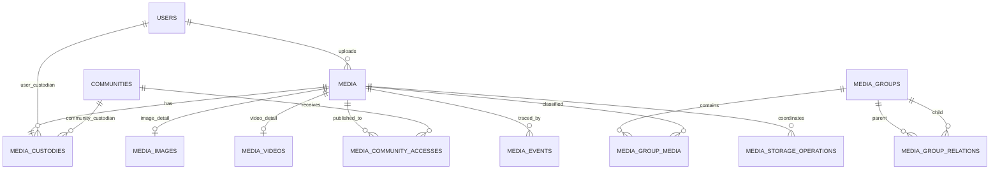

# Media物理データモデル

## 概要

> 実装状況: PostgreSQLは`images`、`image_groups`などImage中心です。このページのMediaテーブル、Custody、Media Event、動画属性、storage operationは未実装です。

PostgreSQLへ実装するMedia関連テーブル、key、constraint、indexを定義します。型名はPostgreSQLを前提とし、IDはアプリケーションで生成するULIDを`varchar(26)`で保持します。時刻は`timestamptz`を使用します。

## 全体ER



## media

| 列 | 型 | 制約 | 意味 |
| --- | --- | --- | --- |
| id | varchar(26) | PK | Media ID |
| media_type | varchar(16) | NOT NULL、CHECK | `IMAGE`または`VIDEO` |
| original_file_name | text | NOT NULL | upload時のfile名 |
| extension | varchar(32) | NOT NULL | 正規化した拡張子 |
| mime_type | varchar(255) | NOT NULL | 検証済みMIME type |
| file_size | bigint | NOT NULL、CHECK 0以上 | 原本byte数 |
| uploaded_by_user_id | varchar(26) | FK users、ON DELETE SET NULL | 最初のUploader |
| uploaded_at | timestamptz | NOT NULL | upload完了時刻 |
| status | varchar(16) | NOT NULL、CHECK | `ACTIVE`または`DELETING` |
| created_at | timestamptz | NOT NULL | 登録時刻 |
| updated_at | timestamptz | NOT NULL | 更新時刻 |

`status=DELETING`はObject Storage削除を完了させるための一時的な処理状態です。ごみ箱、復元、論理削除には使用しません。通常のQueryは`ACTIVE`だけを返します。

index:

- `(uploaded_by_user_id, uploaded_at DESC, id DESC)`
- `(media_type, created_at DESC, id DESC)`
- `(status)`は削除処理の再開に使用

## media_images・media_videos

### media_images

| 列 | 型 | 制約 |
| --- | --- | --- |
| media_id | varchar(26) | PK、FK media ON DELETE CASCADE |
| width | integer | NOT NULL、CHECK 1以上 |
| height | integer | NOT NULL、CHECK 1以上 |

### media_videos

| 列 | 型 | 制約 |
| --- | --- | --- |
| media_id | varchar(26) | PK、FK media ON DELETE CASCADE |
| width・height | integer | NOT NULL、CHECK 1以上 |
| duration_ms | bigint | NOT NULL、CHECK 1以上 |
| codec | varchar(64) | NOT NULL |
| frame_rate | numeric(8,3) | NULL可、CHECK 0より大きい |

`media.media_type`に対応する詳細tableを必ず1件だけ作ります。このtable間制約はServiceと同一transaction内の書き込みで保証し、integration testで検証します。

## media_custodies

Mediaの現在の管理主体だけを保持します。

| 列 | 型 | 制約 |
| --- | --- | --- |
| media_id | varchar(26) | PK、FK media ON DELETE CASCADE |
| user_id | varchar(26) | FK users、ON DELETE RESTRICT、NULL可 |
| community_id | varchar(26) | FK communities、ON DELETE RESTRICT、NULL可 |
| updated_at | timestamptz | NOT NULL |

CHECK constraint:

```sql
CHECK (
  (user_id IS NOT NULL AND community_id IS NULL)
  OR
  (user_id IS NULL AND community_id IS NOT NULL)
)
```

別々のUser用・Community用Custody tableには分けません。単一行とCHECKにより、Custodianがない状態と複数主体による共同管理をDBで禁止するためです。委譲履歴はこのtableへ蓄積せず、`media_events`へ記録します。

index:

- `(user_id, media_id)` WHERE `user_id IS NOT NULL`
- `(community_id, media_id)` WHERE `community_id IS NOT NULL`

## media_community_accesses

User管理MediaをCommunityへ公開する現在状態です。

| 列 | 型 | 制約 |
| --- | --- | --- |
| media_id | varchar(26) | FK media ON DELETE CASCADE |
| community_id | varchar(26) | FK communities ON DELETE CASCADE |
| created_by_user_id | varchar(26) | FK users ON DELETE SET NULL |
| created_at | timestamptz | NOT NULL |

PKは`(media_id, community_id)`です。`(community_id, media_id)`のindexを作成します。

Community CustodyのMediaにはAccess行を作りません。このcross-table ruleはServiceでCustodyをlockして検証します。Community内部の閲覧はMembershipとCustodyから判定します。

## media_events

Mediaに対する重要操作を追跡します。汎用監査ログや著作権証明には使用しません。

| 列 | 型 | 制約 |
| --- | --- | --- |
| id | varchar(26) | PK |
| media_id | varchar(26) | NOT NULL、FKを設定しない |
| event_type | varchar(32) | NOT NULL、CHECK |
| actor_user_id | varchar(26) | FK users ON DELETE SET NULL |
| from_user_id・to_user_id | varchar(26) | NULL可 |
| from_community_id・to_community_id | varchar(26) | NULL可 |
| target_community_id | varchar(26) | NULL可 |
| occurred_at | timestamptz | NOT NULL |

event typeは`UPLOADED`、`CUSTODIAN_CHANGED`、`ACCESS_ADDED`、`ACCESS_REMOVED`、`DELETED`です。event typeごとの必須列はServiceで検証します。

`media_id`へFKを設定しないのは、Mediaを物理削除した後も操作のtraceを保持するためです。eventにfile名、object key、Media本体、著作権情報は保存しません。保存期間到達後はevent単位で物理削除します。

index:

- `(media_id, occurred_at DESC, id DESC)`
- `(actor_user_id, occurred_at DESC)`

## Media Group

### media_groups

| 列 | 型 | 制約 |
| --- | --- | --- |
| id | varchar(26) | PK |
| name | varchar(255) | NOT NULL |
| scope_user_id | varchar(26) | FK users ON DELETE CASCADE、NULL可 |
| scope_community_id | varchar(26) | FK communities ON DELETE CASCADE、NULL可 |
| created_at・updated_at | timestamptz | NOT NULL |

Custodyと同じXOR CHECKで、UserまたはCommunityのどちらか一方をGroupのscopeにします。同一scope内で`name`を一意にします。

### media_group_media

PKは`(media_group_id, media_id)`です。GroupのscopeとMediaの操作権限が一致することをServiceで検証します。Group関連の削除はMediaを削除しません。

### media_group_relations

PKは`(parent_group_id, child_group_id)`です。自己参照をCHECKで禁止し、多段循環は追加前にrecursive CTEまたはServiceのgraph探索で検出します。親子は同一scopeに限定します。

## Community

Media公開が依存する最低限のtableは`communities`、`community_memberships`、`community_administrators`です。

- MembershipのPKは`(community_id, user_id)`
- AdministratorはMembershipを参照し、参加していないUserを任命できない
- Userは複数Communityへ参加できる
- Communityの親子関係tableは作らない

## Storage operation

`media_storage_operations`はDBとObject Storage間の削除を再試行する技術tableです。

| 列 | 型 | 制約 |
| --- | --- | --- |
| id | varchar(26) | PK |
| media_id | varchar(26) | NOT NULL |
| operation_type | varchar(16) | `DELETE` |
| object_key | text | NOT NULL |
| status | varchar(16) | `PENDING`、`COMPLETED`、`FAILED` |
| attempt_count | integer | NOT NULL |
| next_attempt_at | timestamptz | NULL可 |
| last_error | text | NULL可、機密情報を含めない |
| created_at・updated_at | timestamptz | NOT NULL |

uniqueは`(media_id, operation_type, object_key)`です。このtableは復元機能ではなく、削除を最終的に完了させるために使用します。


