# Media物理データモデル

## 概要

> 実装状況: PostgreSQLは`images`、`image_groups`などImage中心です。このページのMediaテーブル、Custody、Media Event、動画属性、storage operationは未実装です。

PostgreSQLへ実装するMedia関連table、column、constraint、index、削除規則を定義します。

## 共通規約

ID、日時、命名、constraint、index、削除方針は[物理データモデル共通規約](/system/data/physical-model-conventions)に従います。本ページではMedia domain固有の定義と例外を記載します.

## 全体ER

```mermaid
erDiagram
  USERS ||--o{ MEDIA : uploads
  MEDIA ||--|| MEDIA_CUSTODIES : has
  USERS ||--o{ MEDIA_CUSTODIES : user_custodian
  COMMUNITIES ||--o{ MEDIA_CUSTODIES : community_custodian
  COMMUNITIES ||--o{ COMMUNITY_MEMBERSHIPS : has
  USERS ||--o{ COMMUNITY_MEMBERSHIPS : joins
  COMMUNITY_MEMBERSHIPS ||--o| COMMUNITY_ADMINISTRATORS : administers
  COMMUNITIES ||--o{ COMMUNITY_INVITATIONS : issues
  COMMUNITY_INVITATIONS ||--o{ COMMUNITY_JOIN_REQUESTS : receives
  USERS ||--o{ COMMUNITY_JOIN_REQUESTS : requests
  MEDIA ||--o| MEDIA_IMAGES : image_detail
  MEDIA ||--o| MEDIA_VIDEOS : video_detail
  MEDIA ||--o{ MEDIA_COMMUNITY_ACCESSES : shared_to
  COMMUNITIES ||--o{ MEDIA_COMMUNITY_ACCESSES : receives
  MEDIA ||--o{ MEDIA_EVENTS : traced_by
  MEDIA ||--o{ MEDIA_VARIANTS : derived_as
  MEDIA ||--o{ MEDIA_PROCESSING_JOBS : processed_by
  MEDIA_GROUPS ||--o{ MEDIA_GROUP_MEDIA : contains
  MEDIA ||--o{ MEDIA_GROUP_MEDIA : classified
  MEDIA_GROUPS ||--o{ MEDIA_GROUP_RELATIONS : parent
  MEDIA_GROUPS ||--o{ MEDIA_GROUP_RELATIONS : child
  MEDIA ||--o{ MEDIA_STORAGE_OPERATIONS : coordinates
```



## 所有table

### media

| 列 | 型 | 制約 | 意味 |
| --- | --- | --- | --- |
| id | varchar(26) | PK | Media ID |
| media_type | varchar(16) | NOT NULL、CHECK | `IMAGE`または`VIDEO` |
| original_file_name | text | NOT NULL | upload時のfile名 |
| extension | varchar(32) | NOT NULL | 正規化した拡張子 |
| mime_type | varchar(255) | NOT NULL | 検証済みMIME type |
| file_size | bigint | NOT NULL、CHECK 0以上 | 原本byte数 |
| uploaded_by_user_id | varchar(26) | FK users、ON DELETE SET NULL | 最初のUploader。NULLの場合は「削除済みUser」として表示 |
| uploaded_at | timestamptz | NOT NULL | upload完了時刻 |
| status | varchar(16) | NOT NULL、CHECK | `ACTIVE`または`DELETING` |
| created_at | timestamptz | NOT NULL | 登録時刻 |
| updated_at | timestamptz | NOT NULL | 更新時刻 |

`status=DELETING`はObject Storage削除を完了させるための一時的な処理状態です。ごみ箱、復元、論理削除には使用しません。通常のQueryは`ACTIVE`だけを返します。

index:

- `(uploaded_by_user_id, uploaded_at DESC, id DESC)`
- `(media_type, created_at DESC, id DESC)`
- `(status)`は削除処理の再開に使用

### media_images・media_videos

#### media_images

| 列 | 型 | 制約 | 意味 |
| --- | --- | --- | --- |
| media_id | varchar(26) | PK、FK media ON DELETE CASCADE | 対象Media ID |
| width | integer | NOT NULL、CHECK 1以上 | 画像の幅 |
| height | integer | NOT NULL、CHECK 1以上 | 画像の高さ |

#### media_videos

| 列 | 型 | 制約 | 意味 |
| --- | --- | --- | --- |
| media_id | varchar(26) | PK、FK media ON DELETE CASCADE | 対象Media ID |
| width・height | integer | NOT NULL、CHECK 1以上 | 画像・動画の幅と高さ |
| duration_ms | bigint | NOT NULL、CHECK 1以上 | 再生時間（ミリ秒） |
| codec | varchar(64) | NOT NULL | 動画codec |
| frame_rate | numeric(8,3) | NULL可、CHECK 0より大きい | frame rate |

`media.media_type`に対応する詳細tableを必ず1件だけ作ります。このtable間制約はServiceと同一transaction内の書き込みで保証し、integration testで検証します。

### media_custodies

Mediaの現在の管理主体だけを保持します。

| 列 | 型 | 制約 | 意味 |
| --- | --- | --- | --- |
| media_id | varchar(26) | PK、FK media ON DELETE CASCADE | 対象Media ID |
| user_id | varchar(26) | FK users、ON DELETE RESTRICT、NULL可 | 対象User ID |
| community_id | varchar(26) | FK communities、ON DELETE RESTRICT、NULL可 | 対象Community ID |
| updated_at | timestamptz | NOT NULL | 最終更新時刻 |

CHECK constraint:

```sql
CHECK (
  (user_id IS NOT NULL AND community_id IS NULL)
  OR
  (user_id IS NULL AND community_id IS NOT NULL)
)
```

別々のUser用・Community用Custody tableには分けません。PKとCHECKによって1行の中で主体を排他的に選択し、複数主体による共同管理を禁止します。Custody行そのものの存在はCHECKだけでは保証できないため、MediaとCustodyを同じtransactionで作成し、integration testで不変条件を検証します。委譲履歴はこのtableへ蓄積せず、`media_events`へ記録します。

index:

- `(user_id, media_id)` WHERE `user_id IS NOT NULL`
- `(community_id, media_id)` WHERE `community_id IS NOT NULL`

### media_variants

| 列 | 型 | 制約 | 意味 |
| --- | --- | --- | --- |
| id | varchar(26) | PK | Variant ID |
| media_id | varchar(26) | NOT NULL、FK media ON DELETE CASCADE | 元のMedia |
| format | varchar(32) | NOT NULL | `WEBP`などの派生形式 |
| width・height | integer | NOT NULL、CHECK 1以上 | 派生画像の寸法 |
| storage_key | text | NOT NULL、UNIQUE | Object Storageのkey |
| size_bytes | bigint | NOT NULL、CHECK 0以上 | 派生物の容量 |
| created_at | timestamptz | NOT NULL | 生成完了時刻 |

`(media_id, format, width)`にUNIQUE constraintを設定し、同じJobの再実行でVariantを重複作成しません。動画固有の列が必要になった場合は要件に応じて拡張します。

### media_processing_jobs

| 列 | 型 | 制約 | 意味 |
| --- | --- | --- | --- |
| id | varchar(26) | PK | Job ID |
| media_id | varchar(26) | NOT NULL、FK media | 処理対象Media |
| job_type | varchar(32) | NOT NULL | 派生物生成などの処理種別 |
| status | varchar(16) | NOT NULL、CHECK | `PENDING`、`PROCESSING`、`COMPLETED`、`FAILED` |
| attempts | integer | NOT NULL、CHECK 0以上 | 実行試行回数 |
| last_error | text | NULL可 | 内部向けの失敗理由 |
| created_at・updated_at | timestamptz | NOT NULL | 登録・更新時刻 |

`(status, updated_at)`をindex対象にします。失敗情報に署名付きURL、credential、個人情報を保存しません。

### outbox_events・idempotency_requests

`outbox_events`はevent ID、event type、aggregate ID、payload、送信状態、作成・送信日時を保持します。送信状態と作成日時にindexを設定し、Publisherが未送信eventを取得します。利用者向け操作traceである`media_events`とは目的が異なるためtableを分離します。

`idempotency_requests`は操作主体、操作種別、idempotency key、request hash、処理状態、有効期限、必要なresponse情報を保持します。主体・操作・keyの組み合わせをUNIQUEとし、同じkeyで異なるpayloadを受け付けません。保存期間は再送要件と個人情報の保持方針に応じて決定します。

### media_community_accesses

User管理MediaをCommunityへ共有する現在状態です。

| 列 | 型 | 制約 | 意味 |
| --- | --- | --- | --- |
| media_id | varchar(26) | FK media ON DELETE CASCADE | 対象Media ID |
| community_id | varchar(26) | FK communities ON DELETE CASCADE | 対象Community ID |
| created_by_user_id | varchar(26) | FK users ON DELETE SET NULL | 操作したUser ID |
| created_at | timestamptz | NOT NULL | 登録時刻 |

PKは`(media_id, community_id)`です。`(community_id, media_id)`のindexを作成します。

Community CustodyのMediaにはAccess行を作りません。このcross-table ruleはServiceでCustodyをlockして検証します。Community内部の閲覧はMembershipとCustodyから判定します。

### media_events

Mediaに対する重要操作を追跡します。汎用監査ログや著作権証明には使用しません。

| 列 | 型 | 制約 | 意味 |
| --- | --- | --- | --- |
| id | varchar(26) | PK | record ID |
| media_id | varchar(26) | NOT NULL、FKを設定しない | 対象Media ID |
| event_type | varchar(32) | NOT NULL、CHECK | 操作の種別 |
| actor_user_id | varchar(26) | FK users ON DELETE SET NULL | 操作したUser ID |
| from_user_id・to_user_id | varchar(26) | NULL可 | 委譲元・委譲先のUser ID |
| from_community_id・to_community_id | varchar(26) | NULL可 | 委譲元・委譲先のCommunity ID |
| target_community_id | varchar(26) | NULL可 | 対象Community ID |
| occurred_at | timestamptz | NOT NULL | 発生時刻 |

event typeは`UPLOADED`、`CUSTODIAN_CHANGED`、`ACCESS_ADDED`、`ACCESS_REMOVED`、`DELETED`です。event typeごとの必須列はServiceで検証します。

`media_id`へFKを設定しないのは、Mediaを物理削除した後も操作のtraceを保持するためです。eventにfile名、object key、Media本体、著作権情報は保存しません。保存期間到達後はevent単位で物理削除します。

index:

- `(media_id, occurred_at DESC, id DESC)`
- `(actor_user_id, occurred_at DESC)`

### Media Group

#### media_groups

| 列 | 型 | 制約 | 意味 |
| --- | --- | --- | --- |
| id | varchar(26) | PK | record ID |
| name | varchar(255) | NOT NULL | 表示名 |
| scope_user_id | varchar(26) | FK users ON DELETE CASCADE、NULL可 | 個人scopeのUser ID |
| scope_community_id | varchar(26) | FK communities ON DELETE CASCADE、NULL可 | Community scopeのID |
| created_at・updated_at | timestamptz | NOT NULL | 登録・更新時刻 |

Custodyと同じXOR CHECKで、UserまたはCommunityのどちらか一方をGroupのscopeにします。同一scope内で`name`を一意にします。

#### media_group_media

PKは`(media_group_id, media_id)`です。GroupのscopeとMediaの操作権限が一致することをServiceで検証します。Group関連の削除はMediaを削除しません。

#### media_group_relations

PKは`(parent_group_id, child_group_id)`です。自己参照をCHECKで禁止し、多段循環は追加前にrecursive CTEまたはServiceのgraph探索で検出します。親子は同一scopeに限定します。

### Storage operation

`media_storage_operations`はDBとObject Storage間の削除を再試行する技術tableです。

| 列 | 型 | 制約 | 意味 |
| --- | --- | --- | --- |
| id | varchar(26) | PK | record ID |
| media_id | varchar(26) | NOT NULL | 対象Media ID |
| operation_type | varchar(16) | `DELETE` | Storage操作の種別 |
| object_key | text | NOT NULL | Object Storageのkey |
| status | varchar(16) | `PENDING`、`COMPLETED`、`FAILED` | 処理状態 |
| attempt_count | integer | NOT NULL | 処理の試行回数 |
| next_attempt_at | timestamptz | NULL可 | 次回の再試行時刻 |
| last_error | text | NULL可、機密情報を含めない | 機密情報を除いた失敗理由 |
| created_at・updated_at | timestamptz | NOT NULL | 登録・更新時刻 |

uniqueは`(media_id, operation_type, object_key)`です。このtableは復元機能ではなく、削除を最終的に完了させるために使用します。

## 他domainとの境界

`communities`、`community_memberships`、`community_administrators`、`community_invitations`、`community_join_requests`の定義、constraint、indexは[Community物理データモデル](/community/physical-data-model)を正本とします。

Media domainは`media_custodies`と`media_community_accesses`を所有し、Communityへの参照と共有・管理関係を定義します。
