# Media物理データモデル

## 概要

> 実装状況: PostgreSQLは`images`、`image_groups`などImage中心です。このページのMediaテーブル、Custody、Media Event、動画属性、storage operationは未実装です。

PostgreSQLへ実装するMedia関連テーブル、key、constraint、indexを定義します。型名はPostgreSQLを前提とし、IDはアプリケーションで生成するULIDを`varchar(26)`で保持します。時刻は`timestamptz`を使用します。

## 全体ER

```mermaid
erDiagram
  USERS ||--o{ MEDIA : uploads
  MEDIA ||--|| MEDIA_CUSTODIES : has
  USERS ||--o{ MEDIA_CUSTODIES : user_custodian
  COMMUNITIES ||--o{ MEDIA_CUSTODIES : community_custodian
  COMMUNITIES ||--o{ COMMUNITY_MEMBERSHIPS : has
  USERS ||--o{ COMMUNITY_MEMBERSHIPS : joins
  COMMUNITY_MEMBERSHIPS ||--o| COMMUNITY_ADMINISTRATORS : administers
  COMMUNITIES ||--o{ COMMUNITY_INVITATIONS : issues
  COMMUNITY_INVITATIONS ||--o{ COMMUNITY_JOIN_REQUESTS : receives
  USERS ||--o{ COMMUNITY_JOIN_REQUESTS : requests
  MEDIA ||--o| MEDIA_IMAGES : image_detail
  MEDIA ||--o| MEDIA_VIDEOS : video_detail
  MEDIA ||--o{ MEDIA_COMMUNITY_ACCESSES : shared_to
  COMMUNITIES ||--o{ MEDIA_COMMUNITY_ACCESSES : receives
  MEDIA ||--o{ MEDIA_EVENTS : traced_by
  MEDIA ||--o{ MEDIA_VARIANTS : derived_as
  MEDIA ||--o{ MEDIA_PROCESSING_JOBS : processed_by
  MEDIA_GROUPS ||--o{ MEDIA_GROUP_MEDIA : contains
  MEDIA ||--o{ MEDIA_GROUP_MEDIA : classified
  MEDIA_GROUPS ||--o{ MEDIA_GROUP_RELATIONS : parent
  MEDIA_GROUPS ||--o{ MEDIA_GROUP_RELATIONS : child
  MEDIA ||--o{ MEDIA_STORAGE_OPERATIONS : coordinates
```



## media

| 列 | 型 | 制約 | 意味 |
| --- | --- | --- | --- |
| id | varchar(26) | PK | Media ID |
| media_type | varchar(16) | NOT NULL、CHECK | `IMAGE`または`VIDEO` |
| original_file_name | text | NOT NULL | upload時のfile名 |
| extension | varchar(32) | NOT NULL | 正規化した拡張子 |
| mime_type | varchar(255) | NOT NULL | 検証済みMIME type |
| file_size | bigint | NOT NULL、CHECK 0以上 | 原本byte数 |
| uploaded_by_user_id | varchar(26) | FK users、ON DELETE SET NULL | 最初のUploader。NULLの場合は「削除済みUser」として表示 |
| uploaded_at | timestamptz | NOT NULL | upload完了時刻 |
| status | varchar(16) | NOT NULL、CHECK | `ACTIVE`または`DELETING` |
| created_at | timestamptz | NOT NULL | 登録時刻 |
| updated_at | timestamptz | NOT NULL | 更新時刻 |

`status=DELETING`はObject Storage削除を完了させるための一時的な処理状態です。ごみ箱、復元、論理削除には使用しません。通常のQueryは`ACTIVE`だけを返します。

index:

- `(uploaded_by_user_id, uploaded_at DESC, id DESC)`
- `(media_type, created_at DESC, id DESC)`
- `(status)`は削除処理の再開に使用

## media_images・media_videos

### media_images

| 列 | 型 | 制約 |
| --- | --- | --- |
| media_id | varchar(26) | PK、FK media ON DELETE CASCADE |
| width | integer | NOT NULL、CHECK 1以上 |
| height | integer | NOT NULL、CHECK 1以上 |

### media_videos

| 列 | 型 | 制約 |
| --- | --- | --- |
| media_id | varchar(26) | PK、FK media ON DELETE CASCADE |
| width・height | integer | NOT NULL、CHECK 1以上 |
| duration_ms | bigint | NOT NULL、CHECK 1以上 |
| codec | varchar(64) | NOT NULL |
| frame_rate | numeric(8,3) | NULL可、CHECK 0より大きい |

`media.media_type`に対応する詳細tableを必ず1件だけ作ります。このtable間制約はServiceと同一transaction内の書き込みで保証し、integration testで検証します。

## media_custodies

Mediaの現在の管理主体だけを保持します。

| 列 | 型 | 制約 |
| --- | --- | --- |
| media_id | varchar(26) | PK、FK media ON DELETE CASCADE |
| user_id | varchar(26) | FK users、ON DELETE RESTRICT、NULL可 |
| community_id | varchar(26) | FK communities、ON DELETE RESTRICT、NULL可 |
| updated_at | timestamptz | NOT NULL |

CHECK constraint:

```sql
CHECK (
  (user_id IS NOT NULL AND community_id IS NULL)
  OR
  (user_id IS NULL AND community_id IS NOT NULL)
)
```

別々のUser用・Community用Custody tableには分けません。PKとCHECKによって1行の中で主体を排他的に選択し、複数主体による共同管理を禁止します。Custody行そのものの存在はCHECKだけでは保証できないため、MediaとCustodyを同じtransactionで作成し、integration testで不変条件を検証します。委譲履歴はこのtableへ蓄積せず、`media_events`へ記録します。

index:

- `(user_id, media_id)` WHERE `user_id IS NOT NULL`
- `(community_id, media_id)` WHERE `community_id IS NOT NULL`

## media_variants

| 列 | 型 | 制約 | 意味 |
| --- | --- | --- | --- |
| id | varchar(26) | PK | Variant ID |
| media_id | varchar(26) | NOT NULL、FK media ON DELETE CASCADE | 元のMedia |
| format | varchar(32) | NOT NULL | `WEBP`などの派生形式 |
| width・height | integer | NOT NULL、CHECK 1以上 | 派生画像の寸法 |
| storage_key | text | NOT NULL、UNIQUE | Object Storageのkey |
| size_bytes | bigint | NOT NULL、CHECK 0以上 | 派生物の容量 |
| created_at | timestamptz | NOT NULL | 生成完了時刻 |

`(media_id, format, width)`にUNIQUE constraintを設定し、同じJobの再実行でVariantを重複作成しません。動画固有の列が必要になった場合は要件に応じて拡張します。

## media_processing_jobs

| 列 | 型 | 制約 | 意味 |
| --- | --- | --- | --- |
| id | varchar(26) | PK | Job ID |
| media_id | varchar(26) | NOT NULL、FK media | 処理対象Media |
| job_type | varchar(32) | NOT NULL | 派生物生成などの処理種別 |
| status | varchar(16) | NOT NULL、CHECK | `PENDING`、`PROCESSING`、`COMPLETED`、`FAILED` |
| attempts | integer | NOT NULL、CHECK 0以上 | 実行試行回数 |
| last_error | text | NULL可 | 内部向けの失敗理由 |
| created_at・updated_at | timestamptz | NOT NULL | 登録・更新時刻 |

`(status, updated_at)`をindex対象にします。失敗情報に署名付きURL、credential、個人情報を保存しません。

## outbox_events・idempotency_requests

`outbox_events`はevent ID、event type、aggregate ID、payload、送信状態、作成・送信日時を保持します。送信状態と作成日時にindexを設定し、Publisherが未送信eventを取得します。利用者向け操作traceである`media_events`とは目的が異なるためtableを分離します。

`idempotency_requests`は操作主体、操作種別、idempotency key、request hash、処理状態、有効期限、必要なresponse情報を保持します。主体・操作・keyの組み合わせをUNIQUEとし、同じkeyで異なるpayloadを受け付けません。保存期間は再送要件と個人情報の保持方針に応じて決定します。

## media_community_accesses

User管理MediaをCommunityへ共有する現在状態です。

| 列 | 型 | 制約 |
| --- | --- | --- |
| media_id | varchar(26) | FK media ON DELETE CASCADE |
| community_id | varchar(26) | FK communities ON DELETE CASCADE |
| created_by_user_id | varchar(26) | FK users ON DELETE SET NULL |
| created_at | timestamptz | NOT NULL |

PKは`(media_id, community_id)`です。`(community_id, media_id)`のindexを作成します。

Community CustodyのMediaにはAccess行を作りません。このcross-table ruleはServiceでCustodyをlockして検証します。Community内部の閲覧はMembershipとCustodyから判定します。

## media_events

Mediaに対する重要操作を追跡します。汎用監査ログや著作権証明には使用しません。

| 列 | 型 | 制約 |
| --- | --- | --- |
| id | varchar(26) | PK |
| media_id | varchar(26) | NOT NULL、FKを設定しない |
| event_type | varchar(32) | NOT NULL、CHECK |
| actor_user_id | varchar(26) | FK users ON DELETE SET NULL |
| from_user_id・to_user_id | varchar(26) | NULL可 |
| from_community_id・to_community_id | varchar(26) | NULL可 |
| target_community_id | varchar(26) | NULL可 |
| occurred_at | timestamptz | NOT NULL |

event typeは`UPLOADED`、`CUSTODIAN_CHANGED`、`ACCESS_ADDED`、`ACCESS_REMOVED`、`DELETED`です。event typeごとの必須列はServiceで検証します。

`media_id`へFKを設定しないのは、Mediaを物理削除した後も操作のtraceを保持するためです。eventにfile名、object key、Media本体、著作権情報は保存しません。保存期間到達後はevent単位で物理削除します。

index:

- `(media_id, occurred_at DESC, id DESC)`
- `(actor_user_id, occurred_at DESC)`

## Media Group

### media_groups

| 列 | 型 | 制約 |
| --- | --- | --- |
| id | varchar(26) | PK |
| name | varchar(255) | NOT NULL |
| scope_user_id | varchar(26) | FK users ON DELETE CASCADE、NULL可 |
| scope_community_id | varchar(26) | FK communities ON DELETE CASCADE、NULL可 |
| created_at・updated_at | timestamptz | NOT NULL |

Custodyと同じXOR CHECKで、UserまたはCommunityのどちらか一方をGroupのscopeにします。同一scope内で`name`を一意にします。

### media_group_media

PKは`(media_group_id, media_id)`です。GroupのscopeとMediaの操作権限が一致することをServiceで検証します。Group関連の削除はMediaを削除しません。

### media_group_relations

PKは`(parent_group_id, child_group_id)`です。自己参照をCHECKで禁止し、多段循環は追加前にrecursive CTEまたはServiceのgraph探索で検出します。親子は同一scopeに限定します。

## Community

### communities

| 列 | 型 | 制約 | 意味 |
| --- | --- | --- | --- |
| id | varchar(26) | PK | Community ID |
| name | text | NOT NULL、前後空白除去後に空でない | 表示名。同名を許可 |
| created_at | timestamptz | NOT NULL | 作成時刻 |
| updated_at | timestamptz | NOT NULL | 更新時刻 |

説明、作成者、親Communityは保持しません。

### community_memberships

| 列 | 型 | 制約 | 意味 |
| --- | --- | --- | --- |
| community_id | varchar(26) | FK communities ON DELETE CASCADE | 所属先 |
| user_id | varchar(26) | FK users | 参加User |
| joined_at | timestamptz | NOT NULL | 参加時刻 |

PKは`(community_id, user_id)`です。`(user_id, community_id)`へindexを追加します。退会・User削除時は共有解除や最終Administrator確認が必要なため、単純なFK cascadeだけに依存しません。

### community_administrators

| 列 | 型 | 制約 | 意味 |
| --- | --- | --- | --- |
| community_id | varchar(26) | 複合FK community_memberships | 対象Community |
| user_id | varchar(26) | 複合FK community_memberships | Administrator |
| granted_at | timestamptz | NOT NULL | 付与時刻 |

PKは`(community_id, user_id)`です。複合FKによって参加していないUserをAdministratorに任命できません。Communityごとに1人以上という条件は、Community行lockとService transactionで保証します。

### community_invitations

| 列 | 型 | 制約 | 意味 |
| --- | --- | --- | --- |
| id | varchar(26) | PK | 招待ID |
| community_id | varchar(26) | FK communities ON DELETE CASCADE | 招待対象Community |
| token_hash | varchar(128) | NOT NULL、UNIQUE | 推測困難なtokenのhash |
| created_by_user_id | varchar(26) | FK users ON DELETE SET NULL | 発行Administrator |
| created_at | timestamptz | NOT NULL | 発行時刻 |
| expires_at | timestamptz | NOT NULL | 発行から7日後 |
| revoked_at | timestamptz | NULL可 | 無効化時刻 |

`revoked_at IS NULL`を条件とするCommunity単位のpartial unique indexで、失効処理されていない招待URLを1件に制限します。期限切れURLは再発行Transaction内で`revoked_at`を設定してから新規行を作成します。期限判定に現在時刻を使うpartial indexは作成しません。

### community_join_requests

| 列 | 型 | 制約 | 意味 |
| --- | --- | --- | --- |
| id | varchar(26) | PK | 申請ID |
| community_id | varchar(26) | FK communities ON DELETE CASCADE | 参加申請先 |
| invitation_id | varchar(26) | FK community_invitations | 使用した招待 |
| applicant_user_id | varchar(26) | FK users | 申請者 |
| status | varchar(16) | NOT NULL、CHECK | `PENDING`、`APPROVED`、`REJECTED`、`CANCELLED`、`INVALIDATED` |
| requested_at | timestamptz | NOT NULL | 申請時刻 |
| reviewed_by_user_id | varchar(26) | FK users ON DELETE SET NULL | 承認・拒否Administrator |
| reviewed_at | timestamptz | NULL可 | 承認・拒否時刻 |
| resolved_at | timestamptz | NULL可 | 確定・取消し・無効化時刻 |

`status = 'PENDING'`を条件に`(community_id, applicant_user_id)`へpartial unique indexを設定し、重複申請を防ぎます。申請User削除時は先に`INVALIDATED`へ更新し、Userの削除・匿名化方式とFK動作は #16・#27 で整合させます。`(community_id, status, requested_at)`のindexで承認待ち一覧を取得します。

Community、招待、参加申請の詳細は[Community詳細設計](./community)を参照します。

## Storage operation

`media_storage_operations`はDBとObject Storage間の削除を再試行する技術tableです。

| 列 | 型 | 制約 |
| --- | --- | --- |
| id | varchar(26) | PK |
| media_id | varchar(26) | NOT NULL |
| operation_type | varchar(16) | `DELETE` |
| object_key | text | NOT NULL |
| status | varchar(16) | `PENDING`、`COMPLETED`、`FAILED` |
| attempt_count | integer | NOT NULL |
| next_attempt_at | timestamptz | NULL可 |
| last_error | text | NULL可、機密情報を含めない |
| created_at・updated_at | timestamptz | NOT NULL |

uniqueは`(media_id, operation_type, object_key)`です。このtableは復元機能ではなく、削除を最終的に完了させるために使用します。
