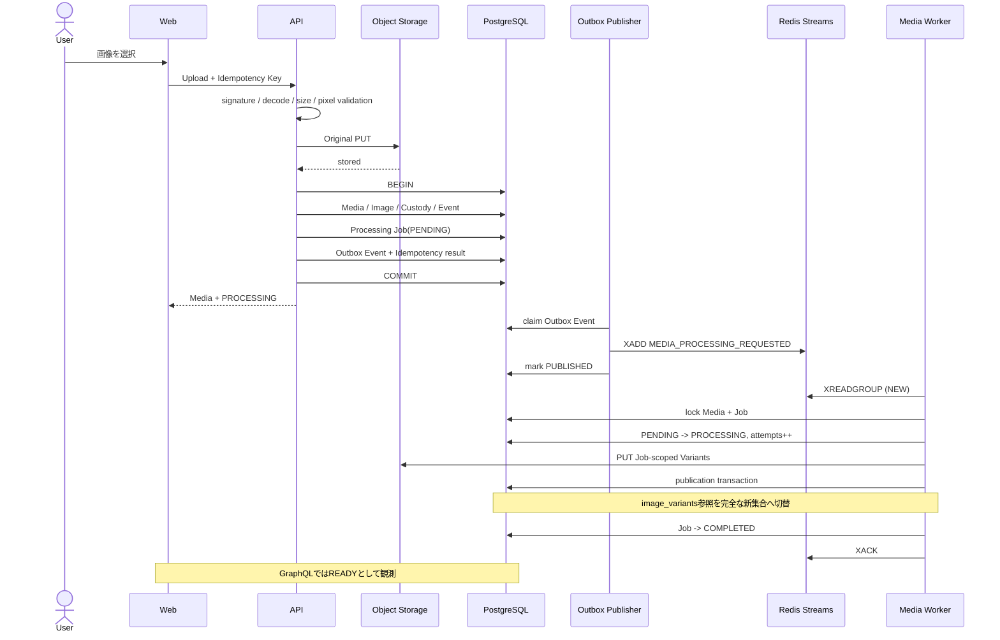
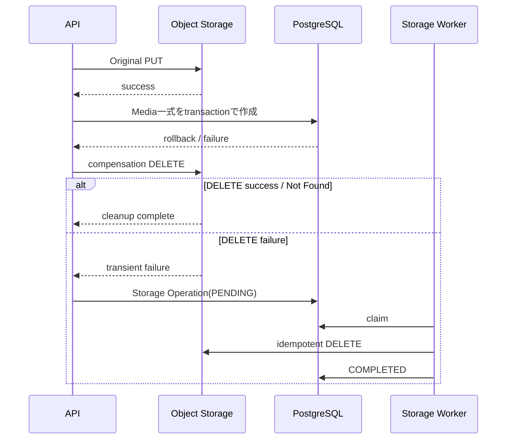
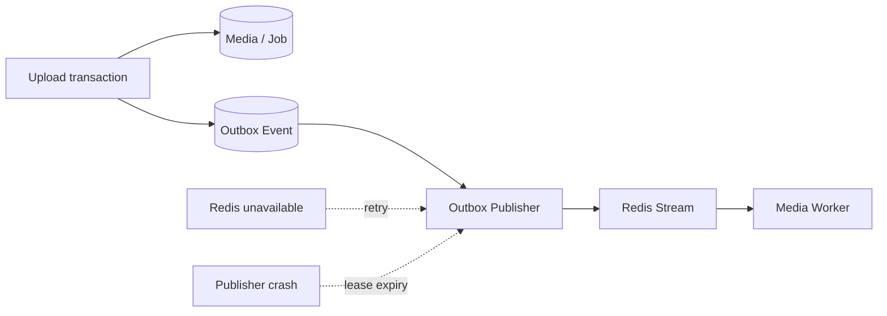
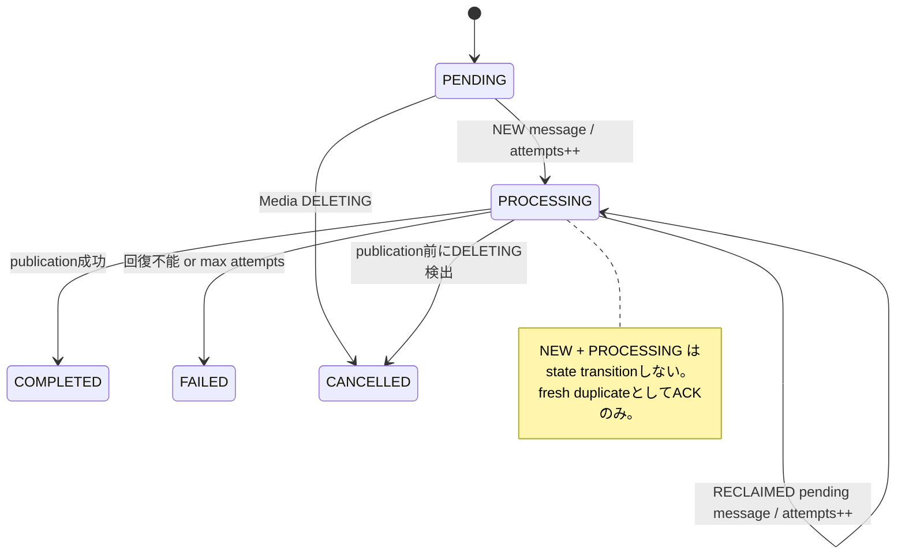
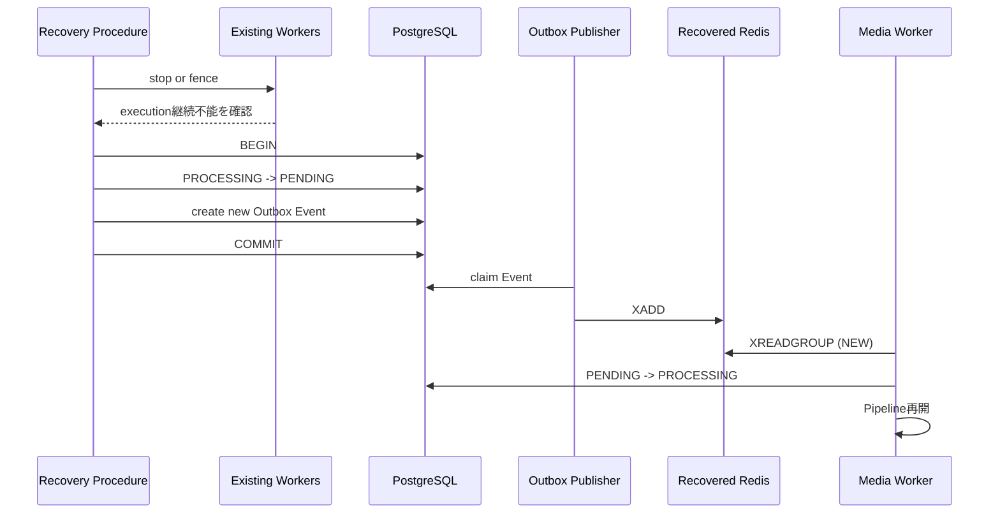
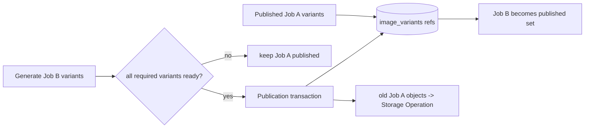

# Media登録・非同期処理アーキテクチャ

## このページの目的

Media登録は、単に画像をObject Storageへ保存する処理ではありません。Client retry、PostgreSQLとObject Storageの部分失敗、Redis停止、Worker crash、重複配送、再処理、Media削除との競合まで含めて、**利用可能なMediaと派生物の整合性を失わずに最終状態へ収束させる**必要があります。

このページは個々のtableやruntime parameterの正本ではなく、Media登録からImage Variant publicationまでを横断して「どの仕組みが何を守るのか」を説明する入口です。詳細仕様は[Mediaの整合性とTransaction](/media/consistency-transactions)、[非同期Media処理](/system/api/asynchronous-processing)、[Transactional Outbox](/system/api/transactional-outbox)、[冪等性](/system/api/idempotency)、[PostgreSQL・Redis運用](/system/data/postgresql-redis-operations)、[Mediaストレージ](/system/data/storage)を正本とします。

## まず守りたい不変条件

この設計は次の不変条件を守るために構成されています。

- Upload成功を返したMediaはPostgreSQL上にMedia、Custody、Processing Job、Outbox Eventがdurableに存在する。
- PostgreSQLに利用可能なMediaだけを先に作り、Originalが存在しない状態を正常系として残さない。
- Redisは配送・実行ownershipを担当するが、MediaやProcessing Jobのdurable truthにはしない。
- At-Least-Once配送によるduplicateが発生しても同じJobを並行実行しない。
- Image Variantは完全な集合が生成できるまで既存公開集合を置き換えない。
- DB transactionとObject Storageを跨ぐ部分失敗をsilent orphanとして放置しない。
- Redis data lossから復旧しても旧Workerと復旧Workerを同時実行させない。

## 各仕組みが解決する問題

| 仕組み | 解決する問題 | 主な責務 | 正本にしないもの |
| --- | --- | --- | --- |
| PostgreSQL Media / Image / Variant | 利用可能なMediaと公開中Variantを一意に決める | domain state、公開参照 | Workerの実行ownership |
| Idempotency Request | Client timeout / retryによる二重登録 | 同じCommandを同じ論理結果へ収束 | 非同期Jobの長期lease |
| Transactional Outbox | DB commitとRedis publishのdual-write failure | commit済みdelivery intentのdurable化 | Media操作の監査履歴 |
| Processing Job | 非同期処理の業務状態をRedisから分離 | PENDING / PROCESSING / terminal state、attempts | 実行中messageのlease |
| Redis Streams / PEL | Workerへの配送と一時的な実行ownership | At-Least-Once delivery、pending ownership、reclaim | durable business truth |
| Job-scoped Variant key | reprocess中の新旧Variant混在 | Jobごとの完全な生成先 | published / staging状態そのもの |
| Publication transaction | 完成したVariant集合だけを公開 | DB参照のatomic switch、Job COMPLETED | Object生成そのもの |
| Storage Operation | Object DELETEの部分失敗 | durable cleanup retry | User向け復元 |
| Orphan reconciliation | cleanup recordすら残せないcrash window | 未参照Objectの検出とStorage Operation化 | 直接DELETE |
| Media-level processing status | 内部Job実装をFrontendへ漏らさない | PROCESSING / READY / FAILED | attempts、last_error等の運用情報 |

## 正常系: UploadからREADYまで

Upload requestはVariant生成完了を待ちません。同期成功点はOriginal保存後のPostgreSQL transaction commitです。これにより画像変換の処理時間やRedisの一時停止をUpload requestの生存時間から切り離します。

## なぜOriginalを先に保存するのか

PostgreSQLを先にcommitすると、その直後のObject Storage PUT失敗で「利用可能なMedia rowはあるがOriginalがない」という状態が発生します。本設計ではOriginalを先に保存し、DB commitに失敗した場合はObject側を補償します。

Storage Operationは「削除を非同期化したいから」存在するのではなく、**外部Object StorageとDBを単一transactionにできないことによる補償処理をdurableにする**ために存在します。

さらにDB障害等によりStorage Operation自体も記録できない狭いfailure windowは、1時間ごとのorphan reconciliationが24時間grace後に検出し、Storage Operationへ引き渡します。reconciler自身はObjectを直接削除しません。

## なぜTransactional Outboxが必要なのか

APIがDB commit後に直接Redisへ`XADD`すると、DB commit成功・Redis送信失敗の間でProcessing Jobが永久に開始されない可能性があります。逆順にRedisへ先に送れば、DB rollback後に存在しない業務状態をWorkerが処理する可能性があります。

Transactional OutboxではMedia / Processing Jobとdelivery intentを同じPostgreSQL transactionへ保存します。Redis送信は後からPublisherが行うため、Redis停止中でもdelivery intentを失いません。

Redisへの`XADD`成功後、Outboxを`PUBLISHED`にする前にPublisherが停止すると同じeventが再送され得ます。このためExactly Once deliveryを作ろうとせず、duplicateを前提に下流で安全に吸収します。

## Processing JobとRedis PELを分ける理由

Processing JobとRedis PELは似ていますが、寿命と責務が異なります。

Processing Jobは「このMediaのVariant生成が業務上どの状態か」というdurable truthです。Redis PELは「いまどのConsumerがこのdeliveryを実行する権利を持つか」という一時的なexecution ownershipです。

DBにもleaseを持たせるとRedis ownershipとの二重管理になり、どちらを正とするかという新しい整合性問題が生まれます。そのため通常運用の実行ownershipはRedis Consumer Groupへ一本化します。

### NEW / RECLAIMEDの意味

同じ`PROCESSING`でも、fresh duplicateとWorker crash後の正当なretryでは意味が違います。WorkerはDB stateだけで判断せず、Consumerがmessageを取得した経路を`NEW` / `RECLAIMED`としてHandlerへ渡します。

正常に長時間処理しているmessageが誤ってreclaimされないよう、実行Consumerは1分間隔で`XCLAIM` heartbeatを行います。5分idleになったpending messageだけが`XAUTOCLAIM`対象です。

## Redis data lossは通常retryと分ける

Redis data自体が失われるとPELも失われるため、通常の`RECLAIMED`という証拠を利用できません。ここで単純にJobを再enqueueすると、旧Workerがまだ実行中だった場合に並行Pipelineが発生します。

**fencing前に`PROCESSING -> PENDING`へ戻してはいけません。** Redis全損は通常retryではなくrecovery procedureとして扱うことで、通常経路を単純なまま保ちます。

## なぜVariantを同じkeyへ上書きしないのか

reprocessで`variants/{width}.webp`を順番に上書きすると、途中失敗時に320pxだけ新世代、640px以降は旧世代という混在状態が発生します。

そこでVariantは`media/{mediaId}/variants/{jobId}/{width}.webp`へJob単位で完全な集合を生成します。全て成功した後、短いPostgreSQL transactionで`image_variants.storage_key`を一括更新します。

Object pathに`staging/`や`published/`を持たせないのは、公開状態をStorageとDBの二箇所で管理しないためです。**公開状態の正本は常にDB参照**です。

## Failureをどの仕組みが引き受けるか

| Failure | 引き受ける仕組み | 結果 |
| --- | --- | --- |
| ClientがUpload responseを受け取れずretry | Idempotency Request | 同じMedia / Job結果へ収束 |
| Original PUT失敗 | API | DBへMediaを作らず失敗 |
| Original PUT後にDB rollback | compensation DELETE | Objectだけ残る状態を解消 |
| compensation DELETE失敗 | Storage Operation | durable retry |
| cleanup record作成前にprocess crash | Orphan reconciliation | grace後にStorage Operation化 |
| DB commit後にRedis停止 | Transactional Outbox | EventをDBへ保持し復旧後配送 |
| XADD後にPublisher crash | At-Least-Once + event identity | duplicate deliveryを許容 |
| fresh duplicateがPROCESSING Jobへ到着 | NEW / RECLAIMED contract | Pipelineを再実行せずACK |
| Worker crash | Redis PEL / XAUTOCLAIM | 同じJobをreclaimしてretry |
| 長時間Pipeline | XCLAIM heartbeat | 正常処理を誤reclaimさせない |
| Redis data loss | fencing + PostgreSQL reconciliation | Jobを安全にPENDINGへ戻し再enqueue |
| Variant生成途中失敗 | Job-scoped keys | 公開中の旧集合を維持 |
| publication後の旧Variant DELETE失敗 | Storage Operation | 公開状態を戻さずcleanupだけretry |
| Media削除とWorker publicationが競合 | Media row lock | DELETINGならpublicationせずCANCELLED |

## 採用しなかった単純化

### APIからRedisへ直接publishしない

DBとRedisのdual writeをrequest処理だけで安全にatomic化できないためです。Redis停止をUpload失敗条件にもしたくありません。

### Processing JobへDB leaseを追加しない

通常実行ownershipはRedis PELが既に担っています。同じleaseをPostgreSQLにも持つと二つの時計・二つのownershipを同期する必要が生まれます。

### Exactly Once deliveryを前提にしない

Publisher crashやnetwork failureを含む分散境界でExactly Onceを成立させるより、At-Least-Onceを受け入れ、event / job identityとatomic publicationでduplicateの影響を消す方が境界を明確にできます。

### Variantを同じkeyへ上書きしない

reprocess途中の部分成功で世代が混在するためです。Job-scoped keyとDBのatomic switchを使用します。

### staging / publishedをObject pathで表現しない

DB参照とObject pathの二箇所にpublication stateを持たせないためです。Objectは生成物、DBは公開参照という責務に分離します。

### Reconcilerから直接DELETEしない

検出と副作用実行を分離し、削除retry・lease・FAILED管理をStorage Operationという一つのdurable経路へ集約するためです。

## 読み進める順序

全体像を把握した後は、目的に応じて次を参照します。

1. Upload / Deleteのtransaction境界: [Mediaの整合性とTransaction](/media/consistency-transactions)
2. Job、Worker、Pipeline、publication: [非同期Media処理](/system/api/asynchronous-processing)
3. DBとRedisのdelivery保証: [Transactional Outbox](/system/api/transactional-outbox)
4. Client / event / Workerの重複制御: [冪等性](/system/api/idempotency)
5. Redis topologyとdata loss recovery: [PostgreSQL・Redis運用](/system/data/postgresql-redis-operations)
6. Object keyとprivate配信: [Mediaストレージ](/system/data/storage)
7. table / constraint / index: [Media物理データモデル](/media/physical-data-model)
