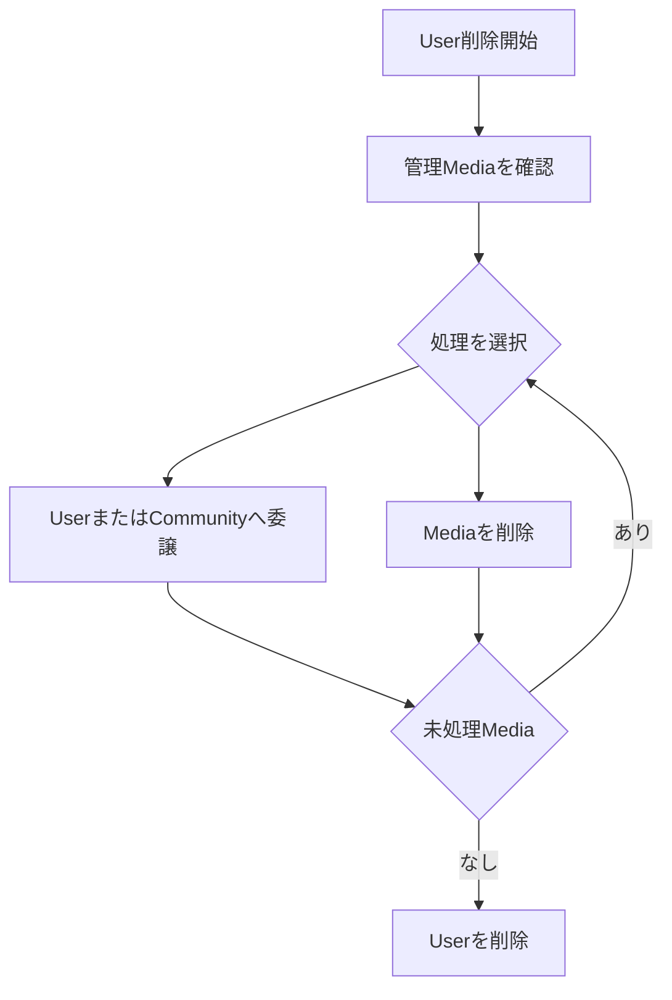

# User削除時のMedia処理

## 概要

> 実装状況: User削除時にMediaを委譲または削除させる処理は未実装です。

## 原則

初回Releaseでは管理主体の委譲を提供しません。account削除時はUser管理Mediaの件数と復元不能な削除を明示して確認し、確定対象を非同期cleanupで削除します。cleanupの一部が失敗してもUserへ再申請を求めず、DELETING状態を維持してsystemが再試行・運用再開します。詳細は[Userユースケース](/user/use-cases)を正本とします。

## 操作単位

- Media単位で委譲または削除を選べる
- 複数Mediaを一括選択できる
- 全Mediaを一括委譲または一括削除できる
- Media Groupを選択条件として利用できる

Media Groupは分類であり管理単位ではありません。「Groupを委譲」するのではなく、Group内のMediaを一括選択して処理します。

## 委譲

管理主体の委譲は[初回Release対象外](https://github.com/hazuki3417/memoria-design/issues/48)です。将来機能を導入した後の選択肢として扱います。初回ReleaseでUser削除を提供する場合、委譲に依存せず、User管理Mediaを削除したうえで処理します。

- UserまたはCommunityを委譲先にできる
- 委譲時に既存共有をすべて解除する
- Uploader情報は変更しない
- 委譲をMedia Eventへ記録する

## 削除

- Mediaを物理削除する
- 復元できないことを明示する
- Group関連と共有設定も削除する
- 削除をMedia Eventへ記録できる

## User削除との関係

Community管理MediaはUploaderのUser削除後も残し、`media.uploaded_by_user_id`をNULLにして投稿者を「削除済みUser」と表示します。削除前nicknameやAuth0 identifierは保持しません。Media Eventのactorも必要な範囲で匿名化し、Userの個人情報をMedia保存のためだけに永久保持しません。

Communityの最後のAdministratorは、別MemberへAdministrator権限を付与するかCommunityを削除するまでUser削除できません。その他のMembershipは退会時と同じく共有・Community分類を解除し、未処理の参加申請は無効化します。詳しくは[Communityユースケース](/community/use-cases)を参照します。

