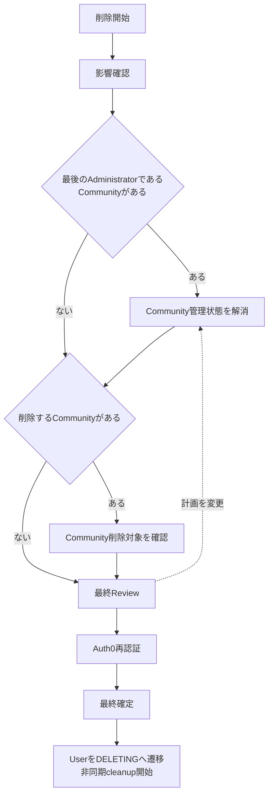

# アカウント削除フロー

## 概要

ACTIVE User本人がMemoria accountを削除する際に、削除の影響を理解し、必要なCommunity上の判断を完了し、再認証後に削除を確定するまでのUser Flowです。

このFlowは画面数やDialog等の具体的なUI構成を規定しません。各段階でUserが理解・判断する内容と、次へ進むための条件を定義します。

## 関連Use Case

- [Userユースケース - accountを削除する](/user/use-cases#accountを削除する)
- [Media関連ユースケース - account削除時に管理Mediaを削除する](/media/use-cases#account削除時に管理mediaを削除する)
- [Communityユースケース - Userを削除する](/community/use-cases#userを削除する)

## フロー

不要なCommunity解決・削除確認段階はskipできます。図はFlowの意味的な順序を示し、各段階を独立Screen / step / Dialogのどれで表現するかは固定しません。

### 1. 削除の開始・影響把握

User自身のaccountが削除されること、User管理Mediaの件数、および対象Mediaが復元不能に削除されることを確認します。

User管理Mediaが0件の場合も同じAccount Deletion Flowを使用します。

### 2. Communityへの影響解決

Userが最後のAdministratorであるCommunityが存在する場合、対象Communityを一つの作業面でまとめて確認し、それぞれのCommunityについて次のいずれかを独立して選択します。

- 別MemberをAdministratorへ昇格してCommunityを保持する。
- Communityを削除する。

後任にできるMemberが存在する場合は、Communityを保持してAdministratorを引き継ぐ選択肢を主な選択肢として提示します。Community削除は明示的に選択できる代替手段として維持します。後任候補が存在しない場合は保持を選択できません。

すべての対象Communityについて解決方法が決定するまで次の段階へ進みません。Communityごとに異なる解決方法を選択できます。

必要なCommunityが存在しない場合、この段階はUserへ不要な判断を要求せずskipできます。

最後のAdministratorではないCommunityは特別な選択を要求せず、account削除時にMembershipと共有を解消します。

### 3. Community削除対象のReview

Community削除を選択した対象がある場合、削除対象Communityを一つの作業面でまとめてReviewします。各Communityについて参加者数、Community管理Media件数、他UserがUploadしたMediaも削除されることを確認します。

誤操作を防ぐため、同じReview上で対象CommunityごとにCommunity名の入力を要求します。すべての削除対象について必要な確認が完了するまで次の段階へ進みません。

Community削除を選択していない場合、この段階はskipします。

### 4. 最終Review

必要なCommunity上の判断と確認をすべて完了した後、削除計画全体をReviewします。User account、User管理Media、削除するCommunity、Administratorを引き継いで保持するCommunity等、account削除によって実行される主要な変更をまとめて確認します。

Userが削除計画を変更する場合は前段階へ戻り、最新の選択結果に基づいてReviewを再構成します。

### 5. Auth0再認証

最終Reviewの内容を確認してaccount削除を継続する場合、Auth0で再認証します。再認証の失敗、取消し、期限切れ時は削除を開始しません。

再認証を強制する具体的なAuth0方式と再認証結果の有効期限はAuthentication / Security設計で定義し、このFlowでは規定しません。

### 6. 最終確定

再認証成功後、Memoriaへ戻り、再認証済みであることと、ここで確定するとaccount削除が開始されることを明確にした状態で、Userに明示的な最終削除Actionを要求します。

Auth0は本人確認、Memoriaは削除内容への最終同意を担当します。再認証後に削除計画を変更した場合は再認証済み状態を引き継がず、最新の削除計画について最終Reviewと再認証を再度完了する必要があります。

### 7. 削除開始

削除確定後、UserをDELETINGとして即時利用不可にします。削除対象を確定時点で固定し、非同期Jobでcleanupします。

Userに非同期cleanupの完了を画面上で待つことは要求しません。

## フロー原則

- Account削除は複数の影響を持つ破壊的操作として段階的に確認します。
- 不要な段階はProgressive Disclosureによりskipし、単純な削除でも不要な判断を要求しません。
- 各段階を独立Screen、同一Screen内のstep、Dialog等のどのUI表現にするかは、このFlowでは規定しません。
- 最終確定前であれば削除を開始せず、UserがFlowを中断できるようにします。
- 削除確定後は同期的なcleanup完了を待たず、DELETINGへの遷移をもってMemoriaの利用を終了します。

## 画面構成：固定4ステップ（Visual Review合意）

アカウント削除の影響確認から最終Reviewまでを同一のFlowとして表現し、次の4ステップを常に同じ順序で扱います。

1. **個人データへの影響**
2. **Communityへの対応**
3. **Communityへの影響**
4. **最終確認**

Userによる対応が不要なCommunity関連ステップはFlow条件に従ってskipします。対象Communityがない場合は `1 → 4` へ進みます。Communityへの対応内容によってCommunity削除が発生する場合は `1 → 2 → 3 → 4` と進みます。

第2段階の選択変更時には第3段階の確認状態を再評価します。削除判断に必要なdata取得に失敗した場合は先へ進めず、再試行またはApplication Navigationによる離脱を可能にします。Auth0再認証と削除の最終確定はStep 4の確認後に行います。

具体的なStepper Component、pixel幅、sticky presentation等はProduct仕様として固定せず、同じFlow構造と現在位置を理解できる表現をVisual Design / 実装で決定します。

### Flow Navigation

Application ShellのNavigationと、削除Flow内のBack / Next / Cancelを別の責務として扱います。

- Step 1ではBack / CancelをFlow Navigationとして表示せず、前進Actionまたは再試行を提示します。Flowから離れる場合はApplication Navigationを使用します。
- Step 2以降は必要に応じてBackを提供します。
- Step 2以降でCancelした場合は削除Flowを終了します。
- Step 2以降で破棄される選択・入力が存在する状態からApplication Navigationで離脱する場合は、破棄確認を行います。
- 破棄される状態がない場合は、不要な確認を挟まずApplication Navigationで離脱できます。
- Flow内の前進Actionはその段階で削除を実行しない限り「削除」と表記せず、次の確認へ進む意味を表します。
- 最終的にaccount削除を実行するActionだけを破壊的Actionとして明確に区別します。

### Content Design

Flow冒頭の説明は「アカウントを削除した場合の影響と、削除前に必要な対応を確認します。」を基本とします。

各Stepのlabelは、その段階でUserが理解・判断する対象を短く表し、内部処理や実装上の状態名をそのままUser-facing labelにしません。不可逆な結果、削除対象、Communityへの影響等、意思決定に必要な説明は省略しません。

### Responsive Behavior

表示領域が変わっても、現在の段階、残る確認、前進・後退・中止の意味を理解できることを維持します。CompactでWideと同じStepper presentationを維持することは要求せず、現在位置とFlow全体の関係を理解できる適切な表現へ変更できます。

操作ボタンをviewportへ固定することは要求せず、各段階のcontentとActionの関係が理解でき、keyboard / touchで操作できることを優先します。
