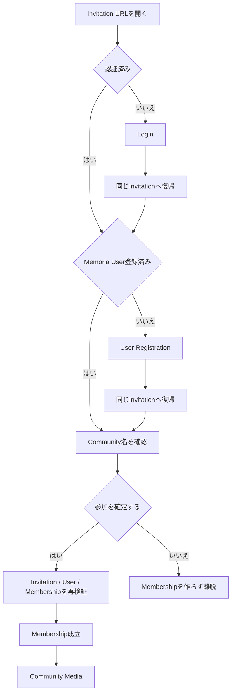

# Community招待の受諾

## 概要

Invitation URLを受け取ったUserが、招待先Communityを確認し、Communityへの参加を明示的に確定する画面です。

Membership成立前のCommunity外Userも到達するため、通常のCommunity Application contextとは分離して扱います。

> 実装状況: Invitation accept UIは未実装です。本仕様はInitial ReleaseのInvitation参加Flowを定義します。

## 目的

Invitationを受け取ったUserが、参加成立前に許可された範囲で招待先を確認し、自分の意思でCommunity参加を確定できるようにします。

LoginやUser Registrationが必要な場合もInvitationの意図を失わず、認証・登録完了後に同じFlowへ復帰できるようにします。

## 関連Use Case

- [Communityユースケース - InvitationからCommunityへ参加する](/community/use-cases#invitationからcommunityへ参加する)
- [Communityユースケース - 招待URLを発行・共有する](/community/use-cases#招待urlを発行共有する)
- [Userユースケース - 新規登録](/user/use-cases#新規登録)
- [Userユースケース - Login・Logout・session失効](/user/use-cases#loginlogoutsession失効)

## 表示情報

参加成立前に表示するCommunity情報は、現在のCommunity名だけとします。

Membership成立前に次の情報を表示しません。

- Member一覧
- Media
- Group / Tag
- email address等のUser情報
- Community内部の管理情報

Invitationを発行したAdministrator個人の情報を、参加判断のための必須情報として追加しません。

## 操作

LoginやRegistrationは参加を自動確定しません。必ずInvitationへ復帰し、ACTIVE User本人による明示的な参加確定を経ます。

### Loginする

未認証UserはMemoriaの認証Flowへ進みます。

Invitation URLを安全な内部復帰先として保持し、認証完了後に同じInvitationへ戻ります。

認証だけではMembershipを作成しません。

### User Registrationへ進む

Auth0認証済みでもMemoria Userが未登録の場合は[User Registration](/screens/user-registration)へ進みます。

Registration完了後は同じInvitationへ戻ります。User RegistrationだけではMembershipを作成せず、Invitation acceptを改めて明示的に確定します。

### Communityへ参加する

ACTIVE Userは、表示されたCommunityへの参加を明示的に確定できます。

実行時にInvitationの有効性、Communityの存在、User状態、Membership不存在を再確認し、成立した場合はrole=memberのMembershipを作成します。

Administratorの個別承認は要求しません。

### 参加せず離脱する

UserはInvitationをacceptせずFlowから離脱できます。

Invitationを開いたこと自体を参加意思とはみなさず、Membershipを作成しません。

具体的な戻り先presentationは固定しません。ACTIVE UserがApplicationへ戻る場合はApplication IAの利用可能なdestinationへ遷移できます。

## 状態

### 未認証

Community名を許可範囲で提示し、参加を続けるためのLogin Actionを提供します。

Login完了後は同じInvitationへ戻ります。

### 認証済み・未登録

Community名を許可範囲で提示し、Memoria User Registrationが必要であることを示します。

Registration完了後は同じInvitationへ戻り、参加を自動確定しません。

### 参加可能

ACTIVE UserがCommunity名を確認し、参加を明示的に確定できます。

### 参加処理中

accept結果が確定するまで同じ意図の重複実行を防ぎます。

### 参加成功

Membership成立後は対象Communityを現在Application contextとして、そのCommunityの標準entryであるMediaへ遷移します。

参加成功後にInvitation確認画面へ留まり続けません。

### すでに参加済み

現在Userがすでに対象Communityの有効なMembershipを持つ場合、新しいMembershipを作成しません。

Userを重複参加させず、対象Communityが利用可能であれば既存Membershipに基づいてCommunityの標準entryへ進める状態として扱います。

API上で重複acceptをerrorとするかidempotentな既存Membership結果とするかはAPI Idempotency設計の正本に従います。

### Invitation期限切れ・無効化済み

新しいMembershipを作成しません。

Invitationが現在利用できないことを持続的に提示し、同じURLの再試行だけで参加できるかのように表現しません。

新しいInvitationの取得方法そのものは本Screenの責務とせず、Administrator情報等を追加で開示しません。

### Community削除済み / Invitation不明

Community名称を含む内部情報を表示しません。

参加できないことだけを提示し、存在しないCommunityと不正なtokenをUser向け情報から不必要に識別可能にしません。

### User利用不可

DELETING等、ACTIVEではないMemoria UserはInvitation acceptを実行できません。

通常の参加可能状態として表示せず、User lifecycleの制約に従います。

### 一時的な失敗

有効性確認やacceptで再試行可能な一時的失敗が発生した場合は、参加が成立していないことを明示し、現在のInvitationを失わず再試行できるようにします。

## Navigation

Invitation URLは通常Application Navigationとは独立したentry pointです。

Membership成立前のUserにCommunity Context Navigationを提示することを前提としません。

未認証UserはLogin後、未登録UserはUser Registration後に、安全な内部復帰先として元のInvitationへ戻ります。

参加成功または既存Membership確認後は、対象Communityを現在contextとしてCommunity Mediaへ遷移します。

Invitationをacceptしない場合はMembershipを作成せずFlowを終了できます。

認証・Registrationからの安全な復帰とoperationを自動再開しない共通behaviorは[Authentication Return / Session Recovery](/design-system/patterns/authentication-return-session-recovery)に従います。

## 制約

- Invitation URLを開いただけではMembershipを作成しません。
- 参加成立にはACTIVEなMemoria Userが必要です。
- 参加成立前に表示できるCommunity情報は名称だけです。
- Invitationは発行から7日間有効です。
- 有効期間内は複数Userが同じInvitationを利用できます。
- accept時にAdministrator承認を要求しません。
- accept成立時のroleはmemberです。
- Invitation tokenをlog、外部解析、第三者Serviceへ送信しません。
- Login / Registration後のreturn URLは許可された内部URLだけを利用します。
- Community削除後はCommunity名称を含む情報を表示しません。
- Community外UserへMember、Media、Group、Tag等の内部情報を開示しません。
- Invitationの有効性とMembership作成のTransaction / 競合制御は[Communityの整合性とTransaction](/community/consistency-transactions)を正本とします。

## Responsive対応

表示領域や入力方式が変わっても、招待先Community名の確認、認証・登録への継続、参加確定、参加しない選択というCapabilityを維持します。

具体的なcard / page / centered layout等は固定しません。参加成立前の限定された情報だけを明確に提示し、重要Actionをhoverだけに依存させません。
