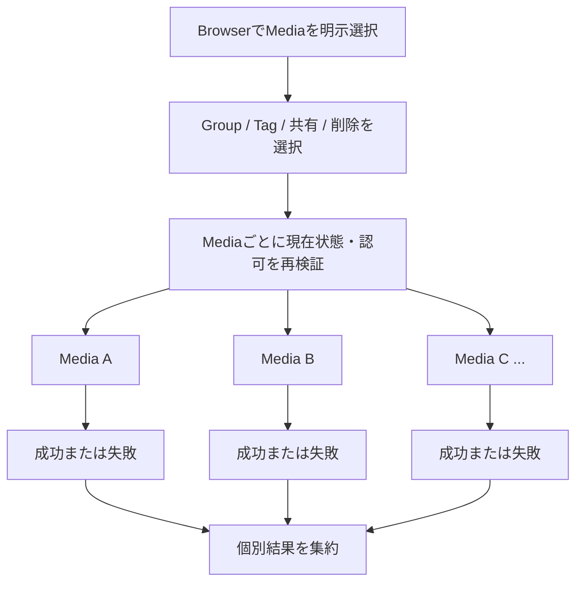

# Media一覧・詳細

## 概要

PersonalまたはCommunity contextで、現在contextのMediaをvisual content中心に発見し、選択したMediaを詳しく閲覧して権限に応じたActionへ進む共通Interactionです。

> 実装状況: 既存のmemoria-webにはthumbnail中心の一覧、Media Detail modal、前後Mediaへの移動、情報panel、複数選択があります。本仕様ではそれらを参考にしつつ、Personal / Community context、Media Custody、現在の認可modelに合わせて意味とBehaviorを定義します。

## 目的

UserがMediaの内部data構造を意識せず、画像そのものを中心に目的のMediaを発見・閲覧し、必要な場合だけ詳細情報や現在実行可能なActionへ進めるようにします。

Personal MediaとCommunity Mediaで共通するBrowser / Detail interactionを定義し、対象Media、共有状態、Custody、Action availability等のcontext固有差分は各Screen Specificationに従います。

## 関連Use Case

- [Media関連ユースケース - Mediaを閲覧・downloadする](/media/use-cases#mediaを閲覧downloadする)
- [Media関連ユースケース - Mediaを削除する](/media/use-cases#mediaを削除する)
- [Media関連ユースケース - MediaをGroupへ追加・除外する](/media/use-cases#mediaをgroupへ追加除外する)

## 表示情報

### Media Browser

Media Browserでは画像のvisual contentを主要な識別情報として提示します。

通常状態では新しいMediaから順に発見できるようにします。Media一覧の標準順序はMediaの作成日時の降順とし、同時刻等でも安定して継続取得できることをAPI contractで保証します。

file名、Uploader、Custodian等をすべてのMediaへ常時表示することは要求しません。対象Mediaを識別し、誤操作を防ぐために必要な補助情報だけをpresentationに応じて提示できます。

### Media Detail

Media Detailでは選択したMedia自体を主役として表示します。

必要に応じて次の情報を確認できるようにします。

- Original file名
- Original file size
- 画像のwidth / height
- Upload日時
- Uploader

Personal contextでは、User管理Mediaの共有状態を管理するために、必要に応じて共有先Communityを確認できるようにします。

Community contextでは、利用可能なActionを理解するために必要な場合、MediaがUser管理かCommunity管理か、およびUploaderを確認できるようにします。

MIME type、Object Storage key、Variant record、Processing Job、内部status等の実装・運用情報を通常のMedia Detail情報として提示することは要求しません。

## 操作

### Mediaを選択して閲覧する

BrowserからMediaを選択すると、そのMediaをDetailとして閲覧できます。

Initial Releaseでは、整理・共有・削除を複数Mediaへ適用するための複数選択も提供します。bulk対象はUserがBrowser上で明示的に選択したMedia ID集合だけとし、現在のfilter結果全件、未読込page、将来追加されるMedia等を暗黙に含めません。「条件に一致するすべてを選択」のようなquery-based bulk operationはInitial Releaseでは提供しません。

Detailのpresentationをmodal、overlay、split view、dedicated routeのいずれかへ固定しません。表示領域と入力方式に適したpresentationを選択できます。

### 前後のMediaへ移動する

Browserの一覧contextからDetailを開いた場合、Userは現在の一覧contextを維持したまま前後のMediaへ移動できます。

前後関係は現在Browserで成立している順序を基準とします。移動のためにPersonal / Community contextや現在の一覧条件を暗黙に変更しません。

### 詳細情報を確認する

Mediaの閲覧を妨げない形で、必要なときに補助情報を確認できます。

詳細情報を常時展開することは要求しません。WideではMediaと情報を同時表示し、Compactでは段階的に表示する等、presentationを変更できます。

### Groupで分類する

Media Detailを、1件のMediaを既存Groupへ分類する主要な入口とします。

Userは現在scopeに存在するGroupについて、対象Mediaが現在所属しているGroupを確認し、分類権限がある場合はGroupへの追加・除外を行えます。

Personal contextではPersonal Groupだけ、Community contextでは現在CommunityのCommunity Groupだけを候補にします。CommunityではAdministratorとMemberのどちらも既存Groupを使って閲覧可能なMediaを分類できます。

1つのMediaを複数Groupへ分類できます。Groupから除外してもMedia本体、他Groupへの分類、Custody、共有状態を変更しません。

Groupの新規作成をMedia分類の成立条件にしません。Group作成は[Group Browser](/screens/group-browser)のGroup構造管理として扱い、Community MemberにはGroup作成Actionを提供しません。

分類操作中にGroup削除、Membership / role変更、Mediaの利用不能化等が発生した場合は現在状態を再検証し、成立しなかった変更を成功として表示しません。

Media Detailの1 Media分類を主要Interactionとしつつ、Media Browserで明示選択した複数Mediaへ同じ既存Groupを一括追加・除外できます。Media選択とGroup新規作成を一体化したshortcutはInitial Releaseの必須Capabilityとしません。

### 複数MediaへActionを適用する

bulk Actionは一つのUser意図として開始しますが、各Mediaの結果は独立します。成功済み変更を他Mediaの失敗でrollbackしません。

複数選択中は、選択集合のすべてに意味があり、現在Userが実行可能なbulk Actionだけを提示します。Initial Releaseでは次をbulk対象に含めます。

- 既存Groupへの追加・除外
- 既存Tagへの付与・解除
- User管理Mediaの1 Communityへの共有
- Media削除

bulk操作はUI上では一つの意図として開始できますが、domain上はMediaごとの独立した結果として扱います。1件の競合・認可変更・validation failureを理由に、既に成立した他Mediaの変更をrollbackしません。API実装は複数IDを受ける単一MutationまたはMedia単位Mutationの集約を選択できますが、Product contractとして全件atomic transactionを要求しません。

実行時には各MediaについてACTIVE状態、現在scopeでの可視性、Custody、Membership / role、対象Group / Tag / Community等を再検証します。成功・失敗はMedia単位で識別でき、部分成功時は成功済み変更を維持したまま失敗対象と理由を確認・再試行できるようにします。

Group / Tag bulk classificationでは1回のActionにつき1つの既存GroupまたはTagを対象にし、選択Mediaへ同じrelation変更を適用します。Group / Tagの新規作成とbulk分類を一つのdomain operationへ結合しません。

bulk sharingでは共有先Communityを1つ固定し、選択集合のうち操作者本人がCustodianであるUser管理Mediaだけを対象にします。Community管理Mediaや既にそのCommunityへ共有済みのMediaを新しい共有relationとして成立させません。

bulk deleteは不可逆操作なので、実行前に選択件数と削除が復元不能であることを明示して確認します。Community contextではMediaごとの削除権限が異なり得るため、権限のないMediaを削除対象として成立させません。削除受付後は各Mediaが独立してDELETINGへ遷移し、Storage cleanupもMedia単位で完了します。

### Contextに応じたその他のActionを実行する

Detailから利用できるActionは現在contextとdomain上の権限に従います。

Personalでは共有・共有解除、Original download、削除等、Communityでは権限のあるOriginal download・削除・共有解除等へ到達できます。

具体的な共有、削除確認等は対応するScreen / PatternのBehaviorに従います。Tag分類とTag filterのsemanticsは[Media Tag](/media/tag)に従います。

## 状態

### Browser: Mediaあり

現在contextで閲覧可能なMediaをvisual content中心に発見できます。Mediaを選択するとDetailへ進めます。

### Browser: Empty

現在contextにMediaが存在しないことを明示します。Mediaを追加するActionはPersonal / Community Mediaそれぞれの仕様に従います。

### Browser: 読み込み失敗

Emptyと混同せず、一覧取得に失敗したことを示して再試行できるようにします。

### Detail: 表示可能

選択したMediaを表示し、現在Userが利用できるActionだけを提供します。

### Detail: Mediaが利用不能になった

Detail表示中にMedia削除、共有解除、Membership喪失等によって現在contextから閲覧できなくなった場合、そのMediaを表示し続けません。

Browserへ戻れる場合は現在contextのBrowserへ戻し、context自体を利用できない場合はApplication IAに従う安全なdestinationへ移動します。

### Detail: 読み込み失敗

Media自体を取得できない状態と、補助情報や個別Actionの一時的な失敗を区別します。再試行可能な場合は対象を保ったまま再試行できるようにします。

## Navigation

Media Browser / Detailは独立したApplication contextを作りません。Personal Mediaまたは現在Community Mediaのcontextを維持します。

Detailを閉じる、またはBrowserへ戻る場合、可能な限り元の一覧contextへ戻れるようにします。

Detail内で前後Mediaへ移動してもApplication contextは変わりません。

## 制約

- Browser / DetailはMediaのvisual contentを優先し、内部data modelをUI構造として露出しません。
- 一覧とDetailの画像表示には同じImage Variant集合を利用でき、presentationに応じて適切なVariantを選択します。
- Original download権限と表示用Variantの閲覧権限を同一視しません。
- UploaderとCustodianを同一視しません。
- UI上のAction availabilityをAPI側認可の代替にしません。
- Browser / Detailの基本InteractionはPersonal / Communityで共通化し、scopeと認可差分を各Screen Specificationで定義します。
- Grid / List、thumbnail size、modal / route等の具体的presentationをProduct仕様として固定しません。
- Media Detailの1 Media分類に加え、Browserで明示選択した複数Mediaへ既存Group / Tagを一括適用できます。query結果全件を暗黙対象にしません。
- Group作成とMedia分類を一つの必須操作として結合しません。
- Uploadのfile選択、進捗、Variant生成等のInteractionは別途Media Upload設計で定義します。
- Tagは[Media Tag](/media/tag)に従い、1 Media単位のMedia Detailを付与・解除の主要入口とし、Media Browserでは現在scopeのTagによる絞り込みを提供します。

## Responsive対応

Compact / Medium / WideでMediaを発見し、1件を詳しく閲覧し、現在利用可能な主要Actionへ到達するCapabilityを維持します。

Wideでは一覧とDetailまたはMediaと情報を同時に提示できますが必須ではありません。CompactではDetailを段階的な画面として提示する等、表示領域に合わせて構成を変更できます。

Media選択、Detailの終了、前後移動、詳細情報、主要Actionをhoverだけに依存させず、touchとkeyboardでも到達できるようにします。
