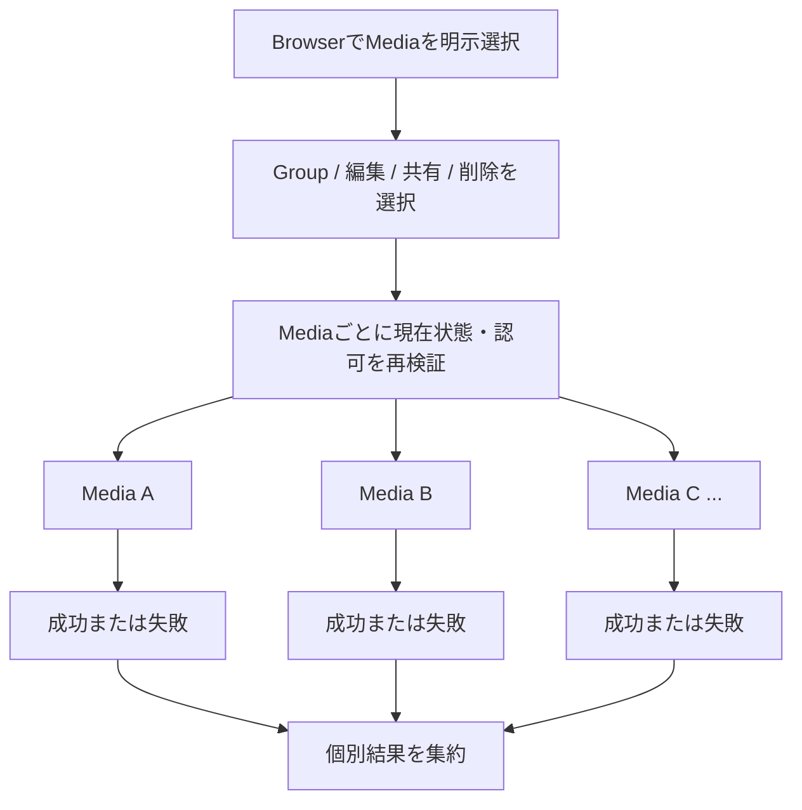

# Media一覧・詳細

## 概要

PersonalまたはCommunity contextで、現在contextのMediaをvisual content中心に発見し、選択したMediaを詳しく閲覧して権限に応じたActionへ進む共通Interactionです。

> 実装状況: 既存のmemoria-webにはthumbnail中心の一覧、Media Detail modal、前後Mediaへの移動、情報panel、複数選択があります。本仕様ではそれらを参考にしつつ、Personal / Community context、Media Custody、現在の認可modelに合わせて意味とBehaviorを定義します。

## 目的

UserがMediaの内部data構造を意識せず、画像そのものを中心に目的のMediaを発見・閲覧し、必要な場合だけ詳細情報や現在実行可能なActionへ進めるようにします。

Personal MediaとCommunity Mediaで共通するBrowser / Detail interactionを定義し、対象Media、共有状態、Custody、Action availability等のcontext固有差分は各Screen Specificationに従います。

## 関連Use Case

- [Media関連ユースケース - Mediaを閲覧・downloadする](/media/use-cases#mediaを閲覧downloadする)
- [Media関連ユースケース - Mediaを削除する](/media/use-cases#mediaを削除する)
- [Media関連ユースケース - MediaをGroupへ追加・除外する](/media/use-cases#mediaをgroupへ追加除外する)

## 表示情報

### Media Browser

Media Browserでは画像のvisual contentを主要な識別情報として提示します。

通常状態では新しいMediaから順に発見できるようにします。Media一覧の順序はMediaの作成日時の降順に固定し、Initial ReleaseではUserが並び順を変更するsort Actionを提供しません。同時刻等でも安定して継続取得できることをAPI contractで保証します。

Initial ReleaseのMedia Browserではfree textによるMedia検索を提供せず、現在scopeのTagによる絞り込みだけをCollection条件として提供します。複数Tagの条件は[Media Tag](/media/tag)に従います。

Media BrowserではMediaのtitleやOriginal file名を表示上の識別情報として使用しません。Uploader、Custodian等もすべてのMediaへ常時表示することは要求しません。対象Mediaのvisual contentを主要な識別情報とし、誤操作を防ぐために必要な補助情報だけをpresentationに応じて提示できます。

### Media Detail

Media Detailでは選択したMedia自体を主役として表示します。

Media DetailでもMediaのtitleやOriginal file名は通常の表示情報として提示しません。Mediaそのもののvisual contentを中心に、必要に応じて次の補助情報を確認できるようにします。

- Original file size
- 画像のwidth / height
- Upload日時
- Uploader

Personal contextでは、User管理Mediaの共有状態を管理するために、必要に応じて共有先Communityを確認できるようにします。

Community contextでは、利用可能なActionを理解するために必要な場合、MediaがUser管理かCommunity管理か、およびUploaderを確認できるようにします。

MIME type、Object Storage key、Variant record、Processing Job、内部status等の実装・運用情報を通常のMedia Detail情報として提示することは要求しません。

## 操作

### Mediaを選択して閲覧する

BrowserからMediaを選択すると、そのMediaをDetailとして閲覧できます。

Initial Releaseでは、整理・共有・削除を複数Mediaへ適用するための複数選択も提供します。bulk対象はUserがBrowser上で明示的に選択したMedia ID集合だけとし、現在のfilter結果全件、未読込page、将来追加されるMedia等を暗黙に含めません。「条件に一致するすべてを選択」のようなquery-based bulk operationはInitial Releaseでは提供しません。

Initial ReleaseのMedia DetailはBrowser上のDialogとして表示します。表示領域と入力方式に応じたDialog内の具体的なpresentationはResponsive対応とUI具体化に従います。

### 前後のMediaへ移動する

Browserの一覧contextからDetailを開いた場合、Userは現在の一覧contextを維持したまま前後のMediaへ移動できます。

前後関係は現在Browserで成立している順序を基準とします。移動のためにPersonal / Community contextや現在の一覧条件を暗黙に変更しません。

前後移動の範囲はClientが現在取得済みのMediaだけに制限しません。現在のCollection上で移動先が存在し、まだ取得されていない場合は、Relay Connectionから必要な範囲を追加取得して移動します。追加取得に失敗した場合は現在表示中のMedia Detailを維持し、移動できなかったことを示して再試行できるようにします。

User Settingsの「前後Navigation循環」がOFFの場合はCollectionの先頭・末尾を境界とします。ONの場合は、Collectionのfilter条件と順序を維持したまま、末尾から次へ進むと先頭へ、先頭から前へ戻ると末尾へ循環します。循環先が未取得の場合も取得済み範囲を境界とはみなさず、必要な範囲をConnectionから取得します。Collectionが1件だけの場合は同じMedia自身への前後移動Actionを成立させません。

### 詳細情報を確認する

Mediaの閲覧を妨げない形で、必要なときに補助情報を確認できます。

詳細情報を常時展開することは要求しません。WideではMediaと情報を同時表示し、Compactでは段階的に表示する等、presentationを変更できます。

### Groupで分類する

Media Detailを、1件のMediaを既存Groupへ分類する主要な入口とします。

Userは現在scopeに存在するGroupについて、対象Mediaが現在所属しているGroupを確認し、分類権限がある場合はGroupへの追加・除外を行えます。

Personal contextではPersonal Groupだけ、Community contextでは現在CommunityのCommunity Groupだけを候補にします。CommunityではAdministratorとMemberのどちらも既存Groupを使って閲覧可能なMediaを分類できます。

1つのMediaを複数Groupへ分類できます。Groupから除外してもMedia本体、他Groupへの分類、Custody、共有状態を変更しません。

Groupの新規作成をMedia分類の成立条件にしません。Group作成は[Group Browser](/screens/group-browser)のGroup構造管理として扱い、Community MemberにはGroup作成Actionを提供しません。

分類操作中にGroup削除、Membership / role変更、Mediaの利用不能化等が発生した場合は現在状態を再検証し、成立しなかった変更を成功として表示しません。

Media Detailを1 Mediaの分類と分類修正の主要Interactionとし、現在のdirect Group所属を確認しながら既存Groupへの追加・除外を行えます。Media Browserで明示選択した複数Mediaについては、関連するMedia群へ共通の分類を効率よく付与することを主要User Goalとし、同じ既存Group群への一括追加を提供します。Initial ReleaseではGroupからのbulk除外を主要Capabilityとせず、誤分類の解除はMedia DetailでMedia単位に判断します。Media選択とGroup新規作成を一体化したshortcutはInitial Releaseの必須Capabilityとしません。

Media Detailの情報・分類PanelにはGroupsセクションを設け、現在のdirect Group所属を確認できるようにします。Group分類を変更できる場合は、このセクションからGroup集合を編集する明示的な編集Actionを提供します。入口を1 Groupの追加・除外に見える `+` / `-` Actionへ分割せず、対象MediaのGroup分類全体を編集するActionとして表現します。具体的なButton presentationはPanel全体のVisual Reviewで決定しますが、Actionの意味がGroup編集であることをUserが識別できるlabelまたは同等に明確な表現を使用します。

編集ActionからMedia Detail Dialogの上位にGroup編集Dialogを開きます。編集Dialogでは現在のdirect Group所属を初期Draftとし、同一scopeの既存Groupを名前で検索して複数選択できます。Group Browserのrelation selectorと同じく、検索可能なmulti-select interactionを基本とし、選択済みGroupを確認・個別解除できるようにします。scope内Groupを巨大なcheckbox listとして一括表示する方式は採用しません。

Groupの追加・除外は個々の選択操作で即時反映せず、同じDraft内で複数指定し、保存Actionで追加・除外差分をまとめて反映します。キャンセル時は未保存Draftを反映しません。検索条件の変更や候補の追加読み込みによってDraftを失わないようにします。Group Browserのrelation編集と共通のselector interactionを利用できますが、Media分類にはParents / Childrenの方向、cycle、depth等のGroup間relation制約を持ち込まず、単一のGroups selectorとして扱います。

Routing / URL / deep link / history等のNavigation contractはこのGroup編集Interactionの前提条件とせず、後続のRouting設計で整合を確認します。

### 複数MediaへActionを適用する

bulk Actionは一つのUser意図として開始しますが、各Mediaの結果は独立します。成功済み変更を他Mediaの失敗でrollbackしません。

複数選択中は、選択集合のすべてに意味があり、現在Userが実行可能なbulk Actionだけを提示します。Initial Releaseでは次をbulk対象に含めます。

- 既存Groupへの追加
- 選択Mediaの編集。Browser上ではTagのbulk追加・解除を直接提供せず、Media Update画面へ遷移して選択Mediaを編集する
- User管理Mediaの1 Communityへの共有
- Media削除

bulk操作はUI上では一つの意図として開始できますが、domain上はMediaごとの独立した結果として扱います。1件の競合・認可変更・validation failureを理由に、既に成立した他Mediaの変更をrollbackしません。API実装は複数IDを受ける単一MutationまたはMedia単位Mutationの集約を選択できますが、Product contractとして全件atomic transactionを要求しません。

実行時には各MediaについてACTIVE状態、現在scopeでの可視性、Custody、Membership / role、対象Group / Tag / Community等を再検証します。成功・失敗はMedia単位で識別でき、部分成功時は成功済み変更を維持したまま失敗対象と理由を確認・再試行できるようにします。

Group bulk classificationでは1回のActionで1つ以上の既存Groupを選択し、選択MediaをそれらのGroupへまとめて追加できます。Selection toolbarのGroup分類ActionからDialogを開き、対象Media件数と、同一scopeの既存Groupを名前で検索して複数選択できるinputを提示します。Dialogは今回追加するGroup集合の指定だけを責務とし、選択Mediaが既に所属しているGroupやMedia間のmixed membership stateは表示しません。初期選択は空とし、選択済みGroupを外す操作は今回の追加対象から外すだけで、既存relationの除外を意味しません。確定Actionは追加として表現し、各Mediaですでに存在するMedia × Group relationはno-opとして重複作成しません。Groupからのbulk除外はInitial Releaseでは提供せず、Media Detailで現在のdirect Group所属を確認してMedia単位で解除します。Groupの新規作成とbulk分類を一つのdomain operationへ結合しません。Tagの編集はBrowser上のbulk Actionとして直接提供せず、Media Update画面へ引き継いで行います。

Group bulk classificationの実行時は、選択したGroup集合をAction全体で共有するpreconditionとして再検証します。選択Groupの不存在、scope不整合、分類先として利用する権限の喪失等によりGroup集合が成立しない場合はAction全体を失敗させ、どのMediaにも変更を適用しません。残ったGroupだけへ暗黙に縮退して処理を続行しません。

Group集合が有効な場合はMediaごとに現在状態とauthorizationを再検証し、Mediaの不存在、利用不能、分類権限の喪失等はそのMediaだけの失敗として扱います。他の有効なMediaへの追加は成功として維持し、Media間では部分成功を許容します。一方、1 Mediaに対する選択Group集合の追加は一つの適用単位として扱い、成功したMediaについて選択Groupの一部だけが追加された状態をProduct contractとして作りません。

全成功時はDialogを閉じて結果をBrowserへ反映します。Action-level failureでは0件適用のままDialogを維持し、Group候補の現在状態を再検証してUserが選択を修正・再実行できるようにします。Media-level partial successでは成功済みMediaをrollbackせず、Dialogを開いたままGroup選択状態から実行結果状態へ遷移します。

結果状態では、成功件数と失敗件数、および今回追加対象として指定したGroup集合を確認できるようにします。成功したMediaの一覧は表示せず、次の判断・復旧が必要な失敗Mediaだけを識別可能なMedia情報とともに一覧表示します。失敗理由はGraphQL / HTTP等の技術的なerrorを直接表示せず、「Mediaが利用できない」「分類する権限がない」等、Userが現在状態と次の行動を判断できるProduct-level reasonとして示します。

結果状態の主要Actionは失敗Mediaだけを同じGroup集合へ再試行するActionとし、副Actionとして結果を受け入れてDialogを終了できるようにします。Initial Releaseでは結果Dialog内に失敗Mediaを再選択するUIを追加せず、再試行対象はその時点で残っている失敗Media全件とします。再試行で成功したMediaは失敗集合から除外し、再度partial successとなった場合は残った失敗Mediaと最新の成功・失敗件数へ結果状態を更新します。すべて成功した場合はDialogを閉じてBrowserへ結果を反映します。

再試行時にもGroup集合をAction全体のpreconditionとして再検証します。Groupの不存在、scope不整合、利用権限喪失等によりGroup集合自体が成立しなくなった場合はMedia単位の再試行を続けず、0件適用のAction-level failureとしてGroup選択を修正できる状態へ戻します。成功済みMediaへの既適用relationはrollbackしません。

bulk sharingでは共有先Communityを1つ固定し、選択集合のうち操作者本人がCustodianであるUser管理Mediaだけを対象にします。Community管理Mediaや既にそのCommunityへ共有済みのMediaを新しい共有relationとして成立させません。

bulk deleteは不可逆操作なので、実行前に選択件数と削除が復元不能であることを明示して確認します。Community contextではMediaごとの削除権限が異なり得るため、権限のないMediaを削除対象として成立させません。削除受付後は各Mediaが独立してDELETINGへ遷移し、Storage cleanupもMedia単位で完了します。

### Contextに応じたその他のActionを実行する

Media Detailが提供するProduct Actionは、Media Browser、Group Browser等のどのScreenからDetailを開いたかによって個別に定義しません。同じMedia Detail Capabilityを利用し、現在のApplication context、対象Mediaの状態・Custody、Membership / role等のProduct / Application ruleからAction availabilityを一貫して導出します。

利用元Screenは、Detailを開いたCollectionの順序、前後Navigation、Detailを閉じた際の復帰先や維持する一覧状態等のBrowser contextを提供しますが、認可・業務上のAction availabilityの正本にはしません。同じApplication context、同じMedia、同じUser状態であれば、利用元Screenが異なることだけを理由にProduct Actionの可否を変えません。

Detailから利用できるActionは現在contextとdomain上の権限に従います。

Personalでは共有・共有解除、Original download、削除等、Communityでは権限のあるOriginal download・削除・共有解除等へ到達できます。

具体的な共有、削除確認等は対応するScreen / PatternのBehaviorに従います。Tag分類とTag filterのsemanticsは[Media Tag](/media/tag)に従います。

## 状態

### Browser: Mediaあり

現在contextで閲覧可能なMediaをvisual content中心に発見できます。Mediaを選択するとDetailへ進めます。

### Browser: Empty

現在contextにMediaが存在しないことを明示します。Mediaを追加するActionはPersonal / Community Mediaそれぞれの仕様に従います。

### Browser: Filter結果0件

Tag filter適用後に一致するMediaが0件の場合は、現在contextにMedia自体が存在しないEmptyと区別します。適用中のfilterを認識できる状態を維持し、Tag filterの変更または解除へ到達できるようにします。Media追加をfilter結果0件からの主要な復旧Actionにはしません。

### Browser: 読み込み失敗

Emptyと混同せず、一覧取得に失敗したことを示して再試行できるようにします。

### Browser: 追加読み込み中・追加読み込み失敗

追加読み込み中も表示済みMedia、現在のTag filter、選択状態では明示選択集合を維持します。追加取得失敗時もCollection全体をErrorへ置き換えず、表示済みMediaを利用できる状態のまま再試行へ到達できるようにします。終端へ到達した場合は追加読み込み中と誤認させる継続的なloading表示を残しません。

### Browser: 選択中

選択中は現在のCollection条件を固定し、Tag filterを変更できないようにします。選択件数と現在実行可能なbulk Actionを確認でき、thumbnail操作でMediaを明示選択・解除できます。選択を終了すると明示選択集合を破棄して通常の閲覧状態へ戻ります。

### Browser / Detail: 画像処理失敗

Media登録後に画像処理がterminal failureとなったMediaも通常のMedia Browserから除外しません。表示用Variantが利用できないことと画像処理に失敗した状態を識別できるようにし、正常なthumbnailが存在するように見せません。

Initial ReleaseではUser向けのProcessing手動retry Actionを提供しません。Media自体は有効な登録済みMediaとして残るため、現在の認可に従って削除等の利用可能なActionへ到達できます。内部attempt数、Redis状態、Processing Job等の運用情報は表示しません。

### Detail: 表示可能

選択したMediaを表示し、現在Userが利用できるActionだけを提供します。

### Detail: Mediaが利用不能になった

Detail表示中にMedia削除、共有解除、Membership喪失等によって現在contextから閲覧できなくなった場合、そのMediaを表示し続けません。

Browserへ戻れる場合は現在contextのBrowserへ戻し、context自体を利用できない場合はApplication IAに従う安全なdestinationへ移動します。

### Detail: 読み込み失敗

Media自体を取得できない状態と、補助情報や個別Actionの一時的な失敗を区別します。再試行可能な場合は対象を保ったまま再試行できるようにします。

## Navigation

Media Browser / Detailは独立したApplication contextを作りません。Personal Mediaまたは現在Community Mediaのcontextを維持します。

Media Browserの基本URLはPersonalで`/media`、Communityで`/communities/[communityId]/media`とします。Initial ReleaseではMedia Detailを開いた状態をURL stateへ反映せず、`mediaId`等のquery parameterやDetailへの直接リンクを提供しません。Detail Dialogのopen / closeはBrowser上の一時的なUI stateとして扱います。後続リリースでDetail presentationを拡張する際に、Detail URLやhistory連携の必要性を改めて検討できます。

Initial ReleaseではMedia Detailをダイアログ方式で表示し、表示方式を変更するUser設定は提供しません。後続リリースではダイアログ方式と右ペイン方式をUser設定で切り替え可能にする方針とし、Personal / Communityで共通の表示設定を適用します。右ペイン方式ではMedia画像を上、詳細情報・Groups・Tags・操作を下に配置します。表示領域が不足する場合は設定にかかわらず適切な表示方式へ適応します。具体的な設定保存方式やbreakpointは後続設計で決定します。

Detailを閉じる、またはBrowserへ戻る場合、可能な限り元の一覧context（Tag絞り込み・スクロール位置を含む）へ戻れるようにします。Groupsから開いた場合は選択中Groupの一覧contextを維持します。

Detail内で前後Mediaへ移動してもApplication contextは変わりません。

## 制約

- Browser / DetailはMediaのvisual contentを優先し、内部data modelをUI構造として露出しません。
- 一覧とDetailの画像表示には同じImage Variant集合を利用でき、presentationに応じて適切なVariantを選択します。
- Original download権限と表示用Variantの閲覧権限を同一視しません。
- UploaderとCustodianを同一視しません。
- UI上のAction availabilityをAPI側認可の代替にしません。
- Browser / Detailの基本InteractionはPersonal / Communityで共通化し、scopeと認可差分を各Screen Specificationで定義します。
- Grid / List、thumbnail size等の具体的presentationは後続のUI具体化で決定します。Media DetailはInitial Releaseではダイアログ方式とし、後続で右ペイン方式と表示設定を追加する方針です。
- Media Detailでは1 Mediaのdirect Group所属を確認して追加・除外でき、Browserで明示選択した複数Mediaには既存Groupを一括追加できます。Initial ReleaseではGroupからのbulk除外を提供しません。Tag編集を含む選択Mediaの編集はMedia Update画面へ引き継ぎます。query結果全件を暗黙対象にしません。
- Group作成とMedia分類を一つの必須操作として結合しません。
- Uploadのfile選択、進捗、Variant生成等のInteractionは別途Media Upload設計で定義します。
- Tagは[Media Tag](/media/tag)に従い、1 Media単位のMedia Detailを付与・解除の主要入口とし、Media Browserでは現在scopeのTagによる絞り込みを提供します。

## Collectionの読み込み

Media Browserの一覧はRelay Connectionによる無限ローディングを使用し、ページ番号によるPaginationを提供しません。閲覧状態ではTag絞り込みの変更に対応するConnectionを取得し、追加取得中・終端・追加取得失敗を区別します。並び順はMedia作成日時の降順に固定します。追加取得に失敗しても表示済みMediaと明示選択を維持し、再試行できるようにします。DetailからBrowserへ戻る場合はTag絞り込み・スクロール位置を可能な限り復元します。未取得Mediaを暗黙にBulk選択せず、keyboard・支援技術からも追加取得に到達できるようにします。

選択状態ではTag絞り込みを変更できないようにし、選択開始時のCollection条件を固定します。追加読み込みは同じCollection条件の継続として利用でき、追加取得されたMediaをUserが明示的に選択できます。選択状態を終了して閲覧状態へ戻るときは明示選択集合を破棄します。

## Responsive対応

Compact / Medium / Wideで、Mediaを発見し、1件を詳しく閲覧し、現在利用可能な主要Product Actionへ到達するUser Goalを維持します。表示領域ごとに補助的なviewer Capabilityを機械的に一致させることは要求しません。

Initial Releaseの基本表示はダイアログ方式とし、Compactでは画面領域に合わせたダイアログの表示方法を採用します。後続の右ペイン方式はWide等の十分な表示領域を前提とし、狭い画面では表示設定より利用可能な領域と操作性を優先します。

Media選択、Detailの終了、前後移動、詳細情報、主要Actionをhoverだけに依存させず、touchとkeyboardでも到達できるようにします。選択状態では選択件数とbulk Actionを表示領域が狭い場合も見失わないpresentationへ適応し、選択状態を色だけで表現しません。追加読み込みと失敗時の再試行もviewportへの到達だけに依存させず、keyboard・支援技術から利用できるようにします。

## UI具体化

Media Browserは正方形thumbnailによるgridを基本とし、実際にBrowserへ割り当てられたcontainer幅へ追従して列数を自動調整します。Compact / Medium / Wideごとの固定列数はProduct仕様にせず、Detail Pane等で同じviewport内の利用可能幅が変化した場合もgridを再構成できるようにします。Browserでは正方形thumbnail Variantを使用し、Media Detailでは元画像のaspect ratioを維持します。

Browser toolbarでは「閲覧」と「選択」を明示的に切り替えます。閲覧を通常状態とし、thumbnail操作でDetailを開きます。閲覧状態では現在scopeのTag filter、現在Application contextで利用可能なMedia追加Action、選択状態への入口へ到達できるようにします。Initial ReleaseではMedia検索とsort ActionをBrowser toolbarへ提供しません。

選択状態ではthumbnail操作で明示選択集合を更新し、selection UI、選択件数、適用可能なbulk Actionを提示します。閲覧状態のthumbnail自体には即時削除Actionを置かず、削除はDetailまたはSelectionの明示的なActionから開始します。Selection中はMedia追加・Upload Actionを隠し、選択対象への操作へtoolbarの責務を限定します。Selection toolbarではGroup分類、編集、共有、削除へ到達でき、編集は選択MediaをMedia Update画面へ引き継ぎます。Tagの追加・解除をBrowser内の独立したbulk Actionとしては提供しません。selection UIは通常状態へ常設しません。選択中はTag filterを変更できず、選択対象となるCollection条件を固定します。同じ条件での追加読み込みを跨いでも明示選択済みMediaは維持し、追加取得Mediaを暗黙に選択対象へ含めません。「条件に一致するすべてを選択」のようなquery-based選択は提供しません。閲覧状態へ戻るときは選択集合を破棄します。

BrowserのProduct ActionはPersonal / Communityごとに別のInteraction modelを持たせず、HeaderのContext Switcherで選択されている現在Application contextを基準に導出します。対象Mediaの状態・Custody・Membership / role等によって一部Actionを実行できない場合は、その現在状態をAction availabilityへ反映します。CommunityではMediaを追加する方法としてCommunityへの直接Uploadと自身のPersonal Mediaからの共有の双方へ明確に到達でき、Custodianが異なる結果を理解できるようにします。両Actionを並列表示するか一つの追加入口から分岐させるか等の具体的presentationはStorybookとVisual Reviewで決定します。

Initial ReleaseのMedia DetailはBrowser上のfull-screen Dialogとして表示します。既存ImageDetailModalのviewer interactionを基礎に現在のApplication Shellへ適応し、画像viewer背景は透明、画像はDialogのheader / footerおよび展開中の情報領域を除いた利用可能領域を最大表示領域としてaspect ratioを維持して表示します。Wide / MediumではMedia画像を主領域、情報・分類・Actionを補助領域としてAdaptiveに配置し、情報領域はWideを含めて開閉可能とします。Media Detailを新しく開いたときの情報領域の初期状態はUser SettingsのResponsive Preferenceを適用し、Wideは展開ON、Mediumは展開OFFを初期値とします。Wide / Mediumは個別に設定でき、Detailを開いた後の手動開閉ではPreferenceを自動更新しません。Detailを開いたままviewportが変化してもPreferenceを再適用して操作状態を強制的にリセットしません。CompactはこのPreferenceの対象外とし、画面全体を使って画像と情報を横方向へ圧縮せず情報領域を画像の下へ配置するCompact固有のProgressive Disclosureに従います。情報領域の開閉はWide / Mediumでは横方向、Compactでは縦方向のslideとfadeを伴うtransitionとします。情報領域内の主要Actionは下部へ配置し、情報本文が増えた場合もAction位置を安定させます。

Detail viewerでは前後Mediaへの移動時に移動方向が分かる短いslide / fade transitionを使用します。Wide / Mediumでは画像の回転、zoom in / out、100%へのzoom resetを提供し、zoomは50–300%の範囲でslider、段階操作、候補選択および数値直接入力から変更できます。回転resetは累積回転角を逆向きにanimationせず即時に0度へ戻します。CompactではMedia閲覧、前後移動、Detailの終了、情報確認、現在利用可能な主要Product Actionへの到達を優先し、Wide / Medium向けの精密なzoom controlとrotation controlを必須Capabilityとしません。画像拡大がCompactで必要となる場合は、desktop向けcontrolをそのまま移植せず、touch等の入力環境に適したinteractionを別途検討します。

Detailを開いてもBrowserのTag filter・読み込み済みCollection・可能な範囲のscroll位置を保持します。Detail内の前後移動は利用元Collectionの順序を使用し、必要な場合はRelay Connectionを追加取得します。close後は可能な限り起点thumbnailへfocusを戻します。

### Overlay / Dialog layering

Application Shell上のDialog / ModalはfeatureごとにHeaderとのz-index競合を解決せず、Application Shellが提供する共通modal portal layerへ描画します。feature固有のz-index値を積み重ねる方式は採用しません。Select / Combobox等を含むDialogでは、Dialog open時のinitial focusによってdropdownが意図せず自動展開しないようにします。
