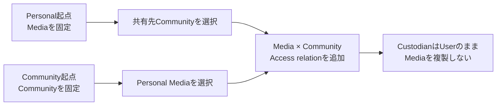

# Media共有

## 概要

Userが自身のUser管理Mediaを、参加中Communityへ共有するInteractionです。

Personal MediaとCommunity Mediaのどちらから開始しても、成立するdomain operationは同じMediaとCommunityの共有relation追加です。入口に応じて既知の対象を固定し、Userに不要な再選択を要求しません。

> 実装状況: 現在のmemoria-webには、本仕様で定義するMedia CustodyとCommunity Accessに基づく共有UIは実装されていません。

## 目的

Userが「Media本体をCommunityへ移す」「Communityへ複製する」と誤認せず、自分が管理するMediaを必要なCommunityの参加者へ安全に閲覧可能にできるようにします。

Personal起点とCommunity起点で別の共有概念を作らず、同じdomain semanticsを異なるcontextから利用します。

## 関連Use Case

- [Media関連ユースケース - User管理MediaをCommunityへ共有する](/media/use-cases#user管理mediaをcommunityへ共有する)
- [CommunityとMediaの共有](/media/community-access)
- [Personal Media](/screens/personal-media)
- [Community Media](/screens/community-media)

## 表示情報

共有対象について、少なくとも次をUserが識別できるようにします。

- 共有するMedia
- 共有先Community
- 共有後もMediaのCustodianはUser本人のままであること
- 共有すると現在のCommunity参加者がそのMediaを閲覧できること

共有によってMediaの複製、Custody transfer、Original download権限の付与が発生するような表現をしません。

## 操作

入口によって先に固定される対象だけが異なり、どちらも同じMediaとCommunityのAccess relation追加へ収束します。

### Personal Mediaから共有する

Personal MediaまたはそのMedia Detailから共有を開始した場合、共有するMediaを固定し、Userが現在参加しているCommunityから共有先を選択します。

既に対象Mediaを共有しているCommunityは、新しい共有先として重複選択させません。既存の共有状態は確認できるようにします。

1 Media単位の共有に加え、Initial ReleaseではPersonal Media Browserで明示選択した複数のUser管理Mediaを、1つの参加中Communityへ一括共有できます。共有先Communityは1回のActionにつき1つとし、Mediaごとの共有relationは独立して成立します。

### Community Mediaから共有する

Community Mediaの「自分のMediaから共有する」から開始した場合、現在Communityを共有先として固定し、User本人がCustodianであるPersonal Mediaから共有対象を選択します。

既に現在Communityへ共有済みのMediaは、新しい共有対象として重複選択させません。

Community起点でも、現在Communityを共有先として固定し、明示選択した複数のPersonal Mediaを一括共有できます。既に共有済みのMediaは新しいrelationを作らず、他Mediaの成立を妨げません。

### 共有を確定する

UserがMediaとCommunityの組み合わせを確認したうえで共有を実行します。

Systemは実行時に次を再検証します。

- MediaがACTIVEである
- 操作者本人が現在のUser Custodianである
- 共有先Communityへの有効なMembershipがある
- 同じMediaとCommunityの共有relationがまだ存在しない

成立した場合は対象CommunityへのAccessだけを追加し、Media本体、Custodian、他Communityへの共有、Personal側Group / Tag分類を変更しません。

共有成功後は開始元contextを維持します。Personal起点ではPersonal Media、Community起点では現在Community Mediaを継続し、共有成功だけを理由にApplication contextを切り替えません。

## 状態

### 選択可能

Personal起点では共有可能なCommunity、Community起点では共有可能なPersonal Mediaを選択できます。

### 共有先Communityがない

Personal起点でUserが参加している共有可能なCommunityがない場合、その状態を明示します。

Community作成を共有成立の必須stepとして組み込みません。Community作成はApplication IAで定義する独立したFlowとして扱います。

### 共有可能なPersonal Mediaがない

Community起点で共有可能なUser管理Mediaがない場合、その状態を明示します。

Personal Mediaが0件の場合と、Personal Mediaは存在するがすべて現在Communityへ共有済みの場合を、必要に応じて区別できるようにします。

### 処理中

共有結果が確定するまで同じ操作の意図しない重複実行を防ぎます。

### 競合・権限変更

選択後にMedia削除、Custody変更、Membership喪失、既存共有の追加等で要求を成立できなくなった場合、現在状態を再評価します。

既に共有済みになっていた場合は重複relationを作成しません。現在状態を反映し、同じMediaが二重に共有されたような成功表現をしません。

Membershipを失って現在Community context自体を利用できない場合は、Application IAに従って安全なdestinationへ移動します。

### Bulk共有の部分成功

複数Mediaを共有する場合、Systemは各MediaについてACTIVE、User Custody、Membership、既存relationを実行時に再検証します。全件atomic transactionは要求せず、成立した共有を他Mediaの失敗によってrollbackしません。

結果では成功件数と失敗対象を識別できるようにします。既に共有済みとなったMedia、操作中に削除・Custody変更されたMedia等は現在状態に合わせ、重複relationや誤った成功表現を作りません。retryは成立していない対象だけに適用できるようにします。

### 一時的な失敗

共有relationが成立していない失敗を成功として表示しません。再試行可能な場合は、可能な限り選択済みのMedia / Communityを維持して再試行できるようにします。

## 共有ダイアログのInteraction

Initial Releaseでは、選択と共有内容の確認を**同じ共有ダイアログ内**で完結させます。選択後に別の確認ダイアログや専用の確認stepを追加しません。実行前に共有するMedia、共有先Community、共有先の参加者全員が閲覧できること、MediaのCustodianは変わらないことを確認できるようにします。

Personal起点では選択済みMediaを維持し、共有先Communityを選択します。Community起点では現在Communityを固定し、Personal Mediaを検索・絞り込み・明示選択します。既に共有済みの対象は重複共有させず、現在の共有状態を識別できるようにします。複数Mediaの選択数と共有実行対象が分かるようにし、対象がない場合は実行できません。

共有実行中は二重送信を防ぎ、ダイアログ内で進行状態を伝えます。**全件成功時**は簡潔な成功Feedbackを表示してダイアログを閉じ、開始元contextを維持します。**部分成功・全件失敗時**はダイアログを維持し、成功件数・失敗対象・可能な範囲の失敗理由と次のActionを継続して表示します。成功済み対象は再送せず、再試行可能な未成立対象だけを再試行できます。結果不明のrequestはServer側の成立状態を確認せず成功・失敗と断定せず、無条件に再送しません。

選択中のCancelは共有relationを作成せずダイアログを閉じます。成立済みの共有はCancelやダイアログを閉じる操作によって取り消しません。失敗時に選択内容を可能な限り維持し、修正・再試行できるようにします。詳細なDialog寸法、検索・絞り込み、Compact presentation、Feedbackの具体的なComponentは後続のUI具体化で決定します。

### Personal起点の共有先Community選択

Personal Media BrowserまたはMedia Detailから共有を開始した場合、起点で明示選択したMedia集合を固定し、ダイアログ内で現在参加中のCommunityから共有先を1つ選択します。写真を再検索・再選択する必要はありません。選択済みMediaの件数と対象をダイアログ内で確認できるようにし、複数Mediaの場合は必要時に一覧を展開して確認します。共有先が未選択の場合は共有を実行できません。

共有先Communityを選択・変更した際は、固定したMedia集合について当該Communityへの現在の共有状態を評価し、新たに共有する件数と既に共有済みの件数を区別して表示します。既に共有済みのMediaは再送せず、すべて共有済みの場合は共有Actionを無効化します。共有先を変更しても起点のMedia選択は維持します。実行前には共有先Communityの参加者全員が閲覧できることとCustodianが変わらないことを確認できるようにします。

Compactでは選択済みMediaの確認とCommunityの選択肢を縦方向に提示し、共有件数と共有Actionをスクロール中も確認できるフッターに配置します。Community選択後の共有済み判定中は未確定の件数を確定値として表示せず、結果が確定するまで誤った共有実行を防ぎます。実行時にはMembership・Media状態・Custody・共有relationをServer側で再検証し、結果表示と復旧は共通の共有ダイアログのInteractionに従います。

### Community起点のMedia検索・絞り込み・追加読み込み

Community起点の共有ダイアログでは、Personal Mediaを新しい順に提示し、写真名検索と既存のPersonal Group / Tagによる絞り込みを利用できるようにします。GroupとTagの絞り込みは併用でき、両方を指定した場合はAND条件で絞り込みます。複数Tagを指定した場合もMedia Tagの既存仕様に従ってAND条件とします。検索・絞り込みの操作と表示はPersonal Media Browserとの一貫性を保ちます。共有先Communityは固定し、現在Communityへ共有済みのMediaは重複選択できない状態として識別できるようにします。

一覧はRelay Connectionによる無限ローディングとし、ページ番号によるPaginationは提供しません。検索・絞り込み変更時は該当条件のConnectionを取得し直し、既に明示選択したMediaは表示範囲外になっても保持します。検索結果と選択済みMediaは別々に管理し、検索・絞り込みの変更や追加読み込みを跨いで選択を維持します。ダイアログ内で開閉できる選択済み一覧から、検索結果に現在表示されていないMediaも確認・個別解除できるようにします。選択件数と共有Actionは大量選択時も見失わない位置に提示し、未取得Mediaを暗黙に選択しません。

追加取得中・終端・追加取得失敗を区別し、失敗時には表示済みMediaと選択を保持して再試行できます。大量のMediaでもダイアログ内の選択・共有確定Actionに到達できるようにし、keyboard・支援技術でも追加読み込みを利用できるようにします。具体的なfetch size、cursor、検索条件、Compact presentationは後続のUI / GraphQL詳細設計で決定します。

### 共有処理中・結果表示・復旧操作

共有処理中は共有Actionを無効化して二重送信を防ぎ、処理中であることをダイアログ内に表示します。APIから確かな進捗を取得できない場合は進捗率や完了件数を推測して表示しません。

全件成功時は簡潔な成功Feedbackを表示してダイアログを閉じます。部分成功・全件失敗時はダイアログを維持し、今回新たに共有できた件数と、共有できなかったMedia・理由・次のActionを継続して表示します。成功済みMediaは結果として確認できる一方、再試行対象には含めません。処理中に既に共有済みと判明したMediaは現在の共有状態を表示し、今回新たに共有した成功件数へ算入せず、再試行対象から除外します。

結果は成功済み・再試行可能・再試行不可能を区別します。一時的な通信・Server errorでは選択を維持し、未成立と確認できたMediaだけ再試行できるようにします。削除済み・Custodian変更等で共有不能になったMediaは理由を示して再試行対象から除外します。共有先CommunityのMembershipを失った場合は共有を中止し、現在のCommunityを利用できないことと次に取れるActionを持続的に表示します。

通信断などでrequestの結果が不明な場合はServer上の共有relationを照合し、成立・未成立を確認するまで成功・失敗と断定しません。照合できない間は無条件の再送を許可せず、確認待ちと再確認Actionを提示します。再試行は未成立と確認でき、かつ再試行可能なMediaだけを対象とします。

Compactでは同じ全画面ダイアログ内で失敗対象・理由・再試行Actionを表示し、写真を最初から選び直さず復旧できるようにします。結果確定後はダイアログを閉じられますが、閉じても成立済みの共有は取り消しません。結果と操作は色だけに依存せず、keyboard・支援技術からも確認・実行できるようにします。

### Compact表示での共有操作

Compactでは、検索・絞り込み・Media一覧・共有Actionに十分な操作領域を確保するため、画面全体を使う共有ダイアログを採用します。Medium / Wideでは中央配置のダイアログを基本とし、同じ共有Taskと状態を維持しながら表示領域に応じて構成を変えます。具体的なbreakpointやpixel寸法はUI具体化とVisual Reviewで決定します。

Compactのヘッダーでは共有Taskと閉じる操作に到達できるようにし、共有先Communityと参加者全員への閲覧共有・Custodian不変を実行前に確認できるようにします。検索欄は常時到達可能とし、Personal Group / Tagの詳細な絞り込み候補は必要時に開きます。Media一覧を主なスクロール領域とし、Relay Connectionによる追加読み込み・再試行を一覧内で扱います。

フッターには選択件数と共有Actionをスクロール中も確認・実行できる形で配置します。選択済み一覧は通常は折りたたみ、開いた場合はダイアログ内で写真一覧から選択済み一覧へ表示を切り替えます。選択済み一覧では現在の検索結果外のMediaも確認・個別解除でき、元の写真一覧へ戻っても検索条件・読み込み済みItem・選択状態・可能な範囲のスクロール位置を維持します。選択済み一覧が写真の探索領域を圧迫しないようにします。

閉じる・検索・絞り込み・選択・選択解除・追加読み込み・共有確定はtouchとkeyboardで操作でき、focusの移動・復帰と読み上げ可能な状態表示を確保します。失敗・部分成功時には同じCompactダイアログ内で対象・理由・再試行Actionを継続して確認できるようにします。

## Navigation

Media Sharingは独立したApplication contextを作りません。

Personal起点ではPersonal context、Community起点では現在Community contextを維持します。Initial Releaseでは両起点とも**共通の共有ダイアログ**を採用し、起点に応じて既知の対象を固定します。Personal起点では選択済みMediaを固定して共有先Communityを選択し、Community起点では現在Communityを固定してPersonal Mediaを選択します。複数Mediaの明示選択にも同じダイアログで対応し、共有対象と共有先を確認してから実行します。入口ごとに専用画面へ遷移させず、共有成功後も元のcontextを維持します。

共有ダイアログの共通した見出し・選択・確認・結果Feedbackを基本とし、選択対象の違いだけを起点に応じて変えます。Community起点のPersonal Media選択では、件数が多くても対象を探せるよう検索・絞り込みと複数選択への到達性を確保します。具体的なダイアログ寸法、Compact表示、選択済み対象の提示、検索・絞り込みの詳細は後続のUI設計で決定します。

共有成功後に共有先Communityへ自動遷移することは要求しません。

## 制約

- 共有できるのは操作者本人がCustodianであるUser管理Mediaだけです。
- 共有先は操作者本人が現在参加しているCommunityだけです。
- Community管理Mediaを別Communityへ共有しません。
- 共有先Communityの全参加者が対象Mediaを閲覧できます。参加者単位の共有設定は提供しません。
- 共有してもCustodianはUser本人のままです。
- 共有はOriginal download権限をCommunity参加者へ付与しません。
- 同じMediaとCommunityの共有relationを重複作成しません。
- 複数Communityへの共有は許可しますが、Initial Releaseの標準Interactionでは1回の操作で1 Communityへの共有を成立させます。
- 明示選択した複数Mediaの一括共有をInitial Releaseに含めます。各Mediaのrelationは独立して成立し、部分成功を許容します。
- Custody transferは別概念でありInitial Release対象外です。
- UI上の選択可否をAPI側の認可・現在状態再検証の代替にしません。

## Responsive対応

Compact / Medium / Wideで、共有するMediaと共有先Communityを識別し、共有結果を理解できるCapabilityを維持します。

選択UIのpresentationは表示領域に応じて変更できます。共有の確定やcancel等の重要Actionをhoverだけに依存させず、touchとkeyboardでも到達できるようにします。
