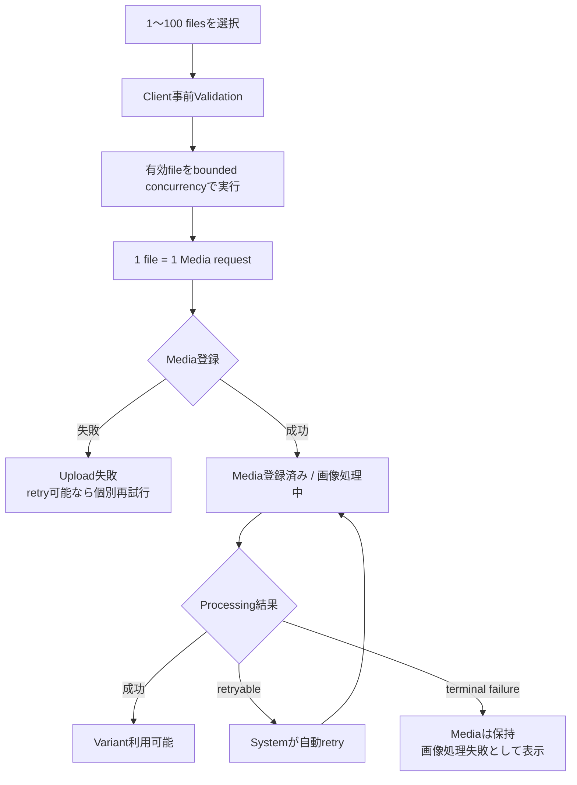

# Media Upload

## 概要

Initial Releaseで静止画像をPersonalまたはCommunityへUploadするInteractionです。

Userは複数画像を一度に選択できますが、複数Mediaを1つのdomain transactionやProcessing Jobとして扱いません。UIは複数MediaのUploadを一つの作業単位として集約して表示し、API request、Media登録、Processing Job、成功・失敗・retryはMedia単位で独立させます。

## 目的

写真を複数枚まとめて選択できる日常的な操作性を提供しながら、一部の失敗によって成功済みMediaを巻き戻したり、全件を最初からやり直したりしなくてよいUpload体験を提供します。

Personal / Communityで共通するUpload Interactionを使用し、違いは初期Custodianと現在contextの認可として扱います。

## 関連Use Case

- [Media関連ユースケース](/media/use-cases)
- [Media処理と派生物](/media/processing)
- [Personal Media](/screens/personal-media)
- [Community Media](/screens/community-media)
- [Media Browser / Detail](/screens/media-browser-detail)

## 画面構成

Initial ReleaseではMedia UploadをMedia Browserとは独立した専用画面として提供します。Personal / CommunityのMedia画面から現在contextを維持して遷移します。既存`memoria-web`の`/images/new`と`ImageDropForm`・`ImageInputForm`は参考実装として扱い、既存route名やUpload API・Task管理の振る舞いをそのまま新仕様とはしません。

専用画面ではfile追加、選択fileごとのpreview・validation、Upload開始、個別進捗・結果、失敗fileの再試行を一つの作業の中で確認できるようにします。**単一画面・状態変化型**を採用し、準備画面と結果画面を別route・別stepとして分割しません。初期状態ではfile追加を主操作とし、file追加後にpreviewと事前Validationを提示します。Upload開始後は同じ画面で全体概要とfile単位の状態を更新し、成功済みMediaを維持しながら失敗fileのみ再試行できます。Media登録後の非同期ProcessingはUpload requestの成功と区別し、登録済みMediaへの導線を提供します。Group / Tag分類はUpload成立の必須入力としません。

画面の基本的な情報順序はfile追加、選択fileのpreview・事前確認、Upload実行、全体進捗・個別結果とします。route、画像一覧のpresentation、responsive対応、Upload中の画面離脱、Upload後の遷移は本仕様の後段およびVisual Prototypeで具体化します。request識別・復帰時のserver-side照合等、実データ接続を必要とするBehaviorはGraphQL / Frontend詳細設計で確定します。既存Web componentの再利用は設計上の制約としません。

## 開始点 / Scope

### Personal

Personal MediaからUploadを開始します。

登録された各Mediaの初期CustodianはUser本人です。

### Community

現在CommunityのCommunity Mediaから直接Uploadを開始します。

登録された各Mediaの初期Custodianは現在Communityです。Uploaderは操作Userとして記録します。

Communityへの直接Uploadが許可されないUser状態やMembershipではUploadを開始・継続できません。

Personal MediaをCommunityへ共有する操作とは別です。Community direct uploadによってUser管理Mediaを作成してから共有する二段階flowにはしません。

## File選択

Userは1件または複数の静止画像fileを選択できます。Initial Releaseでは1回のUpload操作で選択できるfileを最大100件とします。

file picker、drag and drop等の具体的な入力presentationは固定しません。Compact / touch環境ではOS標準の画像選択やcamera roll等、利用可能な入力方法を使用できます。

選択したfileごとに少なくとも次を識別できるようにします。

- preview可能な場合の画像
- file名
- validation結果
- Upload / Processingの現在状態

選択後、Upload開始前に個別fileを対象から外せます。

複数選択はUI上の集約であり、選択件数全体を1 Mediaや1 API requestとして扱いません。

## Upload前Validation

Clientで明らかに判定できる不正なfileはUpload開始前に識別し、他の有効fileまで一律に失敗させません。

ServerはClient validationを信頼せず、file内容、許可形式、size等を再検証します。

許可する画像形式、MIME / file signature validation、file size、pixel count、width / height等の具体的上限は静止画像処理contractで確定します。UI都合や既存実装値からProduct制約を逆算しません。

不正なfileが選択集合に含まれていても、他の有効fileはUpload可能です。Userは問題のあるfileを識別し、対象から外すか、可能な場合は別fileへ置き換えられます。

## Upload実行

複数fileはUI上では一つの作業として集約しますが、図中のMedia登録以降はMediaごとに独立して進みます。1件の失敗によって他Mediaをrollbackしません。

Upload開始時、Upload対象の各fileについて独立したMedia upload requestを実行します。

- 1 requestは1 Mediaを登録する
- 1 Mediaごとに独立して成功・失敗を確定する
- 複数requestはUI / clientで上限付きの並列実行（bounded concurrency）として処理する
- 選択した全fileを同時にrequestしたり、file本体やdecode結果を一括してmemoryへ展開したりすることを前提にしない
- client側の具体的な同時実行数はProduct仕様として固定せず、Frontend実装・実行環境に応じて決定する
- 1件の失敗を理由に他Mediaの成功をrollbackしない
- 成功済みMediaを同じUpload操作のretry対象へ戻さない

Userが同じ操作を誤って再実行して重複Mediaを作らないよう、APIのidempotency contractに従います。具体的なidempotency keyの生成・保持方法はGraphQL/API contractで確定します。

## Upload成功と画像処理

Original保存とMedia登録の同期成功条件、およびVariant生成完了は分離します。

Media登録が成功した時点で、そのMediaのUpload requestは成功として扱えます。表示用Variantは非同期Processing Jobで生成されます。

UIは少なくとも次を区別できるようにします。

- Upload待ち
- Upload中
- Upload失敗
- Media登録済み・画像処理中
- 表示用Variant利用可能
- 画像処理失敗

「Media登録済み・画像処理中」をUpload失敗として扱いません。また、Variant生成がまだ完了していないMediaを、通常の表示用Variantが利用可能であるかのように表示しません。

Processing Jobの内部status名、attempts、Redis / Outbox状態等を利用者へそのまま露出しません。

## 複数Uploadの集約表示

複数fileを選択した場合、Userは全体の進行状況と各Mediaの結果を把握できるようにします。

全体状態は個別結果の集約として表現し、少なくとも次を区別します。

- すべて未開始 / 実行中
- すべて成功
- 一部成功・一部失敗
- すべて失敗

一部成功では成功済みMediaを維持し、失敗したMediaを明確に識別します。

「全件成功しなければ0件」というatomic batch semanticsは導入しません。

## 再試行

### Upload失敗

Media登録が成立していないfileは、失敗理由がretry可能な場合にそのfileだけ再試行できます。

retryによって成功済みMediaを再Uploadしません。

認可喪失、file自体のvalidation failure等、同じ入力の再送では成立しない場合は、単純なretryを提示せず必要な状態変更を案内できるようにします。

### Processing失敗

Media登録後のVariant生成失敗はUpload request失敗と区別します。

Processing retryは同一MediaのProcessing Job contractに従い、retry可能な一時障害はSystemが同じJobを自動retryします。自動retry中のattempt数や内部障害を通常Userへ露出せず、Mediaは画像処理中として扱います。

decode不能、破損画像等、同じOriginalを再処理しても成立しない恒久failureは自動retry対象にしません。retry可能な障害も自動retry上限へ到達した場合はterminalなProcessing failureとして確定します。

Initial ReleaseではProcessing failureに対するUser向け手動retry操作を提供しません。運用上reprocessが必要な場合は、terminal Jobとは別の新しいProcessing Jobを同じOriginalから開始できる運用contractで扱います。

terminalなProcessing failureでもMedia登録自体は成立済みです。Mediaを通常のMedia Browserから暗黙に除外せず、表示用Variantを利用できない失敗状態として識別できるようにし、権限を持つUserは通常のMedia削除操作で削除できます。

Processing失敗を解消するために同じOriginalを新しいMediaとして再Uploadすることを標準復旧手段にしません。

## Upload中のTag分類

Upload中のTag付与はMedia Tagのdomain semanticsに従います。

UploadによってMedia登録が成立した後は、Media Browserのbulk classificationと同じcontractに従い、明示選択した複数Mediaへ同じ既存Tagを付与・解除できます。Uploadのfile選択集合を、そのまま暗黙のTag一括適用対象にはしません。

Uploadを成立させるためにTagを必須にしません。

Group分類もUpload成立の必須条件にしません。

## Cancel / Navigation

Upload開始前は選択したfileを削除して作業を中止できます。

Upload開始後、既にServer側でMedia登録が成立したMediaを「cancel」によって暗黙削除しません。Upload requestの通信cancelと、成立済みMediaの削除は別操作です。

Initial ReleaseではUpload開始前の未送信fileが残る状態、およびUpload中・待機中のfileが残る状態で画面内Navigationを行う場合、作業が失われる可能性を確認してから離脱します。Upload中は未完了requestが中断される可能性を伝え、成立済みMediaをcancelや離脱によって暗黙削除しません。Browserのreload・tab close等は環境が許す範囲で標準の離脱確認を利用し、確実な表示を保証しません。

Media登録が完了しServer側の画像Processingだけが残っている場合、Upload画面への滞在を必須とせずMedia Browserへ移動できます。Media BrowserでもProcessing中・terminal failureを識別できるようにします。

Initial Releaseでは画面離脱後もfile送信を継続するbackground Uploadを必須要件としません。画面遷移・reload・network切断が発生した場合、Serverで登録済みのMediaと未確定requestの状態をidempotencyおよびserver-side observable stateで照合し、結果不明のfileを無条件に自動再送して重複登録しません。具体的な離脱guard、復帰・再試行UI、request識別・照合方法はGraphQL / Frontend詳細設計で決定し、client memoryだけを正本にしません。

## 状態 / Concurrency

実行時にUser、Membership、Community、Media作成条件をMedia requestごとに再検証します。

Communityへの複数Upload中にMembershipを失った場合、それ以降の成立しないrequestを成功として扱いません。既にcommit済みのCommunity管理Mediaは、後続requestの失敗を理由にrollbackしません。

同じfileを複数回選択したことだけを根拠に内容重複Mediaを自動統合しません。内容hash等によるdeduplicationは別Product要件が合意されるまで導入しません。

## Feedback

個別fileのvalidation error、Upload failure、Processing failureを区別します。

複数Uploadでは、全体summaryだけで個別失敗理由を隠しません。一方で、各requestの内部errorをそのまま大量表示して主要な状態把握を妨げないよう、概要と個別詳細を段階的に確認できるpresentationを選択できます。

成功・一部成功・失敗のFeedbackは[Feedback Pattern](/design-system/patterns/feedback)の原則に従います。

## Navigation

Media Uploadは現在のPersonal / Community contextを維持します。

Upload完了を理由にApplication contextを切り替えません。Upload後にMedia Browserへ戻る、Upload結果を同じ画面で確認する等の具体的presentationは固定しませんが、成功したMediaへ到達できるようにします。

## 制約

- Initial Releaseでは静止画像だけを受け付ける
- Originalを無加工で保持する
- 1 request = 1 Media
- 1 Processing Jobは1 Mediaを扱う
- UIでは1回のUpload操作につき最大100件のMediaを選択・実行できる
- 複数Uploadはbounded concurrencyで処理し、選択件数と同時実行数を同一視しない
- 複数Uploadはatomic batchではない
- Personal uploadの初期CustodianはUser本人
- Community direct uploadの初期Custodianは現在Community
- UploaderとCustodianを同一概念として扱わない
- Variant生成完了を同期Upload requestの成功条件にしない
- 直接Object Storage UploadはInitial Release対象外
- file形式・size等の具体値は静止画像処理contractを正本とする
- Client validationをServer validation / authorizationの代替にしない

## Responsive対応

Compact / Medium / Wideで複数fileの選択、問題fileの識別、Upload開始、個別結果、部分失敗の把握へ到達できるCapabilityを維持します。

Wideでは複数fileのpreviewや状態を同時に一覧表示できます。Compactでは1件ずつ詳細を展開する等、presentationを変更できます。

drag and dropだけを唯一のfile入力方法にせず、touch / keyboardを含む利用環境からUploadを開始できるようにします。

## UI具体化

Uploadは単一画面内でfile追加領域、作業summary / 共通操作、file一覧、実行Actionを構成します。file追加はdrag & dropとfile pickerの双方を提供し、file追加後も上限へ達するまで追加できます。

file一覧ではpreview、file名、validation状態、Upload状態、Processing状態、個別Actionを確認できるようにします。UI上では少なくとも未送信、client validation error、送信中、Media登録成功・Processing中、Processing完了、Upload失敗、Processing terminal failure、結果不明を区別し、Serverから取得できない進捗率を推測表示しません。

Initial ReleaseではUpload時にTag編集を提供します。TagをUpload成功の必須条件にはせず、Group分類はMedia登録後のMedia Detail / Browser bulk分類を主要Flowとします。Visual Prototypeでは、明示選択したfileへ共通Tagを追加・除去・置換する操作と、file単位のTag編集を同一画面で提供します。実データ接続時のTag候補取得・mutation contractはGraphQL / Frontend詳細設計で確定します。

全fileの送信結果が確定した後も同一画面で結果確認を維持し、自動的にMedia Browserへ遷移しません。Userの明示ActionでMedia Browserへ戻れるようにします。Personal Uploadは`/media/upload`、Community Uploadは`/communities/[communityId]/media/upload`を使用します。

Wideでは複数fileを一覧しながらsummaryと実行Actionを確認できる構成とし、Compactではpreviewよりfile名・状態・問題理由・Actionの識別を優先します。Upload実行Actionをstickyにするか通常flow内に置くか等の具体的visual値はStorybook / Human Visual Reviewで決定します。

