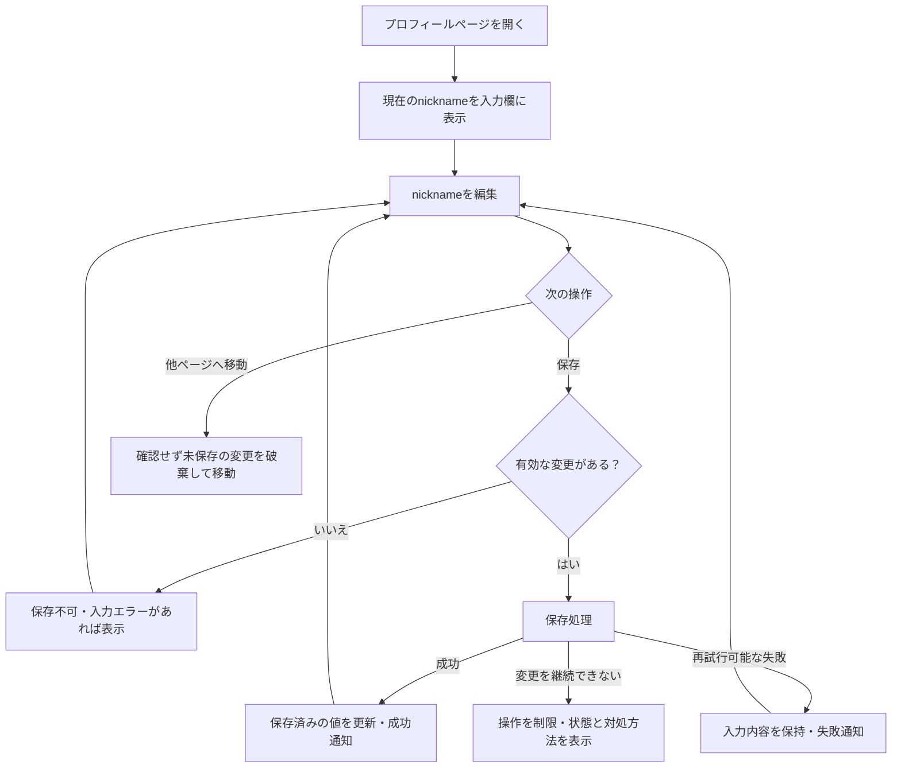

# Userプロフィール

## 概要

ACTIVE User本人が、Memoriaで利用するUser Profileを確認・変更する設定画面です。

> 実装状況: User Profile更新は再実装中です。既存実装のProfile画面は本仕様の正本とはみなしません。

## 目的

UserがMemoriaで利用する自身のProfileを確認し、必要に応じて変更できるようにします。

この画面は特定field専用のProduct操作ではなくUser Profileを管理する設定画面として扱います。初回Releaseではnicknameだけを編集対象とします。

## 関連Use Case

- [Userユースケース - User Profileを登録・変更する](/user/use-cases#user-profileを登録変更する)

## 表示情報

- 現在のUser Profileを提示します。
- 初回Releaseでは現在のnicknameを提示します。
- Userが編集可能なProfile項目と現在値を理解できるようにします。

## 操作

### Profileを変更する

Userはページ上に直接配置された入力欄で編集可能なProfile項目を変更し、同じページに配置された保存ボタンで保存できます。表示モードと編集モードは分けず、編集開始ボタン、キャンセルボタン、保存前の確認画面は設けません。

初回Releaseではnicknameだけを変更できます。変更確定の共通挙動は[Editable Form Pattern](/design-system/patterns/editable-form)に従います。

Profileに現在値からの変更が存在し、nicknameが有効な場合にProfileを更新できます。成功した場合は更新後のProfileを新しい基準値として扱います。

入力条件を満たさない場合は更新を実行せず、Userが修正できる状態を維持します。

## 操作フロー

以下の図は、このページでの編集・保存・画面移動を示します。入力条件、更新失敗時の扱いなどの詳細は後続の「状態」「制約」に従います。

## 状態

### 表示・編集可能

現在のProfileを確認し、編集可能な項目を変更できます。現在値から有効な変更が存在しない間は、変更確定Actionを実行できません。

### 入力不正

nicknameが必須条件を満たさない場合は、[Feedback Pattern](/design-system/patterns/feedback)のField Errorとして、問題のある入力と修正方法をUserが理解できるようにします。Profileは更新しません。

### 更新処理中

更新要求を受け付けた後、結果が確定するまで重複した更新を防ぎます。処理中であることをUserへ伝えます。

### 更新成功

Profileの更新が完了したことを[Feedback Pattern](/design-system/patterns/feedback)のOperation FeedbackとしてUserへ伝え、画面上の現在値を更新後の値として扱います。

### 更新失敗

一時的な失敗等、Userによる再試行が可能な場合は、[Feedback Pattern](/design-system/patterns/feedback)のOperation Feedbackとして保存が完了したことを確認できなかった旨を伝え、編集内容を失わずにUserが手動で再試行できるようにします。通信障害やServer Errorの発生を契機に`me`を自動で再取得して保存結果を照合する処理は行いません。通信障害ではServer側の更新が成立している可能性があるため、未保存と断定する文言は避けます。次回画面を表示する際は、通常のProfile取得処理で現在値を取得します。

User状態の変化等によりProfileの変更を継続できない場合はBlocking Errorとして扱い、短時間で消えるNotificationだけに依存せず、現在の状態と次に取れる行動を伝えます。

## Navigation

ACTIVE Userは[User Settings](/screens/user-settings)の`/settings/profile`から自身のProfileへアクセスできます。独立した`/profile` routeは設けません。Settings自体は[Application Information Architecture](/system/application-information-architecture)で定義するAccount Menuから到達します。ProfileはPersonal / Community contextから独立したUser本人の操作として扱い、Community利用中でもPersonal contextへ切り替えずにアクセスできます。

Profile更新のために別の画面へ遷移することは前提とせず、この画面上で確認・編集・保存を行います。

初回Releaseのnickname編集は再入力の負担が小さいため、キャンセルボタンは設けません。他画面へ移動する際も破棄確認を表示せず、未保存の編集値を破棄して移動します。Profile項目が増える等、編集内容を失う影響が変化した場合は[Editable Form Pattern](/design-system/patterns/editable-form)の判断基準に基づいて対策を再評価します。

## 制約

- ACTIVE User本人のProfileだけを確認・変更できます。
- 初回Releaseの編集対象はnicknameだけです。
- nicknameは必須です。
- nicknameは前後空白を除去した結果が空文字になる値を許可しません。
- nicknameの重複を許可します。
- Memoria nicknameを正本とし、Auth0から同期しません。
- Profile更新成功時は現在値を置き換え、過去値を保存しません。
- DELETING UserはProfileを変更できません。
- Initial ReleaseではProfile更新のversion競合解決や自動mergeを提供しません。複数の有効な更新が成立した場合は、後から成立した更新結果が現在値になります。
- 将来Profile項目を追加できる境界として扱い、nickname専用画面として設計しません。
- 既存Profileの編集と変更確定には[Editable Form Pattern](/design-system/patterns/editable-form)を適用します。
- Profile更新に関する成功、入力error、処理errorの提示には[Feedback Pattern](/design-system/patterns/feedback)を適用します。

## Responsive対応

表示領域や入力方式が変わっても、現在のProfileの確認と編集可能なProfile項目の変更というCapabilityは維持します。

現時点では表示領域ごとに異なるInformation、Action、Navigation要件はありません。具体的なlayoutは実装で決定します。
