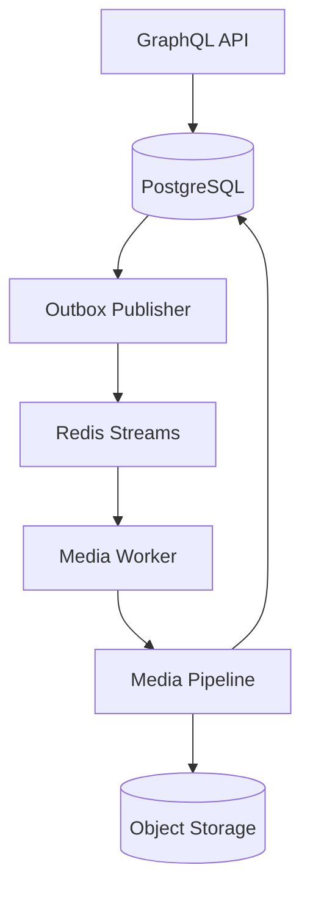

# メディアの非同期処理

## 概要

> 実装状況: Redis Streams、Media Worker、Outbox Publisher、画像・動画の非同期Pipelineは未実装です。

Mediaの派生file生成は、GraphQL APIのrequest処理から分離し、Redis Streamsを通じてMedia Workerへ委譲します。API、Worker、Outbox Publisherは`memoria-api`で管理し、実行processとDeploymentを分けます。

## 構成

APIは業務dataとOutbox eventを同じPostgreSQL transactionへ保存します。Publisherが未送信eventを取得して`XADD`し、WorkerがConsumer Groupからeventを受け取ります。

## Redis Streamの分割

初期構成は`media-processing`という1つのStreamを使用します。画像・動画の種別やMIME typeごとにStreamを増やさず、Worker内で必要なPipelineを選択します。

Streamの分離は、次の差が運用上の問題になった場合に検討します。

- CPU、memory、処理時間の大きな差
- 独立したWorker PoolやDeploymentの必要性
- retry条件や許容待ち時間の差
- 動画処理による静止画像処理の待機

## Workerの責務

| 要素 | 責務 | 知る必要がないもの |
| --- | --- | --- |
| Consumer | `XREADGROUP`、ACK、retry、停止、pending回復 | 画像変換の詳細 |
| Handler | eventとpayloadの検証、対象Mediaの特定 | 個別の変換方式 |
| Pipeline Resolver | media typeと処理目的に応じたPipeline選択 | Redisの配送状態 |
| Orchestrator | Stepの順次実行、context、成果物、errorの受け渡し | StreamのACK |
| Step | decode、resize、WebP encode、動画変換など単一処理 | Consumer Group、job ID、retry制御 |

Step間ではfile本体の複製を前提にせず、Object Storage key、一時file、必要なmetadataを受け渡します。中間表現はmemoryまたは一時領域で処理し、原則として永続化しません。

## 実行方式

Pipeline全体を同じWorker processで実行するIn-process Pipelineを採用します。Stepごとの分散Worker、Step別Stream、分散Orchestrator、Sagaは導入しません。

WorkerはConsumer Groupで水平scaleできます。画像と動画の負荷差が明確になればWorker PoolとStreamの分離を検討しますが、各WorkerのPipelineがprocess内で完結する原則は維持します。

## 配送と失敗

- 配送保証はAt-Least-Onceとし、Exactly Onceを前提にしません。
- 成果物保存、必要なDB更新、job完了の後に`XACK`します。
- Worker停止後のpending messageは`XAUTOCLAIM`などで回収します。
- 一時的な失敗は上限付きbackoffでretryします。
- 回復不能な失敗はjobを`FAILED`として運用から確認できるようにします。
- 同じeventやjobが再配送されても成果物が重複しないようにします。

詳細は[Media処理と派生物](/media/processing)、[Transactional Outbox](./transactional-outbox)、[冪等性](./idempotency)を参照してください。
