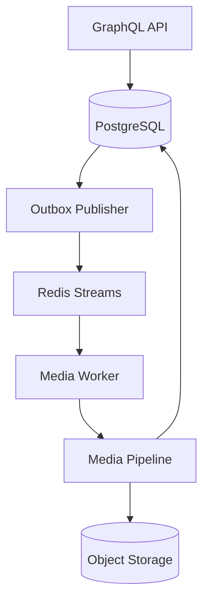

# メディアの非同期処理

> 全体の責務分担、failure path、シーケンス図、採用理由は[Media登録・非同期処理アーキテクチャ](/media/upload-processing-architecture)を参照してください。

## 概要

> 実装状況: Redis Streams、Media Worker、Outbox Publisher、画像・動画の非同期Pipelineは未実装です。

Mediaの派生file生成は、GraphQL APIのrequest処理から分離し、Redis Streamsを通じてMedia Workerへ委譲します。API、Worker、Outbox Publisherは`memoria-api`で管理し、実行processとDeploymentを分けます。

## 構成

```mermaid
flowchart TD
  API[GraphQL API] --> DB[(PostgreSQL)]
  DB --> Publisher[Outbox Publisher]
  Publisher --> Stream[Redis Streams]
  Stream --> Consumer[Media Worker]
  Consumer --> Pipeline[Media Pipeline]
  Pipeline --> Storage[(Object Storage)]
  Pipeline --> DB
```

APIは業務dataとOutbox eventを同じPostgreSQL transactionへ保存します。Publisherが未送信eventを取得して`XADD`し、WorkerがConsumer Groupからeventを受け取ります。

## Redis Streamの分割

初期構成は`media-processing`という1つのStreamを使用します。Consumer Group名は`media-workers`とし、Consumer名はWorker processごとの一意なruntime identityを使用します。画像・動画の種別やMIME typeごとにStreamやConsumer Groupを増やさず、Worker内で必要なPipelineを選択します。

Streamの分離は、次の差が運用上の問題になった場合に検討します。

- CPU、memory、処理時間の大きな差
- 独立したWorker PoolやDeploymentの必要性
- retry条件や許容待ち時間の差
- 動画処理による静止画像処理の待機

## Workerの責務

| 要素 | 責務 | 知る必要がないもの |
| --- | --- | --- |
| Consumer | `XREADGROUP`、ACK、retry、停止、pending回復 | 画像変換の詳細 |
| Handler | eventとpayloadの検証、対象Mediaの特定 | 個別の変換方式 |
| Pipeline Resolver | media typeと処理目的に応じたPipeline選択 | Redisの配送状態 |
| Orchestrator | Stepの順次実行、context、成果物、errorの受け渡し | StreamのACK |
| Step | decode、resize、WebP encode、動画変換など単一処理 | Consumer Group、job ID、retry制御 |

Step間ではfile本体の複製を前提にせず、Object Storage key、一時file、必要なmetadataを受け渡します。中間表現はmemoryまたは一時領域で処理し、原則として永続化しません。

## 実行方式

Pipeline全体を同じWorker processで実行するIn-process Pipelineを採用します。Stepごとの分散Worker、Step別Stream、分散Orchestrator、Sagaは導入しません。

WorkerはConsumer Groupで水平scaleできます。画像と動画の負荷差が明確になればWorker PoolとStreamの分離を検討しますが、各WorkerのPipelineがprocess内で完結する原則は維持します。

## 配送と失敗

- 配送保証はAt-Least-Onceとし、Exactly Onceを前提にしません。
- Redis Consumer Groupを実行中messageのownershipとWorker crash recoveryの正本とし、Worker停止後のpending messageは`XAUTOCLAIM`などで回収します。Processing JobへRedisと重複する実行leaseは保持しません。
- Workerはmessage受信後、対象Mediaをlockして`ACTIVE`を再確認し、続いてProcessing Jobをrow lockします。Mediaが`ACTIVE`なら`PENDING`を`PROCESSING`へ遷移して`attempts`を増加させてcommitしてからPipelineを実行します。Mediaが既に`DELETING`ならJobを`CANCELLED`として確定し、Pipelineを開始しません。terminalな`COMPLETED` / `FAILED` / `CANCELLED`のduplicate deliveryはPipelineを再実行せず`XACK`します。
- Consumerはmessageの取得経路を`NEW`と`RECLAIMED`に区別してHandlerへ渡します。`NEW + PENDING`だけが通常の初回実行資格を持ち、Jobを`PROCESSING`へ遷移してattemptを開始します。`NEW + PROCESSING`は同一event等のfresh duplicate deliveryとしてPipelineを実行せず`XACK`します。`XAUTOCLAIM`で取得した`RECLAIMED + PROCESSING`は元pending messageの正当なownership移譲として同一`job_id`をretryします。Redis messageのclaimなしに`PROCESSING` Jobだけを見て別Workerが並行実行しません。
- 成果物保存、必要なDB更新、Variant publicationとjob `COMPLETED`の確定後に`XACK`します。回復不能failureまたはretry上限到達時は`FAILED`を永続化してから`XACK`します。
- Redis data喪失時は通常のmessage retryと分離したrecovery procedureを使用します。旧Redis ownershipで実行していたWorkerが処理を継続できないことを停止またはfencingによって確認した後、PostgreSQL上のactive Jobを照合します。`PROCESSING` Jobは短いtransactionで`PENDING`へ戻し、新しい`MEDIA_PROCESSING_REQUESTED` Outbox Eventを同じtransactionで作成します。`PENDING` Jobも必要なdelivery intentをOutboxへ作成し、通常のPublisher経路から再enqueueします。復旧messageに特別な実行modeは持たせず、再配送後は`NEW + PENDING`として通常開始します。fencing前に`PROCESSING -> PENDING`へ戻してはなりません。
- 専用DLQを初期必須にせず、恒久失敗はPostgreSQL上のJob状態で追跡します。
- 一時的な失敗ではmessageを`XACK`せずConsumer Groupのpendingへ残し、固定backoff相当のidle時間経過後に`XAUTOCLAIM`で再取得します。Initial Releaseではattemptごとの指数backoffや個別`next_attempt_at` schedulerを導入しません。
- retry回数上限とreclaim idle時間はruntime parameterとし、DB schemaの固定値にはしません。Initial Releaseの初期値は最大3 attempts（初回実行を含む）・reclaim idle 5分とします。固定5分相当のidle後に`XAUTOCLAIM`対象とし、attemptごとの指数backoffやProcessing Jobの`next_attempt_at`は導入しません。
- reclaim idle 5分はPipelineの処理timeoutではありません。正常に実行中のPipelineでは同一Consumerが処理中messageへ1分間隔で`XCLAIM` heartbeatを行い、Redis Consumer Group上のownership / idleを更新します。PostgreSQLへheartbeat用lease columnは追加しません。heartbeatを継続できずownershipを安全に保証できない場合は、publicationを継続せずretry / recovery経路へ委ねます。
- `media_processing_jobs.attempts`はPipeline実行開始ごとに増加し、上限到達または回復不能な失敗ではjobを`FAILED`として永続化してmessageを`XACK`します。
- 同じeventやjobが再配送されても成果物が重複しないようにします。

## Variant再処理とpublication

Image Variantは履歴やgenerationをDBへ保持せず、`image_variants`をその時点で有効な状態の正本とします。再処理では既存Variantを提供し続け、新Variant群を別のObject Storage keyへ生成します。全必要Variantの生成成功後だけ、対象Mediaを`FOR UPDATE`でlockする短いPostgreSQL transactionで`ACTIVE`を再確認し、ACTIVEの場合だけVariant metadataを一括置換してProcessing Jobの完了を同時に確定します。削除要求が先に`DELETING`をcommitしていた場合はpublicationせずJobを`CANCELLED`とし、生成済み未公開ObjectをStorage OperationのDELETE対象にします。publicationが先にMedia lockを取得してcommitした場合、後続の削除要求は新しくpublicationされたVariantを含む最新状態から削除対象を確定します。

Object Storageへの生成・削除はPostgreSQL transactionへ含めません。publication commit後の旧Object削除に失敗した場合はStorage Operationでretryし、publication前に失敗した新Objectは未公開objectとしてcleanupします。同じstorage keyへの逐次上書きは、途中失敗時に新旧Variantが混在するためpublication方式として使用しません。

未公開Variantのstaging Object一覧をProcessing Jobや別relationへ永続化しません。Image VariantのObject keyは`media/{mediaId}/variants/{jobId}/{width}.webp`とし、staging / publishedを物理namespaceでは分離しません。公開状態の正本は`image_variants.storage_key`であり、Job固有keyへ完全なVariant集合を生成した後にDB参照をatomicに切り替えます。Workerが`DELETING`を検出した場合は自身が生成済みの未公開keyについてStorage Operationをdurableに作成してからJobを`CANCELLED`へ確定します。Object生成後からcleanup operation記録前にWorkerが停止するfailure windowは、Object Storage orphan reconciliationを最終的な安全網として回収します。reconciliationは1時間ごとに実行し、24時間のgrace periodを超えたObjectについて、published VariantとしてDBから参照されず、かつactive Jobにも対応しないものをorphan candidateとします。VariantだけでなくDBへ登録されなかったOriginalも対象とし、candidateを直接削除せずStorage Operationを作成してdurable deletion経路へ引き渡します。

詳細は[Media処理と派生物](/media/processing)、[Transactional Outbox](./transactional-outbox)、[冪等性](./idempotency)を参照してください。

## Initial ReleaseのProcessing契約

Initial Releaseの画像Variant生成Jobは`GENERATE_IMAGE_VARIANTS`とします。初回生成と運用上のreprocessで同じ`job_type`を使用し、同一`(media_id, job_type)`のactive Jobは1件だけ許可します。

Upload transactionで作成するOutbox eventは`MEDIA_PROCESSING_REQUESTED` version 1とします。`aggregate_id`はMedia ID、payloadは`{"job_id":"<Processing Job ID>"}`だけを保持します。画像形式、Original storage key、Variant幅、Custody等はeventへsnapshotせず、WorkerはPostgreSQLから現在状態を取得します。

## GraphQLから観測する処理状態

利用者向けGraphQLはProcessing Jobの内部stateをそのまま公開せず、Media-levelの`MediaProcessingStatus`として`PROCESSING` / `READY` / `FAILED`だけを公開します。`PENDING`と`PROCESSING`は`PROCESSING`、`COMPLETED`は`READY`、`FAILED`は`FAILED`へ写像します。`CANCELLED`はMedia削除との競合で発生する内部状態であり、通常Queryから`DELETING` Mediaを返さないため利用者向けenumへ公開しません。

Upload MutationはVariant生成を待たず、PostgreSQL transaction commit後に作成済みMediaと`PROCESSING`状態を返します。Media Browser / Detail Queryでも同じMedia-level stateを取得可能にします。Processing Job ID、attempts、last_error等の運用情報は通常の利用者向けGraphQLへ公開しません。`READY`は公開可能なImage Variant集合が正常にpublication済みであることを意味します。最終Operation名、Input / Payload field名、nullabilityはGraphQL詳細設計で確定します。

### Processing Jobの実行資格

Workerの実行資格はDB stateだけでは判定せず、Redis Consumer Groupで取得したmessageのownership経路と組み合わせて判定します。

| Delivery | Job state | 動作 |
| --- | --- | --- |
| `NEW` | `PENDING` | `PROCESSING`へ遷移し、`attempts`を増加してPipeline実行 |
| `NEW` | `PROCESSING` | fresh duplicateとしてPipelineを実行せず`XACK` |
| `RECLAIMED` | `PROCESSING` | ownershipを引き継いだretryとして`attempts`を増加してPipeline実行 |
| 任意 | terminal | Pipelineを実行せず`XACK` |

`RECLAIMED`は`XAUTOCLAIM`等によって既存PEL messageのownershipを正当に取得した場合だけを意味します。通常の`XREADGROUP`で受け取った別messageを`RECLAIMED`として扱いません。
