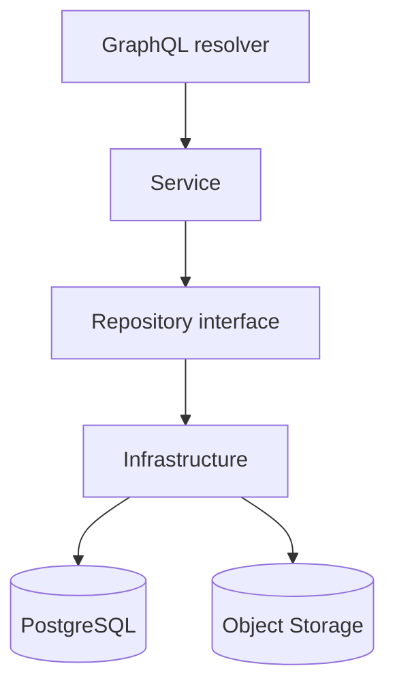

# APIアーキテクチャ

## 概要

> 実装状況: GraphQL、Service、Repository、PostgreSQL、Object Storageの基本構成は実装されています。Media Worker、Outbox Publisher、Redis Streams、冪等request、Media設計に対応するdomain処理は未実装です。
> 実装の正本: `memoria-api`

APIはGraphQLを入口として、ドメインルール、認証・認可、PostgreSQL、S3互換storageへの入出力を提供します。`memoria-api`にはAPI、Media Worker、Outbox Publisherを含め、それぞれのprocessを独立して起動します。

APIは[クリーンアーキテクチャ](/system/api/clean-architecture)を採用し、DomainとUse CaseをGraphQL、DB、Object Storage、認証Providerなどの詳細から分離します。

- resolverは入出力変換、Serviceはユースケース・ドメインルール・transaction、Repository interfaceは外部I/O境界を担当します。
- domainとserviceからGraphQL、DB、S3の具体実装へ依存しません。
- GraphQLの生成元は`schemas/graphql/`、SQLの生成元は`schemas/postgres/`です。生成物を直接編集しません。
- 認証済みcontextを認可の基準とし、クライアント指定IDを無条件に信頼しません。

## CommandとQuery

CommandはMedia登録、公開、委譲、削除など状態を変更するユースケースです。Queryは一覧、詳細、管理主体、公開範囲などの参照に限定します。

- CommandとQueryは責務と入出力を分け、同じPostgreSQLを使用します。
- 読み取り専用database、database複製、Event Sourcingは採用しません。
- DataLoaderはGraphQL request内の関連data取得をまとめ、N+1 queryを抑制します。
- Redis Streamsへの配送はAPIから直接行わず、Transactional OutboxとOutbox Publisherへ委譲します。

詳細は[非同期処理](/system/api/asynchronous-processing)、[Transactional Outbox](/system/api/transactional-outbox)、[冪等性](/system/api/idempotency)を参照してください。

