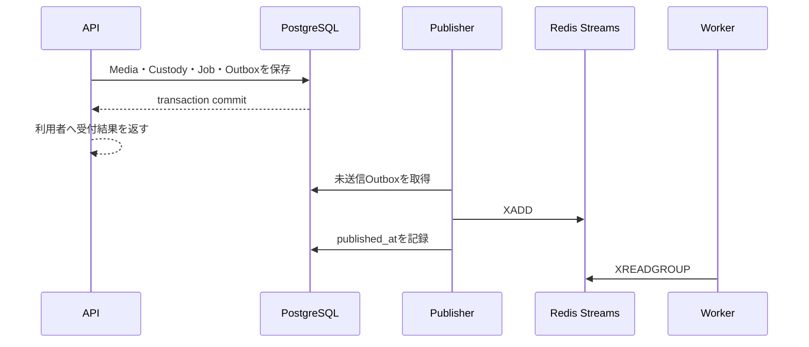

# Transactional Outbox

## 概要

> 実装状況: Outbox table、Outbox Publisher、Redis Streamsへの配送、再試行は未実装です。

PostgreSQLへの業務data更新とRedis Streamsへの配送は、異なるsystemのため同じtransactionで確定できません。Transactional Outboxにより、業務変更と「後でeventを配送する」という約束を同じPostgreSQL transactionで永続化します。

## 処理の流れ

APIの成功条件は、業務dataとOutbox eventが同じtransactionでcommitされたことです。Redisへ届いたことや派生物の生成完了をrequest成功条件にはしません。

## Publisher

Outboxは記録するだけでは再送されません。常駐するOutbox Publisherが未送信eventを定期的にpollingし、`XADD`成功後に配送済みとして更新します。

| 状態 | 振る舞い |
| --- | --- |
| Redisへ配送成功 | `published_at`を記録する |
| Redisへ配送失敗 | eventを未送信のまま保持し、次回retryする |
| Publisherが停止 | 再起動後に未送信eventを回収する |
| 最大retryを超過 | `FAILED`として運用から確認できるようにする |

Publisherは短いDB transactionで実行可能な`PENDING` event、またはclaim lease期限が切れた`PROCESSING` eventを`FOR UPDATE SKIP LOCKED`でbatch取得し、`PROCESSING`へ遷移させて`next_attempt_at`へlease期限を保存してcommitします。Redisへの`XADD`中はPostgreSQL row lockを保持しません。

`XADD`成功後は別transactionで`PUBLISHED`と`published_at`を確定します。失敗時は`attempt_count`を増加し、retry可能な場合は次回実行時刻を`next_attempt_at`へ設定します。自動retry上限へ到達したeventは`FAILED`とし、自動取得対象から外します。運用者が再開する場合は`PENDING`へ戻します。Publisherがclaim後に停止した場合は、`PROCESSING`かつlease期限到達済みのeventを別Publisherが回収します。

## 配送保証の境界

- PostgreSQLからRedisまでの送信保証はOutboxが担当します。
- RedisからWorkerまでの配送管理はRedis StreamsとConsumer Groupが担当します。
- `XADD`成功直後にPublisherが停止すると重複配送が発生し得るため、`event_id`で重複を判定します。
- APIからRedisへ直接publishする経路は設けません。
- CDC、Debezium、即時publishと回復publishの二重経路は採用しません。

Outboxだけをqueueとして利用する方式も成立しますが、業務databaseにpolling、lock、queue管理が集中します。MemoriaではRedis Streamsを非同期配送基盤として分離します。

## 適用条件

業務dataの更新と後続の非同期処理を必ず連動させる操作に適用します。DB更新がなく、Redis送信失敗をrequest errorとして返せばよい処理にまで機械的にOutboxを導入しません。

Outbox eventは配送のための技術情報です。[Media Event](/ubiquitous#media-event)は利用者操作のtraceであり、目的、保持期間、tableを分けます。
