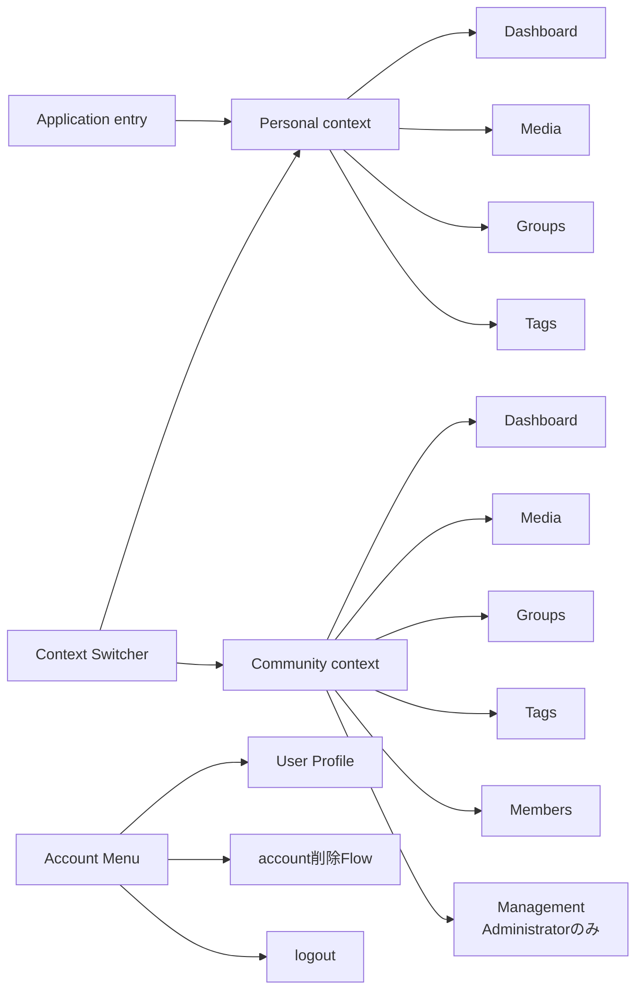

# Application Information Architecture

## 概要

Memoriaの認証後ApplicationにおけるInformation ArchitectureとNavigationの意味的な構造を定義します。

この文書はHeader、Sidebar、Tab、Drawer等の具体的なlayoutやMantine Componentを固定しません。Application内で何をcontextとして扱い、どのNavigationがどの責務を持つかを定義します。

## 基本構造

Application Shellは、次の3つのNavigation責務を分離します。

1. **Context Switcher**: Userが現在操作するPersonalまたはCommunity contextを切り替える。
2. **Context Navigation**: 現在contextのMedia、分類、参加者、管理等へ移動する。
3. **Account Menu**: 現在contextに依存しないUser本人のProfile、account lifecycle、logout等へ移動する。

具体的な表示位置やvisual representationは実装とVisual Reviewで決定します。

この図はNavigationの意味的な責務を示すもので、Header / Sidebar等の配置や具体的なroute構造を規定しません。

## Application Context

### Personal context

Personal contextは、User本人がCustodianであるMediaと、そのUser専用の分類を扱う空間です。

Initial Releaseでは次を主要領域とします。

- **Dashboard**: Personal contextの標準entry。本人のMediaや活動に関する情報を提示する。具体的な表示項目は画面詳細設計で定義する。
- **Media**:User管理Mediaを閲覧・Upload・管理・Community共有する。
- **Groups**: User管理MediaをUser専用のGroupで整理する。
- **Tags**: User管理MediaにUser専用のTagを付与し、分類・絞り込みに利用する。

Profile、account削除、logout等はPersonal contextの機能として扱わず、Account Menuから利用するUser account操作として分離します。

### Community context

各Communityは独立したcontextとして扱います。Community同士でNavigation state、参加者、Media、権限、分類を共有しません。

Initial Releaseでは次を主要領域とします。

- **Dashboard**: 各Community contextの標準entry。そのCommunityのMediaや活動に関する情報を提示する。具体的な表示項目は画面詳細設計で定義する。
- **Media**:Communityで閲覧可能なMediaを表示し、権限に応じて直接Upload等を行う。
- **Groups**: Community内で閲覧可能なMediaをCommunity専用のGroupで整理する。
- **Tags**: Community内で閲覧可能なMediaにCommunity専用のTagを付与し、分類・絞り込みに利用する。
- **Members**: 現在の参加者とAdministrator roleを確認する。Administratorは同じ領域でrole変更・参加者除外を行う。
- **Management**: Administrator向けのCommunity自体の設定を提供する。

ManagementにはCommunity名変更、Invitation管理、Community削除等を含めます。参加者の確認と管理はMembersへ集約し、人を確認する場所と管理する場所を分離しません。Memberが利用できないCommunity設定を日常利用の主要領域と同格に見せることは避けます。

Community内の具体的なScreen構成は各Screen Specificationで定義します。

## Context Switcher

Context Switcherは、現在のApplication contextを明示し、Personalと参加中のCommunityの間を移動するNavigationです。

### 表示するcontext

- Personal
- Userが現在参加しているCommunity

PersonalとCommunityはNavigation上のpeer contextとして切り替え可能ですが、同一種類のdomain objectとして表現しません。Switcher内でもPersonalとCommunityの意味的な違いを理解できるようにします。

Communityの検索、pin、recent、手動並べ替え等はInitial Releaseの必須機能としません。Community数や利用状況から必要性が確認された場合に追加します。

### Community作成

ACTIVE UserはContext SwitcherからCommunity作成を開始できます。

Community作成には[Community Creation](/screens/community-creation)と[Creation Dialog Pattern](/design-system/patterns/creation-dialog)を適用します。作成成功後は作成したCommunityを現在contextとして、そのCommunityのDashboard（`/communities/[communityId]/dashboard`）へ移動します。

### Navigation state

Context SwitcherはApplication固有のhidden session stateを切り替える機構にはしません。

Navigation先から現在contextを判定できることを基本とし、reload、deep link、browser historyからCommunity固有の画面へ直接到達した場合も、そのNavigation先に対応するCommunityを現在contextとして表現します。

Personal Dashboardは`/dashboard`、Community Dashboardは`/communities/[communityId]/dashboard`とします。`communityId`にはAPIが公開する安定した識別子を使用し、表示名をURL上の識別子として扱いません。Community固有の他画面も`/communities/[communityId]/...`配下に配置し、具体的な末尾Pathは各画面の詳細設計で決定します。

### Switcherの状態と遷移

- Community一覧の読み込み中は現在contextの表示を維持し、Switcher内で読み込み中であることを伝えます。取得失敗は空一覧と混同せず、再試行を提供します。
- 参加Communityがない場合もPersonalとACTIVE User向けCommunity作成の入口を維持します。
- Context選択時は対象Dashboardへ遷移します。切り替え処理中は重複操作を防ぎ、遷移先の取得に失敗した場合はエラーを表示し、現在の利用可能なcontextを維持します。
- URLを現在contextの正本とし、Switcher独自の永続的な選択状態を持ちません。Browserの戻る・進むと直接アクセス時にもURLから現在contextを復元します。
- Membership喪失・存在しないURL・閲覧不可・回復不能な取得失敗は、個別の専用画面を設けず共通エラー表示を使用します。APIの公開エラーコードによる内部処理の区別は維持します。認証Session失効時は従来どおりログインへ誘導します。

## Context Navigation

Context Navigationは、現在contextの中でUserが何を行うかを選択するNavigationです。

Personal contextではDashboard、Media、Groups、Tagsを提供します。

Community contextではDashboard、Media、Groups、Tags、Membersを提供し、AdministratorにはCommunity管理へ到達できるNavigationを追加します。

Contextを切り替えた場合、移動先contextのDashboardへ進むことを基本とします。異なるcontext間で同名のGroupや同等のsub-pageを暗黙に対応付けて遷移しません。

### GroupsとTagsの独立性

GroupsとTagsはPersonal・Community双方のContext Navigationで独立した項目として提供します。両者を「分類」という単一のNavigation項目にまとめません。各Context内でGroupsとTagsのデータ・操作を区別し、Context間で暗黙に共有しません。各項目の具体的なURL、一覧・詳細画面の構成は後続のScreen Specificationで定義します。

## Account Menu

Account Menuは現在contextから独立したUser本人の操作を提供します。

Initial Releaseでは少なくとも次への入口を持ちます。

- User Profile
- account削除Flow
- logout

Account Menuを利用するためにPersonal contextへ切り替える必要はありません。Community contextを利用中でもUser Profile等へ直接移動できます。

Profileの具体的な仕様は[User Profile](/screens/user-profile)、account削除は[Account Deletion Flow](/screens/account-deletion-flow)を参照します。

## 標準entry

### Application

認証・User登録完了後に通常のApplicationへ入る場合、Initial ReleaseではPersonal Dashboardを標準entryとします。共通ルーティング基盤で定めた認証成功後の固定`/dashboard`はPersonal Dashboardへの入口とします。

最後に利用したcontextを自動復元するrecent-context behaviorはInitial Releaseの必須要件としません。将来必要性が確認された場合に独立したNavigation behaviorとして検討します。

### Personal

Personal contextの標準entryはDashboardです。

### Community

各Community contextの標準entryは、そのCommunity固有のDashboardです。Personalと各CommunityのDashboardは同一の共通Dashboardではありません。Communityの切り替え後は対象CommunityのDashboardへ移動し、URLから対象Communityを識別できるようにします。Community DashboardのURLは`/communities/[communityId]/dashboard`です。Dashboardの情報構成は画面詳細設計で決めます。

## DashboardとContextの関係

- Dashboardは現在contextの主要領域の一つであり、Context SwitcherはDashboard内の表示filterではなくApplicationの操作対象そのものを切り替えます。
- Personal Dashboardと各Community DashboardをInitial Releaseの画面構成に含めます。両者の表示項目や集計の詳細は後続のScreen Specificationで決めます。
- Context切り替え時は前のcontextの同名画面や直前画面を復元せず、移動先のDashboardへ進みます。最近利用したcontextの自動復元はInitial Releaseの必須機能ではありません。
- DashboardからMediaへ到達できるようにしますが、Dashboardの導入を理由にMediaの閲覧・Upload・分類をDashboardへ統合しません。

## Navigationと権限

Navigation上で操作を提示することと、domain上の認可は分離します。Web UIで非表示または無効化してもAPI側の認可を代替しません。

CommunityのroleやMembershipが変化した場合は現在の権限を再評価し、利用できなくなったManagement等を継続利用させません。Community Membershipを失った場合は、そのCommunityの保護データを継続表示せず、他のエラーと共通のエラー画面を表示します。原因を特定する文言やCommunityの非公開情報を表示せず、Personal Dashboard（`/dashboard`）へ戻る導線を提供します。過去のCommunity URLへの直接アクセスで`NOT_FOUND`となった場合も、同じ画面を表示します。

具体的な認可規則は[Community権限](/community/authorization)および[認証・認可・Privacy共通方針](/system/cross-cutting/authentication-authorization-privacy)を正本とします。

## Responsive Behavior

Compact / Medium / Wideのいずれでも、次のCapabilityを維持します。

- 現在contextを理解できる
- Personalと参加中Communityを切り替えられる
- 現在contextの主要領域へ移動できる
- Account MenuのUser操作へ到達できる

Header、Sidebar、Menu、Drawer等の具体的なpresentationをviewport間で同一にする必要はありません。Context Switcher、Context Navigation、Account Menuという意味的な責務を維持しながら、利用可能な表示領域とinput modalityへ適応させます。

重要なNavigationをhoverだけに依存させず、keyboardおよびtouchでも利用可能にします。

## 設計上の境界

この文書では次を固定しません。

- Header / Sidebar等の具体的layout
- Context Switcherの具体的Componentとvisual design
- Dashboard以外の画面URLと共通エラー表示の具体的な配置
- Groups・Tagsそれぞれの画面内部のNavigation表現
- Community Management内部の画面分割
- Community数増加時の検索・pin・recent等の拡張
- viewportごとのpixel値

これらはScreen Specification、domain詳細設計、実装、Visual Reviewの適切な責務で決定します。
