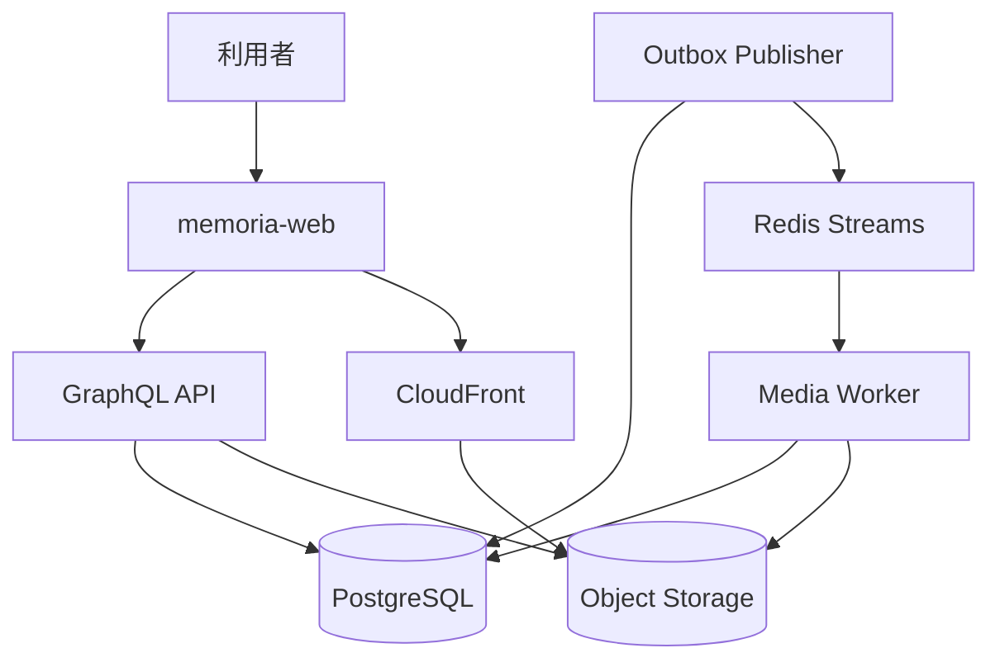

# システム全体構成

## 概要

> 実装状況: Web、API、PostgreSQL、Object Storage、AWS CDKの基本構成は実装されています。Media Worker、Outbox Publisher、Redis Streams、CloudFront配信、動画処理は未実装です。

Memoriaは4つの独立したGitリポジトリで構成する一つのプロダクトです。

| リポジトリ | 責務 |
| --- | --- |
| `memoria-web` | Web UI、認証済み画面、GraphQLクライアント |
| `memoria-api` | GraphQL API、Media Worker、Outbox Publisher、ドメインロジック、永続化 |
| `memoria-design` | プロダクト設計、用語、横断判断 |
| `memoria-IaC` | AWS resourceと実行環境 |

WebはAPIのドメインルールを複製せず、APIはユースケース・認可・data・file入出力を所有します。Media Workerは派生fileを生成し、Outbox PublisherはPostgreSQLに記録したeventをRedis Streamsへ配送します。DBとGraphQLの実行可能なschemaはAPI、AWS resourceはIaCを正本とします。

## バックエンドの実行単位

| 実行単位 | 責務 | Container image |
| --- | --- | --- |
| GraphQL API | 認証、認可、Command、Query、Media登録 | API用の軽量image |
| Outbox Publisher | 未送信eventのpolling、Redis配送、retry | API imageとの共用を許容 |
| Media Worker | Redis consumer、画像・動画処理、派生fileの永続化 | APIとは独立したimage |

実行processとDeploymentは分けますが、Domain、Repository、event契約を同じrepository内で共有します。初期はEC2上でAPI、Publisher、Workerを独立したDocker containerとして実行し、ECS/Fargateは将来的な移行先とします。実行単位を分けることは、repository分割やMicroservice化を意味しません。

## マイクロサービスを採用しない理由

現在の規模では、独立deploy、分散transaction、サービス間通信、監視などの運用複雑性に見合う必要性がありません。WebとAPIの明確な責務境界を維持しつつ、一つのプロダクトとして設計します。
