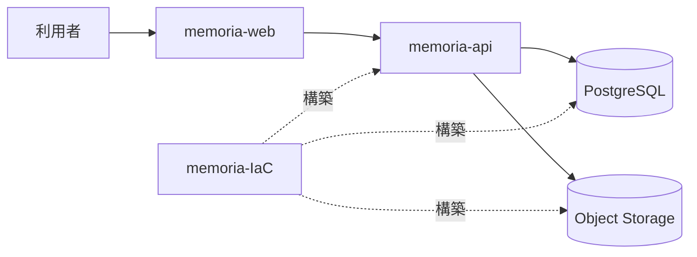

# システム全体構成

## 概要

> 実装状況: Web、API、PostgreSQL、Object Storage、AWS CDKの基本構成は実装されています。Media設計に対応するAPI・データ・動画処理には差分があります。

Memoriaは4つの独立したGitリポジトリで構成する一つのプロダクトです。

| リポジトリ | 責務 |
| --- | --- |
| `memoria-web` | Web UI、認証済み画面、GraphQLクライアント |
| `memoria-api` | GraphQL API、ドメインロジック、永続化、file入出力 |
| `memoria-design` | プロダクト設計、用語、横断判断 |
| `memoria-IaC` | AWS resourceと実行環境 |

WebはAPIのドメインルールを複製せず、APIはユースケース・認可・data・file入出力を所有します。DBとGraphQLの実行可能なschemaはAPI、AWS resourceはIaCを正本とします。

## マイクロサービスを採用しない理由

現在の規模では、独立deploy、分散transaction、サービス間通信、監視などの運用複雑性に見合う必要性がありません。WebとAPIの明確な責務境界を維持しつつ、一つのプロダクトとして設計します。

