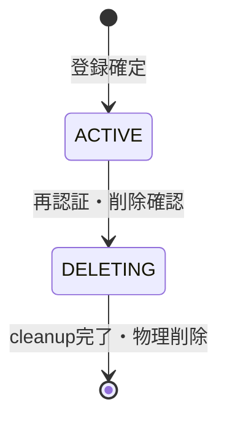

# User論理データモデル

## 概要

> 実装状況: Auth0認証とUser関連実装は存在しますが、本ページで定義する登録・削除・整合性は未実装です。

User domainが所有するentity、認証主体、状態、不変条件、他domainとの境界を定義します。

## Entityと関連

User集約は内部User ID、認証主体、nickname、状態を所有します。Auth0 account、Media、Community、Membershipは別集約であり、User削除workflowがそれらを調整します。

| 概念 | 責務・関連 |
| --- | --- |
| User | 内部User ID、認証主体、nickname、利用状態を所有する |
| Auth Identity | Auth0のissuer・subjectで認証主体を識別し、1件のUserへ対応する |
| Nickname | Userの現在の表示名を表す |
| Deletion Job | account削除対象のsnapshotとcleanup状態を保持する |

## 不変条件

- Userは内部IDを持ち、状態はACTIVEまたはDELETINGのどちらかである。
- issuer・subjectの組は1件のUserにだけ対応する。
- nicknameは必須で重複を許可し、現在値だけを保持する。
- Userごとに有効なDeletion Jobは1件だけで、削除対象snapshotを持つ。
- 登録未確定の認証主体はMemoria Userとして扱わない。

## 状態遷移

仮登録、DELETED、SUSPENDED状態は初回Releaseに設けません。

## 他domainとの境界

User domainは認証主体とUser lifecycle、Media domainはCustody・Uploader・Media削除、Community domainはMembership・Administrator・Community削除を所有します。account削除Jobは各domainの不変条件を迂回しません。
