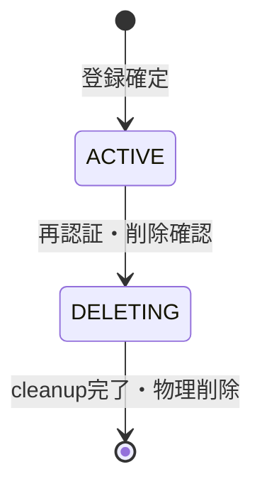

# User論理データモデル

## 集約

User集約は内部User ID、認証主体、nickname、状態を所有します。Auth0 account、Media、Community、Membershipは別集約であり、User削除workflowがそれらを調整します。

| 概念 | 不変条件 |
| --- | --- |
| User | 内部IDを持ち、ACTIVEまたはDELETINGである |
| Auth Identity | issuer・subjectの組が1件のUserにだけ対応する |
| Nickname | 必須、重複可能、現在値だけを保持する |
| Deletion Job | Userごとに有効なJobは1件で、削除対象snapshotを持つ |

仮登録、DELETED、SUSPENDED状態は初回Releaseに設けません。登録未確定の認証主体はMemoria Userではありません。

User domainは認証主体とUser lifecycle、Media domainはCustody・Uploader・Media削除、Community domainはMembership・Administrator・Community削除を所有します。account削除Jobは各domainの不変条件を迂回しません。
