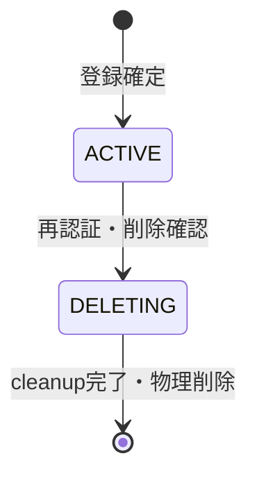

# User論理データモデル

## 概要

> 実装状況: Auth0認証とUser関連実装は存在しますが、本ページで定義する登録・削除・整合性は未実装です。

User domainが所有するentity、認証主体、状態、不変条件、他domainとの境界を定義します。

## Entityと関連

User domainは内部User ID、認証主体、nickname、lifecycleに加え、account同期PreferenceとAccount deletionの計画・再認証状態を所有します。Auth0 account、Media、Community、Membershipは別domainであり、User削除workflowがそれらを調整します。

| 概念 | 責務・関連 |
| --- | --- |
| User | 内部User ID、認証主体、nickname、利用状態を所有する |
| Auth Identity | Auth0のissuer・subjectで認証主体を識別し、1件のUserへ対応する |
| Nickname | Userの現在の表示名を表す |
| User Preferences | account同期するpresentation / behavior preferenceをUserと1:1で保持する |
| Account Deletion Review | 最終削除前に検証したCommunity解決方法と影響snapshotを短期保持する |
| Reauthentication Binding | Auth0強制再認証の成立を特定Reviewへ短期・単回でbindingする |
| Deletion Job | account削除確定後の対象snapshotとcleanup状態をdurableに保持する |

## 不変条件

- Userは内部IDを持ち、状態はACTIVEまたはDELETINGのどちらかである。
- issuer・subjectの組は1件のUserにだけ対応する。
- nicknameは必須で重複を許可し、現在値だけを保持する。
- User PreferencesはUserごとに1件で、Theme等のdevice-local設定は含めない。
- Account Deletion Reviewは削除を開始せず、検証済み計画を識別する短期stateである。
- Reauthentication Bindingは同じUserの特定Reviewだけに有効で、10分・単回使用とする。
- Review変更・再生成時に旧bindingを新Reviewへ流用しない。
- Userごとに有効なDeletion Jobは1件だけで、削除確定時の対象snapshotを持つ。
- 登録未確定の認証主体はMemoria Userとして扱わない。

## 状態遷移

```mermaid
stateDiagram-v2
    [*] --> ACTIVE: 登録確定
    ACTIVE --> DELETING: 再認証・削除確認
    DELETING --> [*]: cleanup完了・物理削除
```

仮登録、DELETED、SUSPENDED状態は初回Releaseに設けません。

## Account同期Preference

User PreferencesはPersonal Accent、日付形式、file size単位、Media thumbnail size、Media Detail navigation wrap、Wide / MediumでのMedia Detail初期情報表示を保持します。Language、Timezone、24時間表記はInitial Releaseで固定し、Themeはbrowser / device-localのため永続化しません。

## Account deletion state

Account Deletion Reviewは破壊的変更前の短期計画stateです。Reviewはowner User、Communityごとの解決方法、影響snapshotまたはその整合性を検証できる情報、作成・失効状態を持ちます。Review自体はDeletion Jobではなく、作成してもUserはACTIVEのままです。

Reauthentication BindingはBFFで完了したAuth0強制再認証をReviewへ結び付けます。BrowserがSecurity proofを保持するmodelにはせず、Server-sideでowner User・Review・成立時刻・期限・消費状態を管理します。Final confirmation成功時にReviewとBindingを再利用不能にし、その時点で初めてDeletion Jobを作成してUserをDELETINGへ遷移します。

## 他domainとの境界

User domainは認証主体とUser lifecycle、Media domainはCustody・Uploader・Media削除、Community domainはMembership・Administrator・Community削除を所有します。account削除Jobは各domainの不変条件を迂回しません。
