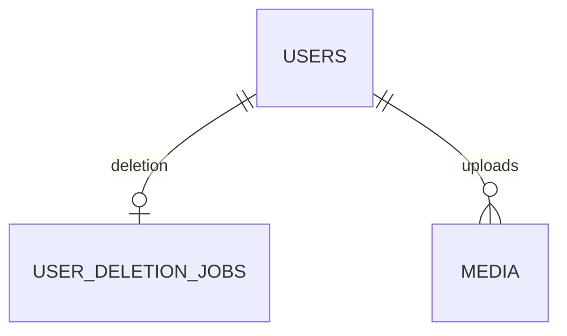

# User物理データモデル

## 概要

> 実装状況: Auth0認証とUser関連実装は存在しますが、本ページで定義するUser状態、削除Job、匿名化の整合性は未実装です。

User domainが所有するPostgreSQL table、column、constraint、index、削除規則を定義します。

## 共通規約

ID、日時、命名、constraint、index、削除方針は[物理データモデル共通規約](/system/data/physical-model-conventions)に従います。Auth0のissuer・subjectは外部認証identifierのためULIDではありません。

## 全体ER

## 所有table

### users

| 列 | 型 | 制約 | 意味 |
| --- | --- | --- | --- |
| id | varchar(26) | PK | 内部User ID |
| auth_issuer | text | NOT NULL | Auth0 issuer |
| auth_subject | text | NOT NULL | Auth0 subject |
| nickname | text | NOT NULL、trim後に空でない | 表示名 |
| status | varchar(16) | NOT NULL、CHECK | ACTIVE / DELETING |
| created_at | timestamptz | NOT NULL | 登録時刻 |
| updated_at | timestamptz | NOT NULL | 更新時刻 |

(auth_issuer, auth_subject)へUNIQUE indexを設定します。email、氏名、profile画像URL、公開account ID、nickname履歴は保存しません。

### user_deletion_jobs

| 列 | 型 | 制約 | 意味 |
| --- | --- | --- | --- |
| id | varchar(26) | PK | Job ID |
| user_id | varchar(26) | UNIQUE、FK users | 削除対象 |
| status | varchar(16) | NOT NULL、CHECK | PENDING / RUNNING / FAILED |
| target_snapshot | jsonb | NOT NULL | 確定時のMedia・Community対象 |
| attempt_count | integer | NOT NULL、0以上 | 試行回数 |
| last_error_code | text | NULL可 | 非機微error code |
| created_at | timestamptz | NOT NULL | 受付時刻 |
| updated_at | timestamptz | NOT NULL | 更新時刻 |

## 削除規則

完了後はUser物理削除に伴ってJobも削除します。Community管理Mediaを保持する場合はMedia側のuploaded_by_user_idをNULLにし、「削除済みUser」と表示します。削除前nicknameやAuth0 identifierは退避しません。

## 他domainとの境界

Mediaのuploaded_by_user_idとCustodyは[Media物理データモデル](/media/physical-data-model)、MembershipとAdministratorは[Community物理データモデル](/community/physical-data-model)を正本とします。
