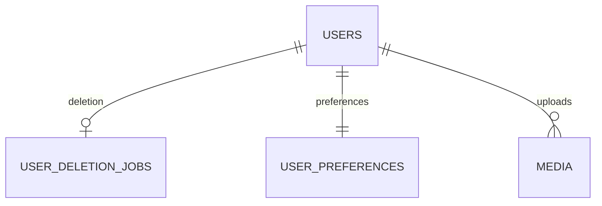

# User物理データモデル

## 概要

> 実装状況: Auth0認証とUser関連実装は存在しますが、本ページで定義するUser状態、削除Job、匿名化の整合性は未実装です。

User domainが所有するPostgreSQL table、column、constraint、index、削除規則を定義します。

## PostgreSQL schema

本domainが所有するrelationは`identity` schemaへ配置します。schema名と共通の参照規約は[物理データモデル共通規約](/system/data/physical-model-conventions)を正本とします。

## 共通規約

ID、日時、命名、constraint、index、削除方針は[物理データモデル共通規約](/system/data/physical-model-conventions)に従います。Auth0のissuer・subjectは外部認証identifierのためULIDではありません。

## 全体ER

```mermaid
erDiagram
  USERS ||--o| USER_DELETION_JOBS : deletion
  USERS ||--|| USER_PREFERENCES : preferences
  USERS ||--o{ MEDIA : uploads
```

## 所有table

### users

| 列 | 型 | 制約 | 意味 |
| --- | --- | --- | --- |
| id | varchar(26) | PK | 内部User ID |
| auth_issuer | text | NOT NULL | Auth0 issuer |
| auth_subject | text | NOT NULL | Auth0 subject |
| nickname | text | NOT NULL、trim後に空でない | 表示名 |
| status | varchar(16) | NOT NULL、CHECK | ACTIVE / DELETING |
| created_at | timestamptz | NOT NULL | 登録時刻 |
| updated_at | timestamptz | NOT NULL | 更新時刻 |

(auth_issuer, auth_subject)へUNIQUE indexを設定します。email、氏名、profile画像URL、公開account ID、nickname履歴は保存しません。

### user_preferences

| 列 | 型 | 制約 | 意味 |
| --- | --- | --- | --- |
| user_id | varchar(26) | PK、FK users ON DELETE CASCADE | 対象User |
| personal_accent_color | varchar(7) | NOT NULL、CHECK | Personal Accent。大文字 `#RRGGBB` |
| date_format | varchar(16) | NOT NULL、CHECK | `YYYY_MM_DD` / `MM_DD_YYYY` / `DD_MM_YYYY` |
| file_size_unit | varchar(16) | NOT NULL、CHECK | `DECIMAL` / `BINARY` |
| media_thumbnail_size | varchar(16) | NOT NULL、CHECK | `SMALL` / `MEDIUM` / `LARGE` |
| media_detail_navigation_wrap | boolean | NOT NULL | Media Detail端移動wrap |
| media_detail_initial_info_wide | boolean | NOT NULL | Wide初期情報表示 |
| media_detail_initial_info_medium | boolean | NOT NULL | Medium初期情報表示 |
| created_at | timestamptz | NOT NULL | 作成時刻 |
| updated_at | timestamptz | NOT NULL | 更新時刻 |

Userと1:1で作成し、account同期するpresentation preferenceだけを保持します。Themeはbrowser / device-localのため保存しません。Personal Accentの初期値はUser Settings正本の固定defaultを使用し、Community Accentのようなrandom生成は行いません。

`personal_accent_color` はApplicationで `#RRGGBB` へ正規化して保存し、DBでも `^#[0-9A-F]{6}# User物理データモデル

## 概要

> 実装状況: Auth0認証とUser関連実装は存在しますが、本ページで定義するUser状態、削除Job、匿名化の整合性は未実装です。

User domainが所有するPostgreSQL table、column、constraint、index、削除規則を定義します。

## PostgreSQL schema

本domainが所有するrelationは`identity` schemaへ配置します。schema名と共通の参照規約は[物理データモデル共通規約](/system/data/physical-model-conventions)を正本とします。

## 共通規約

ID、日時、命名、constraint、index、削除方針は[物理データモデル共通規約](/system/data/physical-model-conventions)に従います。Auth0のissuer・subjectは外部認証identifierのためULIDではありません。

## 全体ER

```mermaid
erDiagram
  USERS ||--o| USER_DELETION_JOBS : deletion
  USERS ||--|| USER_PREFERENCES : preferences
  USERS ||--o{ MEDIA : uploads
```

## 所有table

### users

| 列 | 型 | 制約 | 意味 |
| --- | --- | --- | --- |
| id | varchar(26) | PK | 内部User ID |
| auth_issuer | text | NOT NULL | Auth0 issuer |
| auth_subject | text | NOT NULL | Auth0 subject |
| nickname | text | NOT NULL、trim後に空でない | 表示名 |
| status | varchar(16) | NOT NULL、CHECK | ACTIVE / DELETING |
| created_at | timestamptz | NOT NULL | 登録時刻 |
| updated_at | timestamptz | NOT NULL | 更新時刻 |

 相当のCHECKで形式を防御します。

### user_deletion_jobs

| 列 | 型 | 制約 | 意味 |
| --- | --- | --- | --- |
| id | varchar(26) | PK | Job ID |
| user_id | varchar(26) | UNIQUE、FK users ON DELETE RESTRICT | 削除対象 |
| status | varchar(16) | NOT NULL、CHECK | PENDING / RUNNING / FAILED |
| target_snapshot | jsonb | NOT NULL | 確定時のMedia・Community対象 |
| attempt_count | integer | NOT NULL、0以上 | 試行回数 |
| last_error_code | text | NULL可 | 非機微error code |
| created_at | timestamptz | NOT NULL | 受付時刻 |
| updated_at | timestamptz | NOT NULL | 更新時刻 |

## 削除規則

削除Jobが残っている間は`ON DELETE RESTRICT`でUser物理削除を拒否します。cleanup完了後、WorkerがDeletion Jobを明示削除してからUserを物理削除します。Community管理Mediaを保持する場合はMedia側のuploaded_by_user_idをNULLにし、「削除済みUser」と表示します。削除前nicknameやAuth0 identifierは退避しません。

## 他domainとの境界

Mediaのuploaded_by_user_idとCustodyは[Media物理データモデル](/media/physical-data-model)、MembershipとAdministratorは[Community物理データモデル](/community/physical-data-model)を正本とします。
