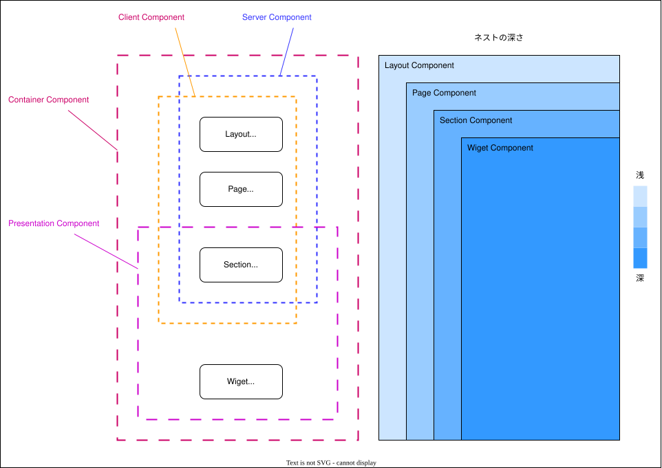

# Webコンポーネント設計

> 状態: 初期設計（現行Web実装との整合確認が必要）

コンポーネント実装の指針について説明します。

## コンポーネントの分離

Reactでのコンポーネント開発において、Presentation Component（プレゼンテーションコンポーネント）とContainer Component（コンテナコンポーネント）の分離は、コードの可読性、再利用性、テストのしやすさを向上させるための有効なパターンです。このドキュメントでは、それぞれの役割と使用方法について説明します。


## コンポーネントの概念と関連性

コンポーネントは大きく分けて以下の概念があります。
- Layout Component
- Page Component
- Section Component
- Widget Component
- Container Component
- Presentation Component

上記のコンポーネントはそれぞれ包含関係にあります。例えば、Container ComponentはPresentation Componentを内包するように実装します。



**Section Component A**
- Container Componentに分類される。
- Container Componentを内包するケースもある。
- Presentation Componentを必ず内包する。
- 再利用できないロジック、UIを持つコンポーネント

**Widget Component A**
- Container Componentに分類される。
- Container Componentを内包するケースもある。
- Presentation Componentを必ず内包する。
- 再利用できるロジック、UIを持つコンポーネント

**Section Component B**
- Presentation Componentに分類される。
- Presentation Componentを内包するケースもある。
- 再利用できないUIを持つコンポーネント

**Widget Component B**
- Presentation Componentに分類される。
- Presentation Componentを内包するケースもある。
- 再利用できるUIを持つコンポーネント


### Section Component

```
.
└── pages
   └── users
        └── @section
             ├── SearchForm
             │   ├── view.tsx           // Presentation Component
             │   ├── view.test.tsx      
             │   ├── view.stories.tsx   
             │   ├── container.tsx      // Container Component
             │   ├── container.test.tsx 
             │   └── index.ts
             ├── Table
             │   ├── view.tsx           // Presentation Component
             │   ├── view.test.tsx      
             │   ├── view.stories.tsx   
             │   ├── container.tsx      // Container Component
             │   ├── container.test.tsx 
             │   └── index.ts
             └── index.ts
```


### Widget Component

Widget Componentのディレクトリ構成を以下に示します。

```
.
└── widget
   ├── presentation
   │   ├── ComponentA
   │   │   ├── index.test.tsx
   │   │   ├── index.stories.tsx
   │   │   └── index.ts
   │   ├── ComponentB
   │   │   ├── index.test.tsx
   │   │   ├── index.stories.tsx
   │   │   └── index.ts
   │   ├── etc,
   │   └── index.ts
   ├── container
   │   ├── ComponentA
   │   │   ├── index.test.tsx
   │   │   ├── index.stories.tsx
   │   │   └── index.ts
   │   ├── ComponentB
   │   │   ├── index.test.tsx
   │   │   ├── index.stories.tsx
   │   │   └── index.ts
   │   ├── etc,
   │   └── index.ts
   └── index.ts
```

**パスマッピング**
  
```json
{
  "paths": {
    "@widget/*": ["./widget/*"],
  }
}
```

### Presentation Component

Presentation Componentは、UIの描画に特化したコンポーネントです。ビジュアル部分のみを担当し、状態管理やビジネスロジックは含みません。主に受け取ったプロパティ（props）を使って表示を行います。

**特徴**
- UIの描画に特化：スタイルやレイアウトに関するロジックのみを持つ。
- 状態管理を持たない：必要なデータは全て親コンポーネントからpropsとして受け取る。
- 再利用可能：異なるコンテナから使い回しが可能。
- テストが容易：見た目の変更が容易にテストできる。

```jsx
// Button.js
import React from 'react';

const Button = ({ onClick, label }) => (
  <button onClick={onClick}>
    {label}
  </button>
);

export default Button;
```

### Container Component
Container Componentは、状態管理やビジネスロジックを担当するコンポーネントです。データの取得や操作、状態の変更などを行い、それをPresentation Componentに渡して表示させます。

**特徴**
- 状態管理とロジック：アプリケーションの状態を管理し、必要に応じて変更を行う。
- APIとの通信：データの取得や送信を行う。
- Presentation Componentをラップ：子コンポーネントとしてプレゼンテーションコンポーネントを持ち、そのpropsに必要なデータや関数を渡す。
- 可読性の向上：ビジネスロジックとUIロジックを分離し、コードの見通しが良くなる。

```jsx
// ButtonContainer.js
import React, { useState } from 'react';
import Button from './Button';

const ButtonContainer = () => {
  const [label, setLabel] = useState('Click Me');

  const handleClick = () => {
    setLabel('Clicked');
  };

  return (
    <Button onClick={handleClick} label={label} />
  );
};

export default ButtonContainer;
```


## 実装方針

### 標準のHTMlタグからコンポーネントを作成

```tsx
import { ComponentPropsWithoutRef, forwardRef, ComponentProps } from "react";

type Props = ComponentPropsWithoutRef<"div"> & {
	// NOTE: 必要に応じて追加のプロパティをここに定義します。
};

const Component = forwardRef<HTMLDivElement, Props>((props, ref) => {
	const { children, ...rest } = props;
	return (
		<div {...rest} ref={ref}>
			{children}
		</div>
	);
});

export default Component;
export type ComponentProps = ComponentProps<typeof Component>;
```


**`ComponentPropsWithoutRef<{tagName}>` の使用**

標準的なプロパティ（className、style、id、onClick など）をすべて含む Props 型を定義します。これにより、汎用的な HTML タグのプロパティをすべてサポートします。

**`forwardRef` の使用**

`React.forwardRef` を使用して、`ref` をサポートするコンポーネントを作成します。これにより、親コンポーネントからこのコンポーネントへの参照を取得できます。

**`children` の分離**

`props` から `children` を分離し、残りのプロパティを `...rest` として展開します。これにより、コンポーネントの `props` の伝搬を確実に行います。

**型のエクスポート**

`ComponentProps<typeof {ComponentName}>` を使用して、実装する Component のプロパティ型をエクスポートします。これにより、他の場所でこのコンポーネントの型を再利用できます。

### サードパーティのコンポーネントからコンポーネントを作成

```tsx
import { FC, ComponentProps } from "react";
import { Input as OriginInput, InputProps as OriginProps } from "antd";

type Props = OriginProps & {
	// NOTE: 必要に応じて追加のプロパティをここに定義します。
};

const Input: FC<Props> = (props) => {
	const { ...rest } = props;
	return <OriginInput {...rest} />;
};

export default Input;
export type InputProps = ComponentProps<typeof Input>;
```

**`const { ...rest } = props` の使用**

`props` に追加のプロパティが将来的に増える可能性を考慮し、明示的に展開することで柔軟性を保ちます。

**型情報のエクスポート**

`React.ComponentProps<typeof {ComponentName}>` を使用することで、ラップされたコンポーネントの型情報を正確にエクスポートします。これにより、型の一貫性が保たれます。
