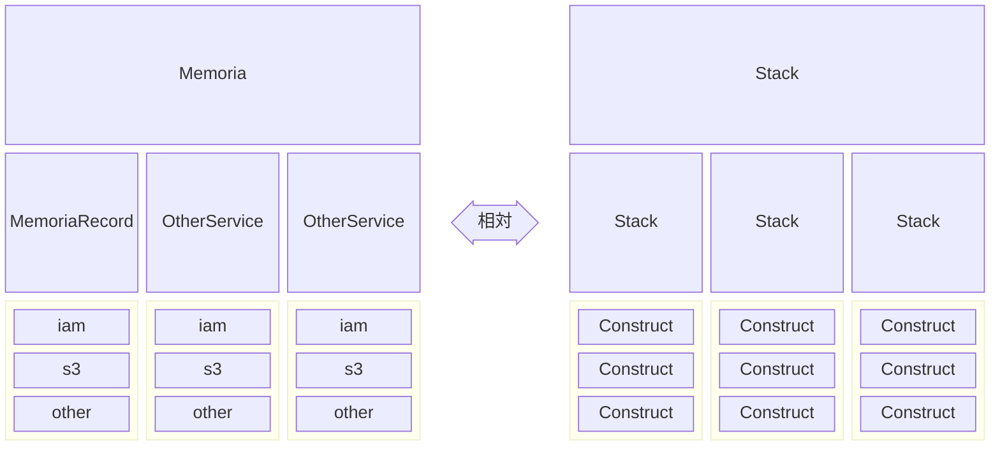

# IaC設計

> 状態: 初期設計（現行CDK実装との整合確認が必要）

aws cdkを利用したインフラ構築のガイドラインです。

## イメージ図

**Stack**

サービスまたはマイクロサービスを1つのスタックとして定義する。

**Construct**

スタック内のリソースを1つのコンストラクトとして定義する。コンストラクトにはリソースに関連する設定も含める。

## 構成について

スタック、コンストラクトはサービス内すべての環境で再利用できるように設計します。環境ごとにビルド・デプロイフローが異なるケースは発生しない前提です。そのためすべての環境で同じビルド・デプロイフローとなります。ビルド・デプロイフローが同じことを担保するためにスタックとコンストラクタの構成と実行順はすべて共通化します。環境ごとに異なるパラメータはパラメータストアに格納し、スタックの実行時に取得するようにします。環境ごとにリソースの有無が異なる場合は、環境名を元に条件分岐を行いリソースの有無を判断するようにします。

## タグ設定

すべてのリソースには以下のタグを設定します。

- Environment: 環境名（`production`, `staging`, `development`）
- Service: サービス名
- MicroService: マイクロサービス名

設定したタグはリソースグループの定義やコスト管理に利用します。

## ディレクトリ構成

TODO: 記載する

## 命名方針

### AWSリソース名

- すべて小文字
- ケバブケース

形式: `{serviceName}`-`{environmentName}`

例）`memoria-record-production`
- serviceName: `memoria-record`
- environmentName: `production`

### タグ名

- 大文字・小文字
- アッパーキャメルケース

例）`Environment`, `Service`, `MicroService`
