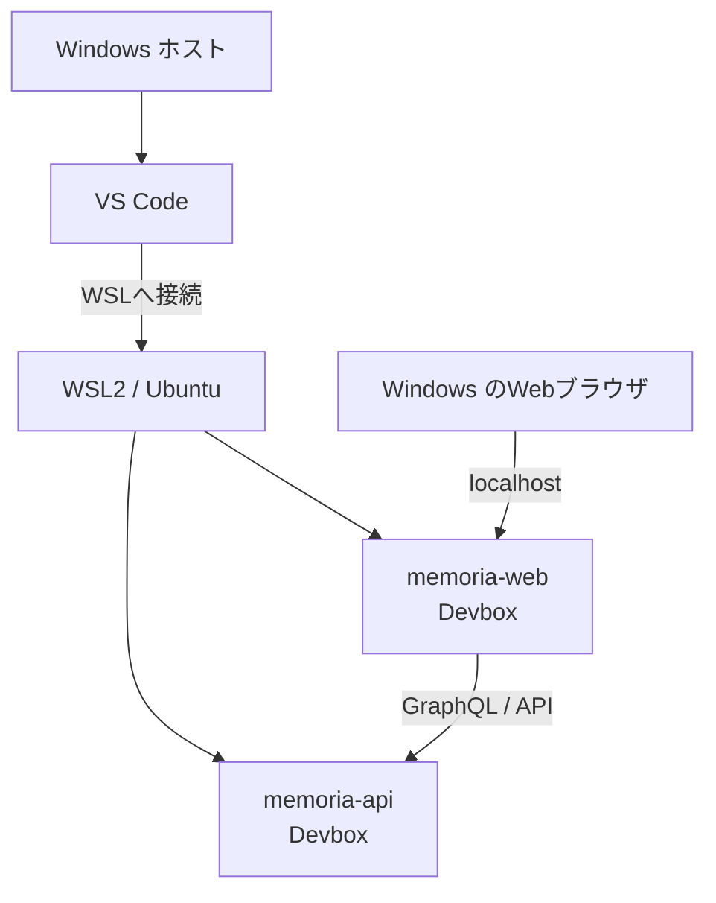

# ローカル開発環境

## 目的

Memoriaのローカル開発環境を再現可能にし、WindowsとLinuxの差異に起因する問題を切り分けやすくするための共通方針です。実行可能なコマンド、環境変数、ポートなどのリポジトリ固有情報は、各リポジトリのREADMEと設定を正本とします。

## 標準構成



- WindowsをホストOSとし、WSL2上のUbuntuを開発環境とします。
- VS CodeからWSLへ接続し、Ubuntu側のリポジトリを開きます。
- Node.js、npm、Goなど、プロジェクトのコマンドはUbuntu上のDevbox内で実行します。
- `memoria-web`と`memoria-api`は、それぞれ別のターミナルでDevboxを起動します。
- 動作確認はWindowsのWebブラウザから`localhost`へアクセスして行います。
- Dockerを使用する場合は、WSLから利用できる状態にします。Docker Desktopを使う場合は対象ディストリビューションのWSL integrationを有効にします。

ローカル開発は人間による開発の主要環境です。AI支援専用の補助環境としては扱いません。

## ファイルの配置

リポジトリは、原則としてUbuntuのファイルシステム（例: `/home/<user>/workspace/`）へ配置します。`/mnt/c/`配下での開発は、ファイル監視やI/O性能、権限の差異が問題になる場合があるため標準構成にしません。

`node_modules`はUbuntu上で生成し、Windows、macOS、他のLinux環境からコピーまたは共有しません。ネイティブバイナリを含むoptional dependencyはOS・CPU・libcに依存するためです。

## 基本手順

### 1. WSLでリポジトリを開く

VS CodeをWSLへ接続し、Ubuntu側にcloneした対象リポジトリを開きます。ターミナルがUbuntu上で動作していることを確認します。

```sh
uname -a
pwd
```

### 2. Devboxへ入る

各リポジトリでDevbox shellを起動します。

```sh
devbox shell
```

以降の`npm`、`go`、コード生成、テスト、開発サーバーのコマンドは、原則としてこのshell内で実行します。

### 3. 依存関係をインストールする

lockfileを変更しない通常のセットアップでは、各リポジトリで文書化されたパッケージマネージャーとコマンドを使用します。npmを基準とするリポジトリでは次を使用します。

```sh
npm ci
```

optional dependencyを除外する`--omit=optional`や`npm_config_optional=false`は使用しません。プラットフォーム固有パッケージが欠落する原因になります。

### 4. WebとAPIを起動する

`memoria-api`と`memoria-web`を別々のWSLターミナルで開き、それぞれのDevbox内で起動します。起動コマンド、環境変数、ポートは各リポジトリのREADMEと設定を参照します。

1. APIを起動し、起動完了と待受ポートを確認します。
2. Webが参照するAPI endpointを確認します。
3. Webを起動します。
4. WindowsのWebブラウザから表示された`localhost` URLへアクセスします。
5. WebからAPIへの通信を含む操作を確認します。

## Nextraの確認

`memoria-design`ではDevbox内で次を実行します。

```sh
npm ci
npm run dev
```

Windowsのブラウザから`http://localhost:3000`へアクセスします。変更を完了する前にビルドも確認します。

```sh
npm run build
```

## Linux向けoptional dependencyが不足する場合

### 症状

Nextra起動時に次のようなエラーが出る場合があります。

```text
Cannot find module '@napi-rs/simple-git-linux-x64-gnu'
```

`@napi-rs/simple-git`は実行環境に応じたネイティブパッケージをoptional dependencyとして読み込みます。今回確認された事象では、Ubuntu x64 glibc向けの`@napi-rs/simple-git-linux-x64-gnu@0.1.16`がインストールされていないことが原因でした。

### 診断

Devbox内で、実行環境、npm設定、インストール状態を確認します。

```sh
uname -m
node --version
npm --version
npm config get omit
npm ls @napi-rs/simple-git @napi-rs/simple-git-linux-x64-gnu
```

確認する点:

- コマンドがWSL2のUbuntu上のDevbox内で実行されているか
- CPUアーキテクチャが想定どおりか
- `optional`がnpmのomit対象になっていないか
- 他のOSで生成した`node_modules`を再利用していないか
- 親パッケージとプラットフォーム固有パッケージのバージョンが一致しているか

### 復旧

まずUbuntu上でoptional dependencyを含めて依存関係を作り直します。`npm ci`は既存の`node_modules`を削除し、lockfileに従って再インストールします。

```sh
npm ci --include=optional
```

それでも今回のパッケージだけが不足する場合は、現在の親パッケージと同じバージョンを一時的に補います。

```sh
npm install --no-save @napi-rs/simple-git-linux-x64-gnu@0.1.16
```

`0.1.16`は今回確認した依存関係に対応する値であり、恒久的な固定値ではありません。更新後は`npm ls @napi-rs/simple-git`などで親パッケージのバージョンを確認し、それに合わせます。`--no-save`はローカル復旧用で、`package.json`やlockfileへ意図しない変更を加えないために使用します。

復旧後は`npm run dev`と`npm run build`を再実行します。

## 再現性を維持する規則

- プロジェクトコマンドはWSL2 Ubuntu上のDevbox内で実行します。
- リポジトリと`node_modules`はUbuntu側に置き、OS間で共有しません。
- lockfileは意図した依存関係更新以外で再生成・削除しません。
- optional dependencyを省略しません。
- WebとAPIを結合確認するときは、両方をそれぞれのDevboxで起動します。
- Windowsブラウザからの`localhost`到達と、WebからAPIへの通信を分けて確認します。
- バージョン、ポート、環境変数、起動コマンドは、各実装リポジトリのREADMEと実行可能な設定を正本とします。

## 既知の課題

プラットフォーム固有のoptional dependencyがlockfileへ十分に記録されていない場合、`npm ci`だけでは別OSの環境を再現できないことがあります。恒久対応としてlockfileや依存関係を変更する場合は、ドキュメント変更とは分離し、Windows/WSL/Linuxなど対象プラットフォームで検証したPRとして扱います。
