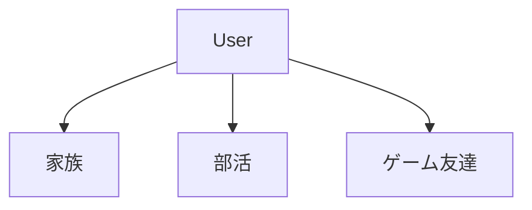
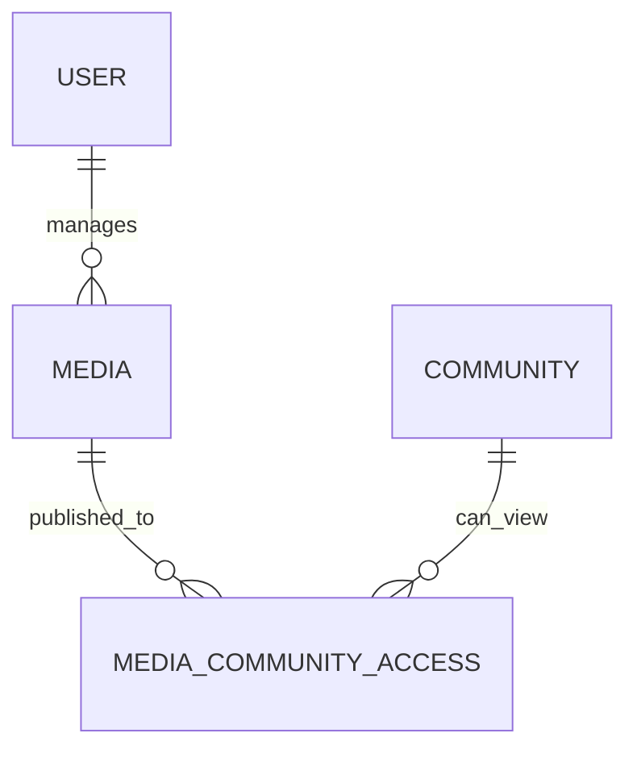

# CommunityとMediaの公開

> 状態: 将来（合意済み・未実装）

## Communityの位置付け

Communityは家族、部活、サークル、友人関係など、現実世界の集団に対応する閉じた独立空間です。Userは複数Communityへ参加できますが、そのUserを介してCommunity同士に関係が生まれることはありません。

- Communityをネストしない
- Community間に親子・包含関係を作らない
- Community間で参加者、Media、権限を継承しない
- 新しい共有範囲が必要な場合は専用Communityを作る

## Community内部

CommunityへMediaを公開すると、参加者全員が閲覧できます。参加者ごとのMedia閲覧許可・拒否は設けません。

Community内部で一部参加者だけへ公開することは、Communityで共有する目的と矛盾し、権限モデルも複雑にするため対応しません。限定された共有範囲が必要な場合は別Communityを作成します。

## User管理Media

Userが管理する1つのMediaは、複数Communityへ同時に公開できます。Communityごとの複製は作らず、同じMediaへの閲覧関係を個別に持ちます。

- 公開してもCustodianはUserのまま
- 公開先Communityは管理権限を持たない
- 1つの公開を解除しても他の公開先へ影響しない
- 委譲時はすべての公開を解除する

## Community管理Media

Communityが管理するMediaは、そのCommunityの参加者が閲覧できます。別Communityへは公開しません。

Community管理Mediaを別Communityにも残すユースケースは、共有、複製、委譲のどれに当たるかを含めて未定義です。具体的な要求が発生するまで対応しません。

## 管理と公開

| 操作 | Custodian | 閲覧範囲 |
| --- | --- | --- |
| UserがCommunityへ公開 | Userのまま | 公開先Communityを追加 |
| Userが公開を解除 | Userのまま | 対象Communityを削除 |
| UserからUserへ委譲 | 新しいUser | すべて解除 |
| UserからCommunityへ委譲 | Community | 委譲先Communityのみ |
| CommunityからUserへ委譲 | User | すべて解除 |
