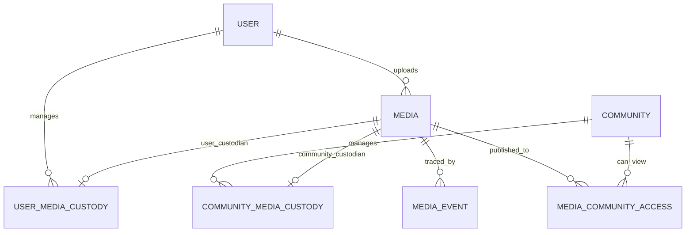
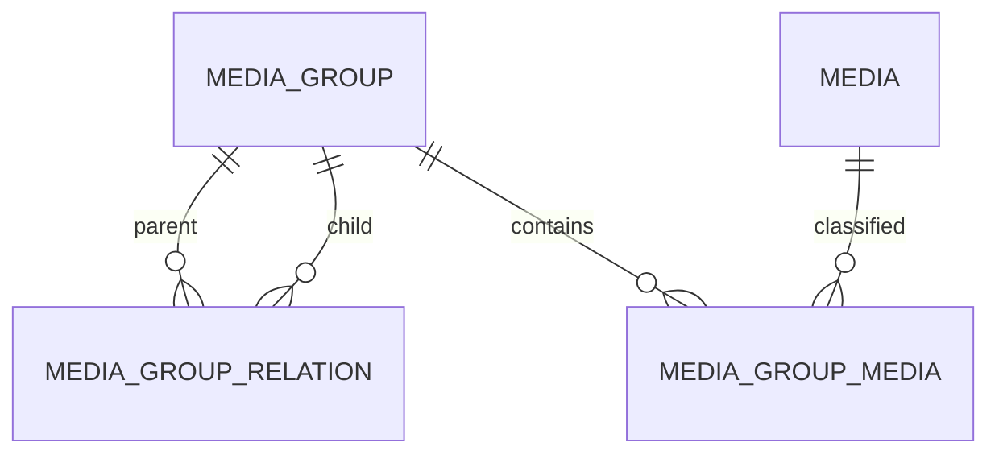

# Mediaデータモデル

## 概要

> 実装状況: PostgreSQLはImage・Image Group中心です。Media、Custodian、Media Event、動画属性は設計との差分があります。物理schemaの正本は`memoria-api/schemas/postgres/`です。

このページはMemoriaの論理データモデルを定義します。

## Media

| 属性 | 意味 |
| --- | --- |
| id | Media識別子 |
| mediaType | IMAGEまたはVIDEO |
| fileName・fileSize・mimeType | 原本の属性 |
| uploadedByUserId | 最初のUploader。User削除後は不明を許容 |
| uploadedAt | アップロード日時 |
| createdAt・updatedAt | 登録・更新日時 |

Imageはwidth・height、Videoはwidth・height・duration・codec・frameRateを持ちます。

## Custodianと公開

各MediaはUser Media CustodyまたはCommunity Media Custodyを必ず一つだけ持ちます。両方がない状態と両方がある状態をDB制約または同等の仕組みで禁止します。

User管理MediaはMedia Community Accessを複数持てます。Community管理Mediaは別CommunityへのAccessを持たず、CustodianであるCommunityの参加者が閲覧します。

## Media Group

GroupはUserまたはCommunityのスコープを一つ持ち、Mediaは複数Groupへ所属できます。Group関係はDAGで、複数の親を許可し、直接・間接の循環を禁止します。

## Community

Community、Membership、Community Administratorを管理します。Communityはネストせず、参加者・Media・権限を別Communityへ継承しません。MembershipはCommunity公開Mediaを閲覧する前提です。
