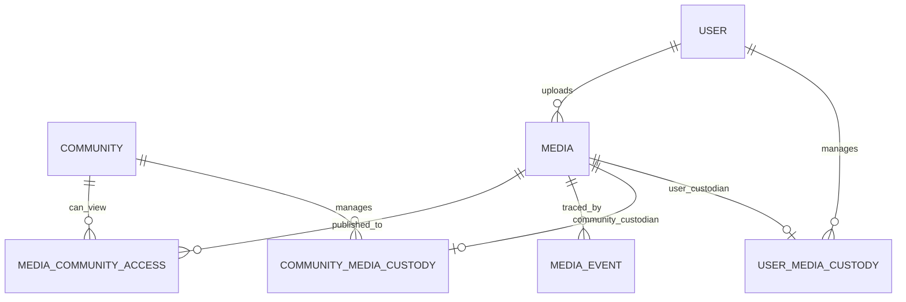
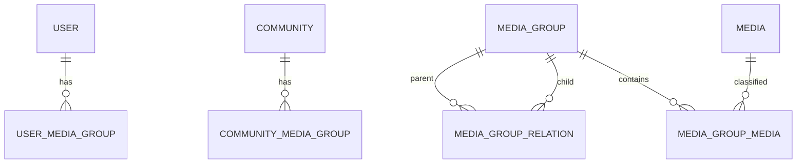

# Media概念データモデル

> 状態: 将来（論理モデル）  
> 現行の物理正本: `memoria-api/schemas/postgres/schema.sql`

## 位置付け

このページは合意したドメインルールを表す論理モデルです。物理テーブル、キー、移行手順は未確定であり、現行DBを変更するものではありません。

## 中核モデル

### 排他制約

各Mediaは次のどちらか一方だけを持ちます。

- 1件の`USER_MEDIA_CUSTODY`
- 1件の`COMMUNITY_MEDIA_CUSTODY`

両方がない状態と両方がある状態を禁止します。この排他性はER図だけでは表現できないため、DB制約または同等の整合性保証が必要です。

## Media

| 属性 | 意味 |
| --- | --- |
| id | Media識別子 |
| mediaType | IMAGEまたはVIDEO |
| fileName | 元のファイル名 |
| fileSize | ファイルサイズ |
| mimeType | Media形式 |
| uploadedByUserId | 最初のUploader。将来不明を許容 |
| uploadedAt | アップロード日時 |
| createdAt | システム登録日時 |
| updatedAt | メタデータ更新日時 |

Image固有情報:

- width
- height

Video固有情報:

- width
- height
- duration
- codec
- frameRate

具体的な保存形式は、動画処理要件をレビューしてから決定します。

## CustodyとAccess

| モデル | 責務 |
| --- | --- |
| User Media Custody | Userが管理する現在状態 |
| Community Media Custody | Communityが管理する現在状態 |
| Media Community Access | User管理MediaのCommunity公開 |
| Media Event | 重要操作のトレース |

Community管理Mediaは別Communityへ公開できないため、`Media Community Access`を持ちません。そのCommunity内部の閲覧はCustodianに付随する基本権限です。

## Group

User用GroupとCommunity用Groupは排他的なスコープを持ちます。Group同士の関係はDAGであり、複数の親を許可しますが循環を禁止します。

## Communityの初期モデル

初期SVGと現行SQLには次の概念があります。

- Community
- Membership
- Membership History
- Community Administrator
- Administrator History

これらの詳細は今回未レビューです。Media公開の前提としてMembershipは必要ですが、招待、脱退、管理者不在、Community削除のルールは別途設計します。

## 現行実装との対応

| 将来概念 | 現行実装 |
| --- | --- |
| Media | images |
| Media Group | image_groups |
| Media Group Media | image_group_images |
| Media Group Relation | image_group_relations |
| User Media Custody | user_image_groupsはGroupのみ。Media custodyは要設計 |
| Community Media Custody | community_image_groupsはGroupのみ。Media custodyは要設計 |
| Media Community Access | image_community_accesses |
| Media Event | 未実装 |
