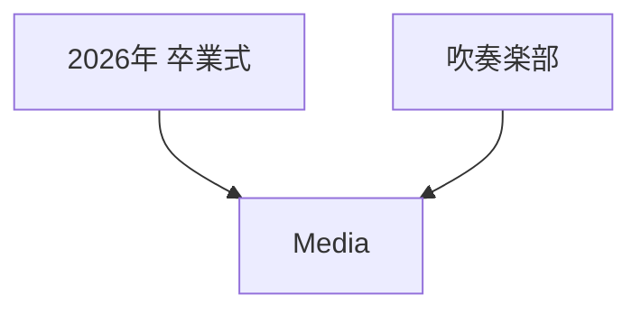
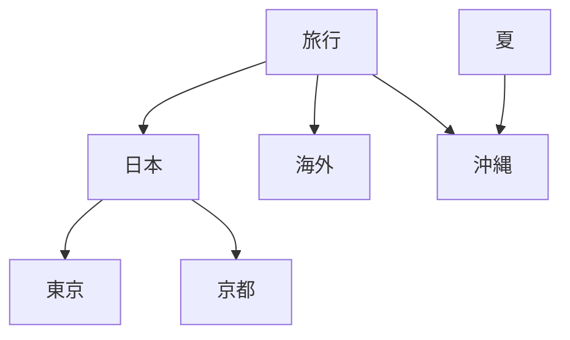

# Media Group

## 概要

> 実装状況: Image Groupと親子関係は一部実装済みです。Mediaへの名称統一とDAGの多段循環保証には差分があります。

## 目的

Media GroupはMediaを分類・整理するための概念です。学校Communityで「2026年 卒業式」「2025年 運動会」のようにMediaをまとめる用途を想定します。

Groupは次の情報へ影響しません。

- MediaのCustodian
- Communityへの公開範囲
- Community内部の閲覧権限
- 物理ファイルの保存場所

## 所属範囲

- Userは自分用のMedia Groupを作成できる
- CommunityはCommunity用のMedia Groupを作成できる
- User間でGroupを共有しない
- Community間でGroupを共有しない
- UserとCommunityの間でGroupを共有しない

## Mediaとの関係

1つのMediaは複数Groupへ所属できます。Media本体を複製せず、関連だけを追加します。

- 1つのGroupから除外しても他のGroup所属は維持する
- すべてのGroupから除外してもMedia本体は削除しない
- Groupを削除してもMedia本体は削除しない
- Media削除時はすべてのGroup関連を削除する

## Group同士の関係

Media Groupは有向非巡回グラフ（DAG）として扱います。同じGroupを複数の親へ関連付けられますが、循環は許可しません。

### 制約

- 自分自身を親または子にできない
- 直接・間接を問わず循環を作れない
- 同じ親子関係を重複登録できない
- 親を持たないGroupを許可する
- 子を持たないGroupを許可する

現行DBの自己参照禁止CHECK制約だけでは複数段の循環を防止できません。実装時にserviceまたはDBで循環検出を保証する必要があります。

## Tagとの違い

| 概念 | 用途 |
| --- | --- |
| Tag | Mediaへ短い属性・検索語を付ける |
| Media Group | 名称と親子関係を持つ分類構造 |

TagとGroupは併用でき、どちらもアクセス制御には使用しません。
